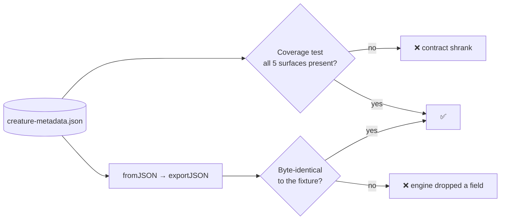

# Golden creature-metadata fixture as the cross-engine round-trip contract

## Summary

Adds a golden creature JSON fixture that pins the full creature metadata
surface, plus the TypeScript round-trip test that makes it the reference
behaviour every other engine must match. Closes #3752.

Issue #3746 existed because the Rust extensions drifted from the TypeScript
contract with no test noticing: `NeuronExport` gained `tags`, `SynapseExport`
gained `tags`, `CreatureCommon` gained `memetic`, and the Rust structs never
followed. Fixing those structs once does not stop the next divergence — a
shared, versioned fixture does.

What landed:

- **`test/fixtures/golden/creature-metadata.json`** — the stable, documented
  path. Covers all five metadata surfaces: top-level `uuid`, top-level `tags`,
  `memetic` (both `biases` and `weights` entries), a hidden neuron carrying the
  `intelligentDesign` pedigree tag stamped by `ImproveSquash`, and a synapse
  carrying `tags`. The fixture documents its own intent in a top-level
  `contract` tag pointing at the sibling README.
- **`test/fixtures/golden/README.md`** — the contract document: what the fixture
  is, the surface-by-surface table, the one deliberate asymmetry (`exportJSON`
  omits the creature `uuid` by the Issue #2054 wire format, so the test restores
  it from the loaded creature), and the CAUTION that editing this file is a
  coordinated cross-repo breaking change.
- **`test/creature/GoldenMetadataRoundTrip.ts`** — four tests, run with the full
  suite on every PR via `.github/workflows/quality.yml`.
- Index entries in `docs/README.md` and `AGENTS.md` so the contract is
  discoverable from both the docs index and the agent conventions.

### Two independent guards, both needed

The round-trip test alone is not enough: regenerating the fixture from a lossy
export would leave it green while the contract quietly shrank. So the suite
asserts coverage _and_ fidelity:



## Evidence

Backend/test-data change — no web interface to screenshot.

**The round-trip test genuinely detects a dropped surface.** Temporarily
patching `src/neuron/NeuronSerialization.ts` to stop emitting neuron `tags`
(reverted afterwards; not part of this PR) fails the gate:

```text
golden fixture covers every creature metadata surface (#3752) ... ok (1ms)
golden fixture round-trips byte-identically (#3752) ... FAILED (7ms)
golden fixture uuid is the deterministic structural uuid (#3752) ... ok (3ms)
golden fixture round trip is idempotent (#3752) ... FAILED (1ms)
error: AssertionError: Values are not equal: re-exporting the golden fixture must reproduce its bytes exactly
FAILED | 2 passed | 2 failed
```

Unpatched, on the committed tree:

```text
running 4 tests from ./test/creature/GoldenMetadataRoundTrip.ts
golden fixture covers every creature metadata surface (#3752) ... ok (1ms)
golden fixture round-trips byte-identically (#3752) ... ok (2ms)
golden fixture uuid is the deterministic structural uuid (#3752) ... ok (4ms)
golden fixture round trip is idempotent (#3752) ... ok (1ms)
ok | 4 passed | 0 failed (16ms)
```

`./quality.sh` on the full tree: **8370 passed, 3 failed**. All three failures
are unrelated to this change:

- `deno fmt --check` flagged this PR summary, written after the gate's format
  step ran — resolved by `deno fmt`, and `test/scripts/FormatConsistency.ts` now
  passes.
- Two `test/wasm/NativeCoreLibrary.ts` failures
  (`libneat_core was resolved but
  failed to load`) reproduce identically on a
  clean tree with this branch's changes stashed — a local dylib-loading
  limitation on the build machine, not a regression from this PR.

## Test Plan

Added `test/creature/GoldenMetadataRoundTrip.ts`:

- `golden fixture covers every creature metadata surface (#3752)` — asserts the
  fixture still carries the creature `uuid`, top-level `tags` (including the
  `contract` note), `memetic.biases` and `memetic.weights`, a hidden neuron with
  an `intelligentDesign` tag, and a tagged synapse. Guards against a lossy
  regeneration of the fixture.
- `golden fixture round-trips byte-identically (#3752)` — loads the fixture and
  asserts the re-export reproduces the file bytes exactly. This is the
  regression test for the #3746 class of drift.
- `golden fixture uuid is the deterministic structural uuid (#3752)` — strips
  the recorded `uuid` and asserts `CreatureUtil.makeUUID` recomputes the same
  value, so the fixture's uuid is derived from its own topology rather than
  arbitrary.
- `golden fixture round trip is idempotent (#3752)` — a second load/export cycle
  must not drift.

No existing tests were modified or removed.

## Notes for reviewers

- **A diff touching `test/fixtures/golden/` is a cross-repo breaking change.**
  It requires coordinated updates in NEAT-AI-core, NEAT-AI-Backpropagation, and
  NEAT-AI-Lamarck. That is stated in the fixture README's CAUTION block.
- **Known gap, deliberately not built here** (the issue says not to block on
  it): adding a new field to the creature interfaces _without_ extending the
  fixture is not caught automatically — round-tripping a fixture that lacks the
  field still passes. Detection today is review of the interface diff; the
  README records this and names a cheap lint/CI check as the fix if it proves to
  be a recurring blind spot.
- The Rust-side sub-issues (#3747, #3749, #3750) have been pointed at this path
  so their regression tests consume the same bytes rather than duplicating them.
