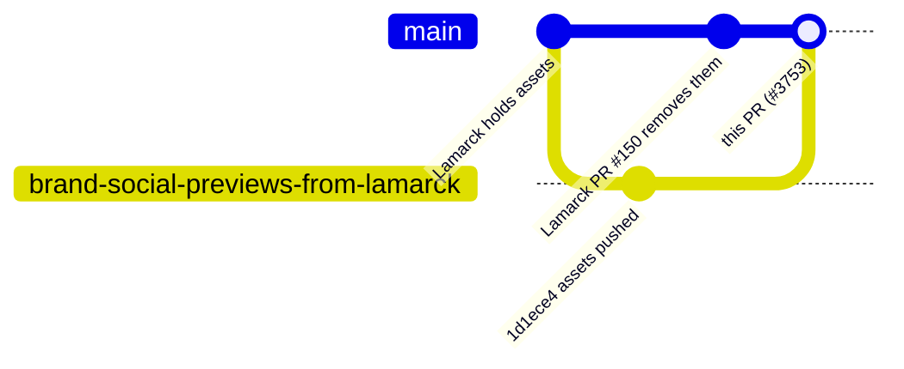

# Land the NEAT-AI family brand set on Develop

## Summary

The 1280×640 GitHub social previews and the transparent organic mark were moved
out of NEAT-AI-Lamarck (its PR #150, merged 2026-08-15), but the receiving PR in
this hub repo was never opened — the Lamarck worker was blocked from writing
here (`WRITE_REPO_BLOCKED`). The approved assets therefore sat only on the
unmerged branch `brand-social-previews-from-lamarck` (commit `1d1ece4`) and
`docs/brand/` was absent from both repos.

This PR lands that asset set on `Develop` unchanged — no artwork was
regenerated:

- `docs/brand/README.md` — the canonical brand home for the repository family.
- `docs/brand/neat-ai-social-organic-alt-transparent.png` — transparent mark.
- `docs/brand/social-previews/` — one 1280×640 preview per NEAT-AI\* repo (hub,
  core, Discovery, Explore, Examples, Backpropagation, Lamarck, scorer) plus
  `neat-ai-organic-approved.png` and `neat-ai-snapshot.png`, with a catalogue
  `README.md`.
- `test/docs/BrandAssets.ts` — behavioural guard for the set.
- `docs/README.md` — index entry pointing at the brand home.

Out of scope, per the issue: no pointer `docs/brand/README.md` files in the
other NEAT-AI\* repos (Lamarck's existing pointer is enough), and applying each
PNG as its repo's GitHub social-preview setting is a manual Settings upload, so
no upload checklist is included. The branch's own `pr-summary-brand-home.md` was
deliberately not carried across — this file replaces it.

Closes #3753.

## Evidence

This is a docs/asset change with no web interface of its own. The evidence is
the committed artwork plus the behavioural test that reads it:


`test/docs/BrandAssets.ts` was added **before** the assets and failed on all
four cases (`docs/brand/README.md` not found, `docs/README.md` does not link
`docs/brand/README.md`), then passed once the assets landed:

```text
running 4 tests from ./test/docs/BrandAssets.ts
social-previews catalogue lists exactly the committed images ... ok (2ms)
every social preview uses GitHub's 1280x640 canvas ... ok (3ms)
brand docs' relative links resolve ... ok (3ms)
the documentation index points at the brand home ... ok (454µs)

ok | 4 passed | 0 failed (13ms)
```

How the assets reached `Develop`:



## Test Plan

- Added `test/docs/BrandAssets.ts` (4 tests, all reading the real committed
  files):
  - `social-previews catalogue lists exactly the committed images` — the
    catalogue table and the directory listing must agree in both directions, so
    a half-finished move fails here.
  - `every social preview uses GitHub's 1280x640 canvas` — parses each PNG's
    IHDR chunk and asserts the signature and dimensions.
  - `brand docs' relative links resolve` — every relative link in the two brand
    documents must `stat`.
  - `the documentation index points at the brand home` — `docs/README.md` links
    `brand/README.md`.
- Full gate: `./quality.sh < /dev/null` (fmt, lint, type-check, discovery, WASM
  sync, full test suite).
