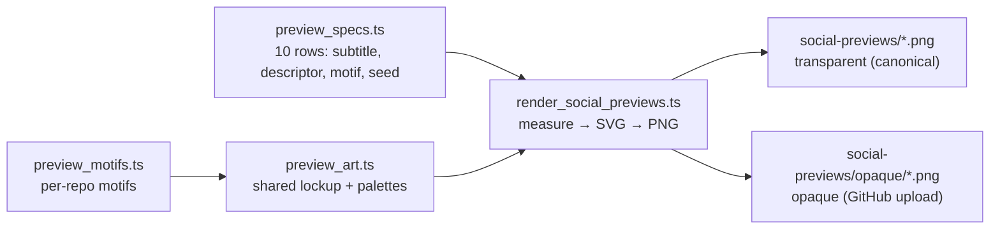

# Branding: transparent social previews, used in the README (Issue #3764)

## Summary

All ten previews in `docs/brand/social-previews/` are re-rendered from scratch
with **transparent backgrounds**, so the artwork works in light and dark modes
alike. Closes #3764.

The set is no longer a folder of hand-tweaked bitmaps: a committed generator
(`scripts/brand/`) draws the shared family lockup once — smiley-neuron soma
standing in for the **A**, teal/coral dendrite tree, sub-project subtitle, one
line saying what the sub-project does, and the five capability pills — and each
sibling adds only its subtitle, descriptor, and motif. That is what keeps the
family look consistent across the NEAT-AI\* projects while each image still
hints at what its sub-project is.

Two variants ship per preview:

| Path                           | Use                                                                                              |
| ------------------------------ | ------------------------------------------------------------------------------------------------ |
| `social-previews/*.png`        | **Canonical**, transparent. Committed paths unchanged, so sibling READMEs keep hot-linking them. |
| `social-previews/opaque/*.png` | Flattened on the brand navy for GitHub's manual Social-preview upload slot.                      |

Legibility on a transparent canvas comes from a halo pass: every text run and
every piece of artwork is drawn twice, a white outline underneath and the ink on
top. On a white page the halo disappears; on a dark page it outlines the dark
ink.

Also in this change:

- `README.md` leads with the transparent `neat-ai.png` (replacing
  `docs/logo.png`) and gains a **Family previews** gallery of the eight sibling
  previews.
- `docs/brand/README.md` and `docs/brand/social-previews/README.md` document the
  two variants, the palettes, and the regeneration command.
- `docs/README.md` notes that `logo.png` is superseded as the README header.

### Regenerating

```bash
deno run -A scripts/brand/render_social_previews.ts
```

The rasteriser is `@resvg/resvg-js`, pinned and pulled from npm by `deno run` —
a developer tool for regenerating committed artwork, not a library dependency.
Text is laid out from measured glyph extents, so the lockup stays centred
whichever font of the family stack the host resolves.

**Deno regression avoided** — rendering runs through `deno run` with an `npm:`
specifier and the lockfile; no `package.json`, `node_modules/`, or Node bundler
was introduced.



## Evidence

The same committed file on a light page and a dark page — the halo is invisible
on white and outlines the ink on navy:


The full transparent set, showing the shared family look and the per-repo motifs
(gear, magnifier, bar chart, reverse gradient arrows, giraffe, telescope,
camera, notebook):


The opaque upload variants:


## Test Plan

New behavioural tests — they read the committed pixels and the committed README,
not the source that produced them:

- `test/docs/BrandTransparency.ts`
  - `every social preview has a transparent background` — decodes each PNG
    (helper `test/docs/_pngPixels.ts`) and asserts an alpha channel, fully
    transparent corners, and ≥ 20% transparent pixels.
  - `every social preview still draws artwork` — guards against a blank canvas
    passing the transparency check.
  - `each social preview ships an opaque variant for GitHub uploads` — `opaque/`
    mirrors the set and every sampled pixel is fully opaque.
  - `the README leads with the transparent hub preview` — README shows
    `docs/brand/social-previews/neat-ai.png` and no longer shows
    `docs/logo.png`.
  - `the README gallery links every sibling preview`.
- `test/docs/BrandPreviewSvg.ts` — calls the real generator: the transparent
  palette paints no background and the opaque one does, every spec carries its
  own subtitle and descriptor, rendering is deterministic, `xmlEscape`
  neutralises markup, an unknown motif fails loudly, and the render catalogue
  matches the committed PNGs.

Existing `test/docs/BrandAssets.ts` (catalogue ↔ directory, 1280×640 canvas,
brand-doc links) stays green unchanged.
