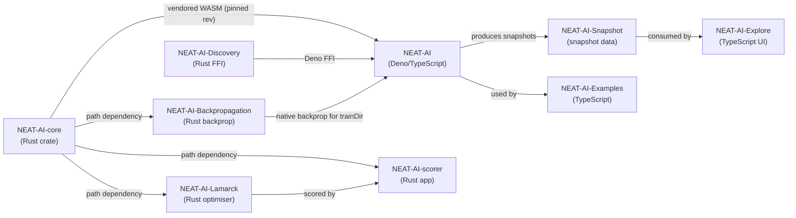

# README: list NEAT-AI-Lamarck and NEAT-AI-Backpropagation as family repos

## Summary

The README's "🌐 Related Repositories" section listed seven family repos, but
two public siblings — **NEAT-AI-Backpropagation** and **NEAT-AI-Lamarck** — were
missing from both the table and the Mermaid dependency graph, even though both
already appeared in the Family previews grid directly beneath. The inventory now
matches reality. Closes #3767.

- Two rows added to the table, in the same link + bold-name style as the
  existing seven, ordered to mirror the previews grid:
  - **NEAT-AI-Backpropagation** — native Rust backpropagation
    (`neat_ai_backpropagation`) used by NEAT-AI's `trainDir`.
  - **NEAT-AI-Lamarck** — experimental Rust optimiser (`neat_ai_lamarck`) that
    refines already-fit creatures; results judged by NEAT-AI-scorer.
- Two nodes and four edges added to the dependency graph. Both siblings take
  `neat-core` as a **path dependency** — verified against each repo's committed
  member manifest (`backpropagation/Cargo.toml`, `lamarck/Cargo.toml`, both
  `neat-core = { path = "../../NEAT-AI-core/neat-core" }`), so the edge label
  matches the existing NEAT-AI-scorer edge.
- The existing seven rows, the NOTE callout, and the previews grid are
  unchanged. The private `NEAT-Integration-Testing` repo is deliberately not
  listed.

Backpropagation's row is worded without spawn/opt-in detail: it is the default
for eligible `trainDir` via Deno FFI on Develop (PRs #3771 / #3768).

## Evidence

Documentation-only change — no web interface to screenshot. The evidence is the
new consistency test, which fails against the unfixed README and passes after:

```text
$ deno test --allow-read test/docs/RelatedRepositories.ts   # before the fix
every family preview has a Related Repositories table row ... FAILED
  [Diff] Actual / Expected
-   [ "neat-ai-backpropagation", "neat-ai-lamarck" ]
+   []
FAILED | 2 passed | 1 failed

$ deno test --allow-read test/docs/RelatedRepositories.ts   # after the fix
ok | 3 passed | 0 failed
```

Updated dependency graph:



## Test Plan

New `test/docs/RelatedRepositories.ts` (behavioural — reads the committed README
and asserts the three inventory surfaces agree, following the
`test/docs/BrandAssets.ts` pattern):

- `every family preview has a Related Repositories table row` — the regression
  test for this issue; a sibling with a preview image but no table row fails.
- `table and dependency graph list the same repositories` — bidirectional, so
  neither surface can drift ahead of the other.
- `every dependency-graph node is wired by at least one edge` — a node added
  without edges fails.

Existing suite unchanged; `./quality.sh` run clean.
