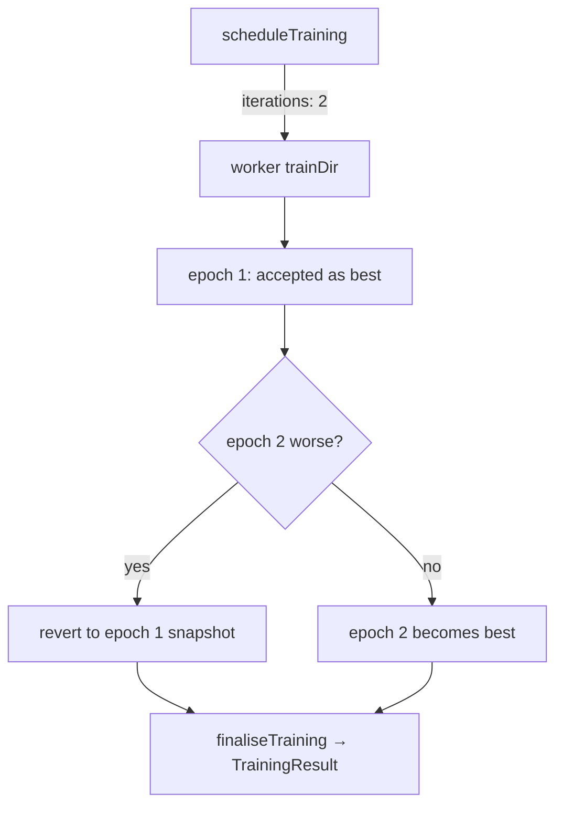

# Scheduled training runs 2 epochs; `customCost` keeps the evolution-only `trainPerGen`

## Summary

Two defects amplified the wasted backprop burn seen in GRQ #4063 (FX evolve on
GRQ-3), where every scheduled training task made the creature worse (~13× error)
and was discarded. Closes #3776.

1. **Single-epoch scheduled training could never roll back.** `NeatScheduling`
   hard-coded `iterations: 1`. With one epoch there is no earlier epoch to
   compare against, so `applyEpochOutcome` always accepted it — a regressing
   epoch became the worker's "best" result. Scheduled tasks now request
   `SCHEDULED_TRAINING_ITERATIONS = 2` epochs, matching the `TrainOptions`
   contract ("Need to run at least 2 iterations to allow rollback"). The
   per-task wall-clock budget still bounds the total work, so the second epoch
   is skipped when the budget is spent.
2. **`customCost` inherited the MSE-shaped `trainPerGen`.** `costName` keeps its
   `"MSE"` default even when a `customCost` function replaces the built-in cost,
   so `resolveDefaultTrainPerGen` scaled the default to ~20% of the population —
   roughly 10× more doomed train tasks than intended.
   `resolveDefaultTrainPerGen` now takes an explicit `hasCustomCost` flag and
   returns the evolution-only default of `1`; an explicit `trainPerGen` still
   wins.

The issue offered a second option for (1) — restoring the pre-train creature
when a single epoch regresses. That was implemented and reverted: the loop's
best snapshot is taken _before_ `applyLearnings`, so restoring it on a
single-epoch run discards that epoch's learning entirely, which broke
`test/propagate/MaximumGradientFlow.ts` and `MinimumGradientFlow.ts` (both train
with `iterations: 1` precisely to keep the applied learnings). The epoch-count
guard in `finaliseTraining` is therefore unchanged, with a comment recording
why.

## Evidence

Backend library change — no web interface to screenshot. Verified by unit tests
that call the real functions and assert on their outputs (the `TrainOptions`
dispatched to the worker, and the resolved config).



The full gate run shows the rollback engaging on real evolve tests, e.g.:

```text
Training 40d7a7a7 made the error: 36.389, worse: 36.389, target: 0.002,
  failed: 1 out of 2 iterations
```

New tests:

```text
running 12 tests from ./test/config/TrainPerGen.ts
resolveDefaultTrainPerGen - a custom cost overrides a supervised cost name ... ok
createNeatConfig - customCost falls back to the evolution-only trainPerGen ... ok
createNeatConfig - customCost with an explicit supervised costName still trains one per generation ... ok
createNeatConfig - explicit trainPerGen still wins with a customCost ... ok
running 1 test from ./test/NEAT/ScheduledTrainingIterations.ts
scheduleTraining requests at least two training epochs ... ok
```

Each fails against the unfixed code: `iterations: 1` fails the scheduling
assertion, and the two-argument `resolveDefaultTrainPerGen` returns `10` for a
`customCost` configuration.

## Test Plan

- `test/NEAT/ScheduledTrainingIterations.ts` (new) — captures the `TrainOptions`
  a stub worker receives from `scheduleTraining` and asserts `iterations >= 2`.
- `test/config/TrainPerGen.ts` — four new tests cover `hasCustomCost` in
  `resolveDefaultTrainPerGen` and the `createNeatConfig` default (including an
  explicit supervised `costName` alongside `customCost`, and an explicit
  `trainPerGen` still winning).
- Full gate: `./quality.sh --skip-discovery`.

## Documentation

- `docs/config/TRAINING.md` — records the `customCost` default and the two-epoch
  scheduling behaviour.
- `CHANGELOG.md` — entry under `[Unreleased]`.

## Security self-check

- No new external input, secrets, injection surface, or endpoints; the change is
  internal configuration defaults and a scheduled epoch count.
