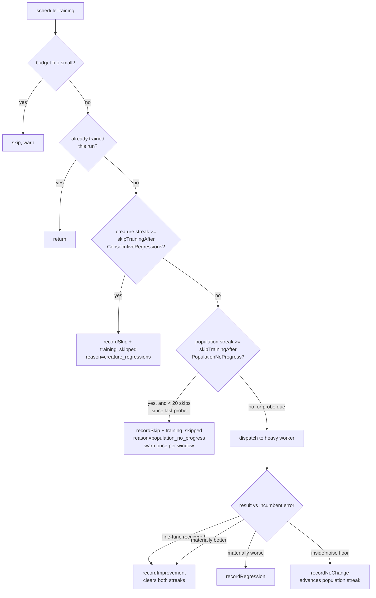

# Population-wide no-progress training skip + skip telemetry (Issue #3779)

## Summary

The `TrainingRegressionTracker` skip added by #2382 could not stop a
population-wide dead end, which is why GRQ #4064 watched Mac-Ultra dispatch ~17
doomed training tasks in a row despite wiring
`skipTrainingAfterConsecutiveRegressions=3`. Three reasons, all fixed here:

1. The skip is **per creature UUID**, and a creature is trained at most once per
   run (#3553), so a per-UUID streak almost never reaches the threshold.
2. A training result equal to the incumbent (the `🫥` outcome) took the
   `recordImprovement` path and **reset** the streak.
3. Skip lines were logged only under `verbose`, so a run-end summary could not
   see `totalSkipped` at all.

What changed:

- **New option `skipTrainingAfterPopulationNoProgress`** (default `0`, opt-in) —
  a run-level gate that stops dispatching training once the whole population has
  produced N consecutive no-progress outcomes (a regression **or** a no-change).
  Any material improvement anywhere clears the streak. While the gate is closed
  one dispatch is still let through every `POPULATION_PROBE_INTERVAL` (20)
  skips, so a population that becomes trainable again reopens the gate — without
  the probe, no outcome could ever be recorded and memetic evolution would be
  dead for the rest of the run.
- **No-change is no longer an improvement.** New
  `isTrainingErrorMaterialImprovement()` mirrors `isTrainingErrorRegression()`
  around the same noise floor; a delta inside it now calls `recordNoChange()`,
  which advances the population streak and leaves the per-creature streak alone
  (it is not a regression, but it is certainly not the improvement that should
  clear the streak).
- **Skips are visible without `verbose`.** Every skipped dispatch emits a
  `training_skipped` event (`reason`, `threshold`, `consecutiveNoProgress`,
  `totalSkipped`), and the population gate additionally logs a `warn` once per
  probe window. Per-creature skip lines stay `verbose`-only deliberately: that
  guard can fire once per creature per generation, so an unconditional line
  would be O(population) log spam each generation — the event and the totals are
  the non-verbose surface.
- **`trainingOutcomes` on every `evolve*` result** — `improvements`,
  `regressions`, `noChange`, `skipped`, `regressionRate` — so a consumer's
  run-end summary can print what training actually bought at any log level.

Non-goals respected: nothing here touches `targetError` or
`trainingTaskTimeoutMinutes`.

Closes #3779.

## Evidence

Backend/library change with no web interface, so no screenshot applies; the
evidence is the test suite and the quality gate.

Scheduling flow after the change:

Quality gate: `./quality.sh < /dev/null`. The one failure it reports,
`analyzeParallel with requireGpu=false returns structured Rust error when GPU
unavailable (Issue #2116)`,
is pre-existing and environmental — it fails identically on the unmodified
checkout (verified by stashing this branch's changes and re-running that spec)
because the container has no GPU adapter. It is untouched by this change, which
does not go near the discovery path.

## Test Plan

New/extended tests, all calling the real functions:

- `test/NEAT/PopulationTrainingSkip.ts` (new) — wires the gate into a real
  `Neat`: three distinct creatures each with a single no-progress outcome (no
  per-UUID streak reaches its threshold) now stop the next dispatch; an
  improvement anywhere keeps dispatching; the gate is off by default; and both
  skip reasons are reported through `onTrainingEvent`.
- `test/NEAT/TrainingRegressionTracker.ts` — population streak across creatures,
  no-change accounting, streak reset on improvement, threshold `0` disabling the
  gate, the 20-skip probe letting one dispatch through, and `reset()`.
- `test/NEAT/TrainingErrorComparison.ts` — `isTrainingErrorMaterialImprovement`
  happy path, identical error, 1e-9 evaluate noise, worse error, and both
  non-finite edges.
- `test/creature/EvolveTrainingOutcomes.ts` (new) — `evolveDataSet` returns
  `trainingOutcomes` with finite non-negative integer counters and a
  `regressionRate` in `[0, 1]`.
- `test/scripts/AuditOptionUsage.ts` — pinned `NeatArguments` top-level key
  count 108 → 109 for the new option, which is classified in
  `scripts/lib/optionAuditRollup.ts` so the roll-up coverage gate stays green.

Existing `test/NEAT/TrainingRegressionSkip.ts` (#2382) passes unchanged — no
test was removed or commented out.
