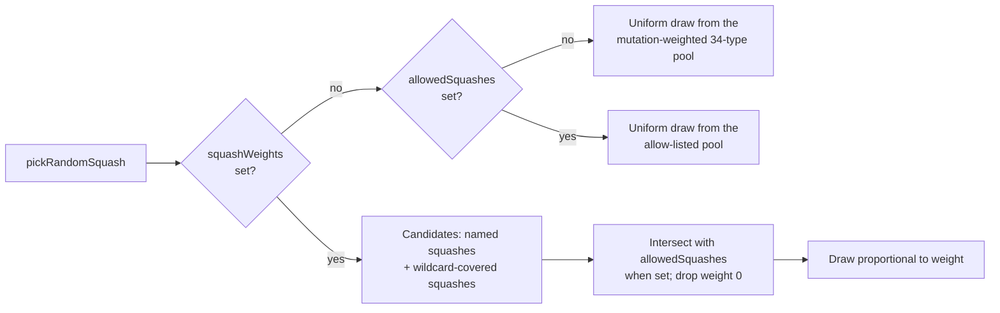

# feat: weighted soft-bias squash selection in SquashBudgetConfig

## Summary

`SquashBudgetConfig.allowedSquashes` (#3263) is a **hard** allow-list — squash
selection is either restricted to the set or unrestricted, with no way to
express a preference. This adds `squashBudget.squashWeights`, an opt-in map of
squash name to relative selection weight, so a team can strongly prefer a few
activations (e.g. the aggregates `IF` / `MINIMUM` / `MAXIMUM`) without
hard-excluding the rest. Closes #3796.

```jsonc
"squashBudget": {
  "squashWeights": { "IF": 10, "MINIMUM": 10, "MAXIMUM": 10, "TANH": 5, "*": 1 }
}
```

Semantics:

- `Activations.pickRandomSquash` samples **proportionally** to the weights.
- `"*"` is the default weight for every squash the map does not name. It only
  covers squashes evolution may normally introduce (`mutationProbability > 0`),
  so deprecated and output-only activations stay out unless named explicitly —
  naming one opts it in, matching the existing `allowedSquashes` precedent.
- `0` excludes; an absent or empty map keeps today's behaviour **exactly**
  (uniform mix, or uniform over `allowedSquashes` when set).
- Composes with `allowedSquashes`: the allow-list stays the hard boundary and
  the weights apply within it.
- Fails loud at configuration time (#3234) on an unknown name
  (`ActivationError`), a negative/NaN/non-numeric weight, two aliases of the
  same squash carrying different weights, or a combination that leaves nothing
  selectable (`ValidationError`). A rejected budget applies nothing.

Two supporting changes fell out of this:

- `Activations.setSquashBudget(allowed, weights)` installs both levers
  atomically. `createNeatConfig` now uses it, so a fresh config can never
  inherit the previous run's weights — with two separate setters, a stale
  weights map could have made a new allow-list unsatisfiable.
- `Activations.isSquashAllowed` now also answers `false` for a zero-weight
  squash, so it still means "can selection ever return this?" under either
  lever.

## Evidence

Backend/library change with no web interface, so there is no screenshot to
capture. Evidence is the test suite plus the selection benchmark.

Selection flow — the allow-list is the hard boundary, the weights are the
preference inside it:



**Quality gate:** `./quality.sh` — `8484 passed | 1 failed`. The single failure,
`analyzeParallel with requireGpu=false returns structured Rust error when GPU
unavailable (Issue #2116)`,
is **pre-existing and unrelated**: it reproduces on a clean checkout of this
branch point (`git stash` → same failure) and concerns Rust discovery GPU-error
classification in a container with no GPU adapter.

**Benchmark** (`deno bench --allow-all bench/SquashBudgetSelection.ts`, aarch64
Linux container, Deno 2.9.5, 1000 draws/iter) — the weighted draw walks a
cumulative-weight scan rather than indexing an array, and selection cost stays
flat:

| Squash pool                         | time/iter (avg) |
| ----------------------------------- | --------------- |
| Free 34-type mix (baseline)         | ~76.6 µs        |
| GPU-hostable budget (4 types)       | ~69.9 µs        |
| Soft-bias weights over the full mix | ~74.5 µs        |

This is not a performance issue, so no improvement is claimed — the numbers show
the new path costs nothing measurable on the selection hot path.

## Test Plan

New — `test/methods/activations/SquashWeights.ts` (16 cases, seeded RNG so the
proportion assertions are deterministic):

- Draws are proportional to the weights (9:1 within a sampling band).
- Wildcard keeps unlisted squashes reachable while the named ones dominate; a
  wildcard never introduces a zero-`mutationProbability` squash.
- Without a wildcard, unlisted squashes are excluded; a `0` weight excludes a
  squash the wildcard would otherwise allow.
- Aliases canonicalise (`RELU` → `ReLU`); an explicit weight can name a
  zero-mutation squash (`SOFTMAX`).
- Fail-loud cases with no partial application: unknown name, negative / NaN /
  non-numeric weight, conflicting duplicate aliases, all-zero map, and an
  allow-list that zeroes every weight.
- Composition in both orders (weights then allow-list, allow-list then weights).
- `exclude` is honoured under weighted selection, and excluding the only
  weighted squash still returns it (legacy no-change behaviour).
- `null` / `{}` restores the free mix; `resetAllowedSquashesForTesting` clears
  the weights too.

Extended — `test/config/SquashBudgetConfig.ts`:

- `parseSquashBudget` defaults `squashWeights` to `{}`, normalises the map
  (trimmed keys, numeric strings coerced), and rejects a non-object map, blank
  keys, negative weights, and non-numeric weights.
- `createNeatConfig` applies the weights globally and biases selection without a
  hard allow-list; an unknown weighted name fails loud.

Unchanged — `test/methods/activations/SquashBudget.ts` (the #3263 allow-list
suite) passes as-is, confirming the default path is untouched.
