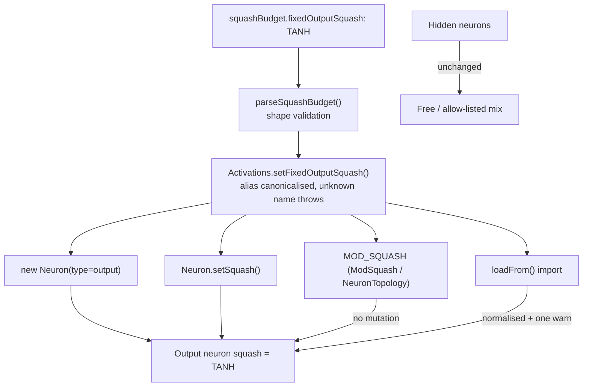

# Pin the output neuron squash against mutation (Issue #3797)

## Summary

Added the opt-in `squashBudget.fixedOutputSquash` option so an operator can pin
every **output** neuron to one activation (e.g. `TANH` for a -1..1 bounded
target). Seeding the output as `TANH` previously did not keep it there —
`MOD_SQUASH` could rewrite an output neuron to any squash in the mutation pool,
creating false paths for a bounded target. Closes #3797.

With a pin configured:

- **Output neurons are born on the pin** — the `Neuron` constructor applies it
  ahead of both the `costName` default (#2793) and an explicit
  `outputLayer.squash`.
- **Every mutation path skips them** — `ModSquash` and
  `NeuronTopology.mutate(MOD_SQUASH)` report no mutation for an output neuron,
  and `Neuron.setSquash()` (the chokepoint every rewrite — discovery,
  intelligent design, repair, fine tune — routes through) resolves back to the
  pin.
- **Imported seeds are normalised, loudly** — `loadFrom` counts output neurons
  whose squash disagrees and emits one
  `🔒 [loadFrom] Normalised N output
  neuron squash(es) …` warning per load,
  rather than silently diverging (Issue #3234). An alias of the pinned squash
  (`RELU` for `ReLU`) is not a conflict.
- **Hidden neurons are unaffected** — they keep evolving over the full pool, or
  over `squashBudget.allowedSquashes` when a budget (#3263) is also set.
- **Unknown names fail loud** at configuration time via `Activations.find()`.

Leaving `fixedOutputSquash` unset (default `""`) keeps today's behaviour exactly
— no existing run changes.

## Evidence

Backend/library change with no web interface to screenshot. Evidence is the test
suite plus the full quality gate.

Enforcement points:

Quality gate (`./quality.sh < /dev/null`): **8479 passed, 1 failed**. The single
failure is
`analyzeParallel with requireGpu=false returns structured Rust error
when GPU unavailable (Issue #2116)`
in `test/ErrorGuidedStructuralEvolution/AnalyzeParallelGpuGuard.ts` —
pre-existing and unrelated (this container has no GPU adapter). Verified by
stashing the change and re-running that spec on the base tree: it fails
identically there.

## Test Plan

New tests:

- `test/methods/activations/FixedOutputSquash.ts` — registry and neuron level:
  unset by default; alias canonicalisation (`RELU` → `ReLU`); unknown name
  throws `ActivationError` without partially applying a pin; `null`/blank
  clears; new creatures seed outputs with the pin; a conflicting explicit
  `outputLayer.squash` is normalised; `setSquash` cannot rewrite a pinned output
  while a hidden neuron still changes; no pin leaves rewrites alone.
- `test/mutate/ModSquashFixedOutput.ts` — mutation and import level: 500
  `ModSquash` mutations never move a pinned output (hidden neurons still
  change); `neuron.mutate(MOD_SQUASH)` returns `false` for a pinned output;
  without a pin outputs still evolve (regression guard for the default path); a
  seed with `LOGISTIC` outputs is normalised at import and survives a
  round-trip; an alias seed is not a conflict; hidden squashes are untouched at
  import.

Modified tests (additive field, documented here per the no-silent-test-change
rule):

- `test/config/SquashBudgetConfig.ts` — the two `parseSquashBudget` default
  assertions now also expect `fixedOutputSquash: ""`. Added cases for trimming,
  blank-means-no-pin (so a parsed config can be fed back through
  `createNeatConfig`, as `Neat` does), non-string rejection, the
  `createNeatConfig` wiring, and the fail-loud unknown-name path.
- `test/_preload.ts` — resets the new per-worker global alongside the RNG and
  squash budget.
