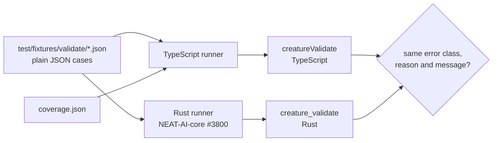

## Summary

Builds a language-neutral conformance corpus that freezes what
`creatureValidate` does today, plus a runner that replays every case against the
current TypeScript implementation. Nothing in `src/` changed — this is
description only, so validation can move into NEAT-AI-core (#3800) against an
executable definition rather than a reading of the TypeScript. Closes #3801.

- `test/fixtures/validate/*.json` — 57 plain-JSON cases in eight group files. No
  `$ref`, no comments, no code-built creatures: `JSON.parse` is the only reader,
  so NEAT-AI-core can vendor the bytes verbatim as a Rust test input.
- `test/fixtures/validate/coverage.json` — the manifest naming every validation
  site in `CreatureValidate.ts`, in source order, with the error class and
  reason it raises.
- `test/validate/CreatureValidateConformance.ts` — the runner. One `Deno.test`
  per case in the normal CI gate, plus a coverage gate that fails when a site
  loses its last case (the silent failure mode the issue calls out).
- `test/fixtures/validate/README.md` — case → rule map and the format contract.

### Creature shape: runtime, not `exportJSON()`

The issue sketched the fixture creature as `exportJSON()`-shaped. That shape
cannot carry most of the corpus: `loadFrom` canonicalises neuron order, resolves
UUIDs to fresh integer ids and repairs invalid `IF` neurons, so a duplicate id,
a constant after a hidden, an input neuron whose id is not its index, or a
non-finite bias can never reach the throw site being pinned. The cases therefore
use the runtime (`CreatureInternal`) shape — an existing interface in this repo,
and what a Rust `creature_validate` receives after its own load step. Two
conventions cover what JSON has no literal for: `null` means absent
(`undefined`), and `"Infinity"` / `"-Infinity"` / `"NaN"` carry the non-finite
values. Rationale is in the fixtures README.

### Findings recorded, not fixed

Authoring the corpus surfaced six throw sites that no input can reach, and one
no fixture can describe. They are recorded in `coverage.json` with `status`
`shadowed` / `not-expressible` and pinned by cases asserting what _actually_
happens — a Rust port needs to know which branches are dead before copying them.

- `HIDDEN_BIAS_UNDEFINED`, `HIDDEN_BIAS_NOT_FINITE` — the generic non-input bias
  check fires first (`Number.isFinite` is false for `undefined` and `NaN`).
- `SYNAPSE_TO_INPUT` — the target input neuron fails `INPUT_HAS_INWARD` in the
  earlier neuron loop.
- `WASM_FORWARD_ONLY`, `WASM_STRUCTURAL`, `WASM_CYCLE` — the `forwardOnly` leg
  runs last and the TypeScript loops reject every defect it looks for.
- `NEURON_CREATURE_MISMATCH` — `neuron.creature !== creature` is TypeScript
  object identity; no JSON can express it, so it stays with the hand-written
  tests.

The duplicate-synapse discrepancy flagged in the issue (`TopologyError` /
`INVALID_CONNECTION` despite `ValidationErrorName` declaring
`DUPLICATE_SYNAPSE`) is recorded in that case's `notes` against
stSoftwareAU/NEAT-AI-core#556, not resolved here.

## Evidence

Backend/test-only change — no web interface to screenshot. The evidence is the
runner passing against an unmodified `src/architecture/CreatureValidate.ts`
(`git diff` touches no file under `src/`):

```text
running 57 tests from ./test/validate/CreatureValidateConformance.ts
conformance forward-only: forward-only-backward-synapse-shadowed ... ok (1ms)
…
conformance corpus: case names are unique ... ok (114µs)
conformance corpus: every throw site is accounted for ... ok (709µs)
ok | 57 passed | 0 failed (14ms)
```



## Test Plan

- **Added** `test/validate/CreatureValidateConformance.ts` — replays all 57
  corpus cases; asserts the exact `stats` object for `"ok"` cases and the error
  class, `reason` and message fragment for `"throws"` cases. Two extra gates:
  unique case names, and every site in `coverage.json` accounted for (with a
  covered throw site's declared error/reason matching its cases).
- **Added** `test/validate/CreatureValidateConformanceLoader.ts` — 12 tests
  driving the corpus and coverage parsers with malformed input (bad JSON,
  unknown keys, missing `id`, a non-sentinel bias string, a throwing case with
  no `reason`, an `"ok"` case with no `stats`, an empty file, a shadowed site
  with no note, a duplicate site id, a covered throw site with no error class),
  asserting each fails loudly rather than being skipped, plus the builder's
  `null` → `undefined` and sentinel → non-finite mapping.
- **Unchanged** `test/validate/CreatureValidate.ts` and
  `test/architecture/CreatureValidateErrorMessages.ts` — the corpus adds
  coverage beside the hand-written tests, it does not replace them.
- Full `./quality.sh` run: **8533 passed, 2 failed** — both failures are
  pre-existing on the milestone branch and unrelated to this change.
  `test/docs/BrandAssets.ts` and `test/docs/BrandPreviewSvg.ts` both fail
  because `scripts/brand/preview_specs.ts` lists `neat-ai-forests.png` while
  `docs/brand/social-previews/` has no such file:
  `git ls-tree 4ea2e65c
  docs/brand/social-previews/` (the branch head before
  this work) already has no `forests` entry, and this branch's only new commit
  touches `test/` and `AGENTS.md`. Repo-wide `deno lint` likewise reports one
  pre-existing `no-import-prefix` problem in
  `scripts/brand/render_social_previews.ts`. Neither is in scope for #3801; both
  belong with the brand-preview work that landed them.
