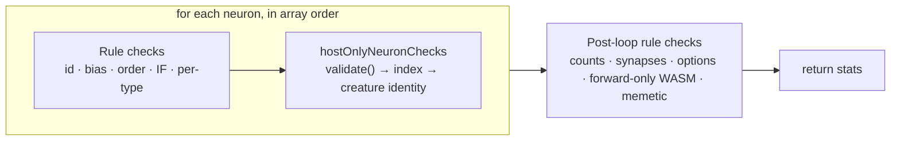

## Summary

Separates `creatureValidate`'s **host-only** checks from its **portable rule**
checks as a pure refactor, so the later WASM swap (#3803) is "replace the rule
half with one call" rather than a rewrite of the file. No behaviour change:
messages, reason codes, error classes, the `stats` return value and the option
semantics (`neurons`, `connections`, `feedbackLoop`, `forwardOnly`) are all
untouched. Closes #3802.

- `src/architecture/CreatureValidate.ts` — the four host-only items are now in
  one place, `hostOnlyNeuronChecks(creature, neuron, indx)`: `neuron.validate()`
  for `hidden` and `output` neurons, the `neuron.index` cache field, and the
  `neuron.creature` object identity. Its doc comment states why each cannot move
  to Rust — object identity and in-memory caches have no serialised form to hand
  a WASM validator. `debugWrite` is unchanged and stays reachable from both
  halves; it is a diagnostics side effect, not a check.
- The module comment now records the **throw-ordering contract** the rule half's
  replacement has to reproduce.
- No rule code was deleted, no exported signature changed, and no new public
  export was added — `hostOnlyNeuronChecks` is file-local.

### Ordering: interleaved, not a second pass

The issue sketched `hostOnlyChecks(creature)` as a walk over `creature.neurons`.
A separate walk would change behaviour: `creatureValidate` is
first-failure-wins, and the host-only checks currently fire **inside** the
neuron loop, after that neuron's rule checks and before the next neuron's. A
creature whose neuron 0 has a stale `index` and whose neuron 2 has no inward
connections throws the index error today; a host-only pass placed after the loop
would throw the connectivity error instead. So the extracted function is
per-neuron and called from exactly where those checks fired before.



The two rule boxes are what #3803 replaces with a WASM call;
`hostOnlyNeuronChecks` stays in TypeScript whatever else moves.

## Evidence

Backend-only change with no web interface, so there is no screenshot to capture.
The evidence is the unchanged behaviour of the existing suites plus the new
ordering spec.

- `test/validate/CreatureValidateConformance.ts` — the #3801 conformance corpus
  (57 cases + the coverage gate) passes **unchanged**; no fixture and no
  `coverage.json` site was edited, because no throw site moved, was added or was
  removed.
- `test/validate/CreatureValidate.ts` and
  `test/architecture/CreatureValidateErrorMessages.ts` pass unchanged.
- The new ordering spec was written **before** the refactor and passed against
  the unmodified file, so it pins current behaviour rather than the new shape.

```text
deno test test/validate/*.ts test/architecture/CreatureValidateErrorMessages.ts
ok | 120 passed | 0 failed
```

Pre-existing, unrelated: `test/creature/CreatureTrainEvolve.ts` `train_*` cases
fail identically on the parent commit in this sandbox
(`MockWorker.postMessage`), both with and without this change.

## Test Plan

Added `test/validate/CreatureValidateHostOnlyOrdering.ts` — six cases pinning
the interleaving the module comment documents, none of which the JSON corpus can
express:

- a hidden neuron breaching both halves (no outward connections **and** no
  squash) still throws the **rule** error `NO_OUTWARD_CONNECTIONS`;
- `neuron.validate()` fires before the `index` check on the same neuron;
- the `index` check fires before the creature-identity check on the same neuron;
- a host-only breach on neuron 0 fires before a rule breach on neuron 2;
- a creature-identity breach inside the loop fires before the post-loop
  duplicate-synapse rule;
- `neuron.validate()` is **not** called for `input` / `constant` neurons — a
  squash on an input neuron still validates, as it does today.

Added to `test/validate/DebugWriteDiagnostics.ts`:

- `validate with DEBUG writes creatureValidate.json diagnostics` — the
  `debugWrite` path had no assertion at all, so a regression there (no dump
  written when `creature.DEBUG` is set) would only have surfaced during manual
  debugging. Redirects the dump to a temp directory via `setDiagnosticsDir` so
  parallel specs cannot collide.

Docs: `test/fixtures/validate/README.md` now names the host-only half, points at
`hostOnlyNeuronChecks`, and links the ordering spec from the
`NEURON_CREATURE_MISMATCH` "not-expressible" note.
