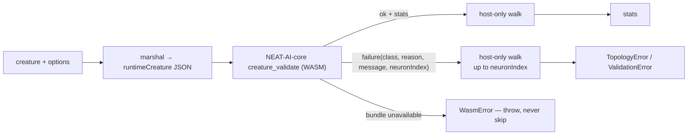

# creatureValidate: call the NEAT-AI-core WASM validator, delete the TypeScript rules

## Summary

`creatureValidate` now calls NEAT-AI-core's `creature_validate` instead of
running its own port of the rules, so NEAT-AI and its sibling consumers read one
set of validation rules rather than four. The ported rule code is **deleted** —
the neuron walk, the `IF` checks, the synapse sort / duplicate / recursive
checks, the `forwardOnly` `TypedTopology` leg and the memetic block — taking
`src/architecture/CreatureValidate.ts` from 624 lines to a 218-line wrapper of
which roughly half is documentation. Closes #3803.

What is left in TypeScript is only what cannot cross the boundary:

- the four host-only checks from #3802 (`neuron.validate()`, `neuron.index`,
  `neuron.creature`, and the `debugWrite` diagnostics dump),
- marshalling the creature and `options` into core's runtime request shape,
- rehydrating core's structured failure into the `TopologyError` /
  `ValidationError` callers already catch — `class`, `reason` and `message` come
  straight from core, so there is no translation table,
- preserving the throw ordering between the two halves.

**No fallback.** If the bundle cannot be loaded, `creatureValidate` throws a
`WasmError` carrying the loader's own failure (`getWasmLoadError()`) as `cause`.
A creature is never treated as valid because validation could not run.

### Files

| File                                          | Change                                                                 |
| --------------------------------------------- | ---------------------------------------------------------------------- |
| `src/architecture/CreatureValidate.ts`        | rewritten as a thin wrapper (624 → 218 lines)                          |
| `src/architecture/CreatureValidateMarshal.ts` | new — creature → request, and the values JSON has no literal for       |
| `src/wasm/WasmCreatureValidate.ts`            | new — the JSON bridge and its fail-loud contract                       |
| `src/wasm/WasmModuleLoader.ts`                | new `creature_validate` function pointer and `getCreatureValidateFn()` |
| `src/errors/WasmError.ts`                     | new `INVALID_REQUEST` reason for a payload that never reached a rule   |
| `src/wasm/TopologyErrorMessages.ts`           | **removed** — orphaned by the deletion                                 |
| `src/architecture/TypedTopology.ts`           | `validateForwardOnly()` retained, remaining role documented            |

### Pinned core release

`deno.json` already pins `neatCore.rev` `2ba8437` / `assetSha256 a039d58…`, the
release that carries `creature_validate` (core #562) together with the
`runtimeCreature` request shape added for this issue. `./quality.sh` step 8
re-verified it against the committed `wasm_activation/pkg/**` and
`src/wasm/WasmBundleSha256.ts` per `docs/CORE_DEPENDENCY_POLICY.md`:

```text
[8/9] Syncing WASM package from NEAT-AI-core...
wasm_activation/pkg/wasm_activation_bg.wasm: memory model wasm64 — verified.
Skipping build: wasm_activation/pkg already matches
  stSoftwareAU/NEAT-AI-core@2ba843707f7bbd6b18a19b998b6f0b1fa12ae03c
```

The bundle exports `creature_validate(request: string): string`
(`wasm_activation/pkg/wasm_activation.d.ts:423`) and the tests below drive it
for real, so no bundle change was needed and none is committed.

## Evidence

Backend/CLI change — there is no web interface to screenshot. The evidence is
the conformance corpus, the fail-loud tests and the quality gate.

### Flow



### Parity — the #3801 corpus, unchanged

All 57 cases replay green against the WASM-backed validator with no edit to a
single fixture:

```text
deno test --allow-all test/validate/CreatureValidateConformance.ts
ok | 57 passed | 0 failed (20ms)
```

`test/validate/CreatureValidate.ts` (18 cases),
`test/architecture/CreatureValidateErrorMessages.ts` (7 cases),
`test/validate/CreatureValidateHostOnlyOrdering.ts` (6 cases) and
`test/validate/DebugWriteDiagnostics.ts` (2 cases) also pass unchanged.

### Fail-loud — the regression that would matter most

`test/validate/CreatureValidateNoWasmBundle.ts` runs `creatureValidate` in a
child process where the bundle really is unavailable, two ways, and asserts it
**throws** rather than returning `stats`:

```text
Issue #3803: creatureValidate throws when the bundle was never initialised ... ok
Issue #3803: creatureValidate surfaces the loader error when the bundle
  cannot be read ... ok
```

The second case denies read access to `wasm_activation/` — the shape a JSR
consumer hits — and asserts the loader's `PermissionDenied` travels in the
message and as `cause`.

### Quality gate

```text
./quality.sh
[8/9] Syncing WASM package from NEAT-AI-core... (pin re-verified)
[9/9] Running tests (Rust scorer mode)...
ok | 8609 passed (5 steps) | 0 failed | 41 ignored (5m44s)
```

### Throughput — read this before approving

This is not a performance change, but it has a measurable performance cost and a
reviewer should see it. `creatureValidate` on an unchanging creature, 20 000
iterations after a 2 000 iteration warm-up, same machine and same pinned bundle.
"Before" is the milestone branch at `d9e8d1b`; "after" is this branch.

| Creature | Neurons | Synapses | Before (TS rules) | After (WASM) | Ratio |
| -------- | ------: | -------: | ----------------: | -----------: | ----: |
| small    |       8 |       15 |           0.49 µs |      7.51 µs | 15.3x |
| medium   |      22 |      120 |           1.86 µs |     29.89 µs | 16.1x |
| large    |      73 |     1260 |          20.90 µs |    233.24 µs | 11.2x |

Roughly 92 % of the cost is the wire format rather than the rules: on the large
creature, `JSON.stringify` is 58 µs and the WASM call (string copy + serde
parse + rules) is 145 µs, against 12 µs to build the request and 0.3 µs to read
the answer. This PR already took the obvious bite out of it by leaving the
synapse `weight` behind — no rule reads it, and dropping it took the request
from 60 825 to 32 213 bytes and the large case from 379 µs to 222 µs.

Going further means changing the ABI in NEAT-AI-core, which is out of scope here
and is filed as **stSoftwareAU/NEAT-AI#3832** with the full measurements and the
options. Nothing in that follow-up may reintroduce a TypeScript copy of the
rules or a path that skips validation to go faster.

## Test Plan

Added:

- `test/wasm/WasmCreatureValidate.ts` — 8 cases over the bridge: an unavailable
  bundle throws with and without a recorded loader error; a `malformed` answer,
  a non-JSON answer, a healthy answer with no counters and a failure with no
  detail each raise `WasmError`/`INVALID_REQUEST` rather than being read as a
  verdict; and two cases drive the real bundle for counters and for a named
  rule.
- `test/validate/CreatureValidateMarshal.ts` — 9 cases over the values JSON has
  no literal for: a `NaN`, `Infinity` or string neuron id keeps its printed
  value in the message; an earlier rule still wins over a substituted id;
  non-finite biases travel as their sentinels; a synapse carries only what the
  rules read; only the four known option keys reach core.
- `test/validate/CreatureValidateNoWasmBundle.ts` — 2 subprocess cases proving
  the no-fallback contract (above).

Removed:

- `test/wasm/TopologyErrorMessages.ts` — its module under test,
  `src/wasm/TopologyErrorMessages.ts`, is deleted. It existed to label
  `TOPOLOGY_*` / `STRUCTURAL_*` codes for `creatureValidate`, which now reads
  whole messages from core, and it had no other caller. The `TOPOLOGY_*` /
  `STRUCTURAL_*` constants themselves stay in `WasmTopologyOps.ts` — they are
  still read by `WasmBatchOps.ts`.

Unchanged and still green: `test/validate/CreatureValidateConformance.ts`,
`test/validate/CreatureValidate.ts`,
`test/architecture/CreatureValidateErrorMessages.ts`,
`test/validate/CreatureValidateHostOnlyOrdering.ts`,
`test/validate/DebugWriteDiagnostics.ts`,
`test/validate/CreatureValidateConformanceLoader.ts`.

## Reviewer notes

### The two host-side edits, and why neither is a translation table

1. **An id JSON cannot carry.** `Neuron.id` is declared `number`, so core types
   the wire field as a JSON number — but a corrupt in-memory creature can hold a
   string, a `NaN` or an `Infinity` there, and NEAT-AI's own tests build exactly
   that. Such an id travels as a non-integer placeholder, which puts core's walk
   on the identical rule at the identical neuron, and the real value is put back
   into the message on the way home. The rule, class and reason are core's,
   untouched; only the value this side could not send is restored.
2. **Declared-width ordering.** Core reports a failure's `neuronIndex`, which is
   what lets the host-only walk interleave exactly as #3802 documented. The
   three declared-width rules (the `neurons` option, `input`/`output` being
   positive integers) name no neuron — they named none in TypeScript either — so
   a creature that breaks one of them _and_ has a host-only breach now reports
   the host-only breach first. Both still throw and no creature passes that did
   not before. This is the only behaviour difference in the change, and it is
   documented in the module comment.

### Dead-code sweep

- `src/wasm/TopologyErrorMessages.ts` — removed with its test (orphaned).
- `TypedTopology.validateForwardOnly()` — **retained**, with its remaining role
  documented in its JSDoc: it is published API (`TypedTopology` is exported from
  `mod.ts` and documented in `docs/api/CREATURE.md` and
  `docs/WASM_RESIDENT_TOPOLOGY.md`) and the typed entry point to
  `WasmTopologyOps.validateTopology`, which keeps its own direct tests
  (`test/wasm/WasmTopologyOps.ts`,
  `test/wasm/WasmTopologyOpsMalformedBuffers.ts`) and shares the `TOPOLOGY_*`
  codes with `WasmBatchOps.ts`. Removing it would cascade into deleting a tested
  WASM op, which is outside this issue.
- `TypedTopology.validateStructuralIntegrity()` / `detectCycles()` — retained;
  both are still called by `test/wasm/WasmStructuralValidation.ts`.

### Security self-check

- **Input validation** — the bridge validates every field of core's answer
  before reading it, and refuses a response that is not JSON, not an object,
  carries `ok: true` with no counters, or carries a failure with no detail.
- **Injection surface** — the request is built with `JSON.stringify` over a
  typed payload; no string concatenation of creature data into the wire format.
- **Error handling** — no stack traces or paths are added to user-facing
  messages beyond the loader's own error, which is the actionable cause and was
  already surfaced this way by `WasmTopologyOps.requireWasm`.
- **Secrets / dependencies** — none added; the pinned core revision is unchanged
  and re-verified by the gate.
