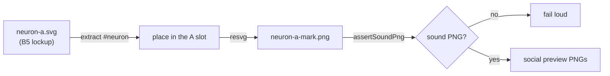

# Re-export the B5 neuron-A mark (Issue #3805)

## Summary

`docs/brand/templates/neuron-a-mark.png`, as committed in 4ea2e65c, was a
corrupt PNG — its single IDAT chunk failed both its CRC and its zlib data check,
so no decoder could read it. `@resvg/resvg-js` skips an undecodable `<image>`
silently, so every preview rendered against it came out with a blank A slot and
nothing reported a fault. Closes #3805.

The mark is now **generated, not hand-exported**:

- `scripts/brand/render_neuron_mark.ts` rasterises the mark from the signed-off
  B5 template. `scripts/brand/neuron_mark.ts` lifts the `#neuron` group out of
  `docs/brand/templates/neuron-a.svg`, drops the template's own wordmark and
  pills, and places the neuron's face in the A slot the generated lockup leaves
  open — the template's own lockup puts the neuron where the renderer draws the
  "E", so a straight rasterisation of the template lands in the wrong place.
- `scripts/brand/png_integrity.ts` (`assertSoundPng`) checks signature, chunk
  chain, CRCs, and the presence of IHDR/IDAT/IEND. The exporter checks the bytes
  before writing them and `preview_art.ts` checks them before embedding them, so
  a corrupt mark fails loud instead of rendering blank artwork.
- The family previews were re-rendered against the re-exported mark. That run
  also produced `neat-ai-forests.png` and its opaque variant, which
  `preview_specs.ts` and both brand READMEs already listed but which were never
  committed — two brand tests were failing on `Develop` because of it. The
  README family table and dependency graph gained their matching NEAT-AI-Forests
  rows.
- `@resvg/resvg-js` moved into `deno.json`'s import map, so both brand scripts
  reference it by bare specifier instead of an inline `npm:` import.



## Evidence

The re-exported mark renders in the wordmark's A slot, and the transparent
preview reads on both a light and a dark page (captured with Playwright against
the committed PNG served over `127.0.0.1`):


The opaque upload variant of the newly rendered sibling preview:


Before the fix, the committed asset failed to decode at all:

```
$ python3 -c "…inflate the IDAT chunks…"
IDAT 9191 crc BAD
inflate FAIL Error -3 while decompressing data: incorrect data check
```

and the new guard reports it in the same terms:

```
error: Error: docs/brand/templates/neuron-a-mark.png is corrupt: IDAT chunk at
byte 121 has CRC 0x187208d6, declares 0x10b7178b
```

`./quality.sh` is green apart from one pre-existing, unrelated failure —
`analyzeParallel with requireGpu=false returns structured Rust error when GPU
unavailable (Issue #2116)`
in `test/ErrorGuidedStructuralEvolution/AnalyzeParallelGpuGuard.ts`, which fails
identically on the base commit (4ea2e65c) in this container because no GPU is
present: 8518 passed, 1 failed.

## Test Plan

- `test/docs/BrandMarkIntegrity.ts` (new) — the committed mark is a sound PNG,
  and `assertSoundPng` is driven with damaged, truncated, non-PNG, and
  IHDR-renamed input. The first case is the regression test: it fails against
  the asset committed in 4ea2e65c and passes against the re-export.
- `test/docs/BrandNeuronMark.ts` (new) — the neuron group is extracted whole
  with balanced nesting; unknown ids, unclosed elements, and self-closing
  elements are handled; the built mark SVG uses the 1280×640 canvas, carries the
  gradient, and carries none of the template's lettering; the face lands on the
  A slot for both the default and a custom placement; and the committed PNG
  really has ink in the A slot and none at the canvas edges or the pill band —
  the blank-mark failure this issue is about.
- `test/docs/BrandAssets.ts` — added "every rendered brand PNG decodes", which
  inflates each asset's IDAT chunks.
- `deno test -A test/docs/*.ts` → 250 passed, 0 failed.
