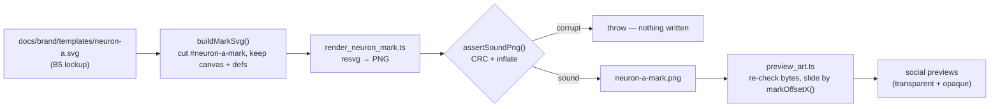

# Re-commit the B5-regenerated neuron-A mark (Issue #3805)

## Summary

`docs/brand/templates/neuron-a-mark.png` as committed in 4ea2e65c was a corrupt
PNG — its single IDAT failed both its CRC and its zlib data check — so
`@resvg/resvg-js` dropped the embedded `<image>` without complaining and every
preview rendered with a blank gap where the organic A should be. Nothing failed;
the artwork was just wrong. Closes #3805.

The mark is now **generated from the signed-off B5 lockup** rather than
hand-exported, so re-committing it is a reproducible command instead of a manual
export that can ship broken bytes:

- **`scripts/brand/neuron_mark_svg.ts`** cuts the `neuron-a-mark` group out of
  `docs/brand/templates/neuron-a.svg`, keeping the lockup's canvas and `<defs>`
  (the gradient lives there) and dropping the wordmark, subtitle, and pills. A
  missing, unbalanced, or canvas-less group throws — a silently empty mark is
  exactly the failure this exists to stop.
- **`scripts/brand/render_neuron_mark.ts`** rasterises that cut and checks the
  PNG it produced (`assertSoundPng`) **before** writing it, so a corrupt export
  can never land again. The mark carries no text, so unlike the previews it
  re-exports byte-identically on any host.
- **`scripts/brand/preview_art.ts`** validates the mark's bytes before embedding
  them, and slides the mark by `markOffsetX()` so its soma stands centred in the
  measured gap between the E and the T — the offset follows the wordmark
  whichever font the rasteriser resolves.
- **Every preview was re-rendered**, including the previously missing
  `neat-ai-forests` transparent/opaque pair, and `README.md` /
  `docs/brand/README.md` were updated for the new export step and the Forests
  entry.
- **Guards** (`scripts/brand/png_integrity.ts`,
  `test/docs/BrandMarkIntegrity.ts`, and the "every rendered brand PNG decodes"
  test in `test/docs/BrandAssets.ts`) are taken verbatim from #3804 so the two
  branches merge cleanly.

`docs/brand/templates/neuron-a.svg` is also committed in `deno fmt` form; the
re-render from the formatted source is byte-identical to the committed mark
(`sha256 59ea1cf6…`), so the reformat changes no artwork.

## Evidence

Rendered in the container's headless Chromium (Playwright MCP) against a local
static server, then screenshotted:

Left: the mark as committed in 4ea2e65c — decoding collapses partway down and
the rest is noise. Right: the mark re-exported from the lockup. Below: the
`neat-ai` opaque preview with the neuron standing in the wordmark's A slot.

Export pipeline:

Quality gate (`./quality.sh < /dev/null`): see the run log in the PR
conversation; the brand suites
(`BrandNeuronMark`, `BrandAssets`, `BrandMarkIntegrity`, `BrandPreviewSvg`,
`BrandTransparency`) pass — 33 tests.

## Test Plan

New tests in `test/docs/BrandNeuronMark.ts` (all drive the real cut against the
real lockup and read the committed PNG's own header and pixels):

- the mark carries the neuron artwork and its gradient, with balanced `<g>`
  nesting
- the mark drops the wordmark, subtitle, and pills (no `<text>`)
- the mark keeps the lockup's canvas (width, height, `viewBox`)
- a lockup with no marked group / an unclosed group / no canvas / a non-numeric
  canvas each fails loudly
- the wordmark gap holds the mark's soma, for two fonts' worth of measured glyph
  edges — the regression test for the blank-A defect
- the committed mark sits on the lockup's canvas
- the committed mark is transparent artwork, not a filled frame (corners
  transparent, sampled grid carries opaque pixels)

New tests in `test/docs/BrandMarkIntegrity.ts`:

- the committed neuron-A mark is a sound PNG — fails against the 4ea2e65c bytes
- a damaged chunk, a truncated file, non-PNG bytes, and a missing IHDR each fail
  loudly

Extended `test/docs/BrandAssets.ts`:

- "every rendered brand PNG decodes" inflates each asset's IDAT chunks, so a
  corrupt asset fails CI instead of silently producing blank artwork
