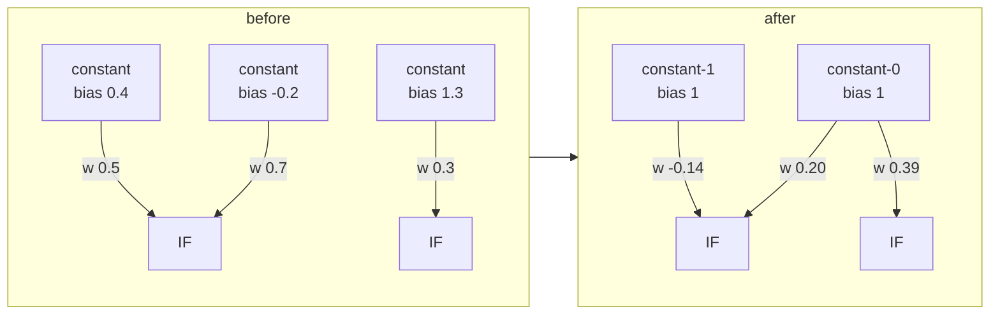
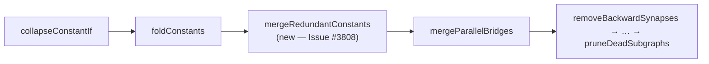

# Merge redundant constant neurons during compaction (Issue #3808)

## Summary

Generating IF-squash trees left one `type:"constant"` neuron per branch, each
with its own bias — the worst creature in the GRQ-sampler fleet snapshot carries
**277 constants with 263 distinct biases**. `src/compact/ConstantFold.ts` cannot
absorb them: it folds a constant into a consumer's _bias_, which is only valid
for additive consumers, and these constants all feed **aggregate** consumers
(`IF`/`MAXIMUM`/`MINIMUM`/`HYPOT`), which read each inbound value individually.
So they accumulated without bound. Closes #3808.

A new safe compaction pass, `src/compact/ConstantMerge.ts`, canonicalises them.
A constant contributes exactly `bias · weight` to its consumer (see
`makeSynapsesValue`), so the bias moves onto the outgoing weight:

```text
bias b × weight w   →   canonical bias 1 × weight (w · b)
```

The rewrite is **exact** — the creature's error is unchanged — while the score
improves as the redundant neurons disappear. On the worst offender: 277
constants → **2**, 275 neurons removed, worst output delta **0** across random
inputs.

Canonical constants use fixed, fleet-wide well-known UUIDs — `constant-0`,
`constant-1`, `constant-2` — in the same spirit as `input-N`/`output-N`, so
breeding aligns them across machines.

**Three slots, not one.** `creatureValidate` rejects duplicate `(from, to)`
synapses, so two inbound edges on one consumer can share a canonical constant
only when they can be _summed_ into one edge:

- **IF consumers** sum per role (`condition`/`positive`/`negative`), so one IF
  needs at most three canonical constants — one per role.
- **Other aggregates** (`MAXIMUM`/`MINIMUM`/`HYPOT`) treat every inbound value
  separately, so each synapse needs its own source. A consumer needing more
  distinct sources than there are free slots keeps the surplus constants
  unchanged — a partial merge is still exact, because a retained constant keeps
  both its bias and its weight.

Frozen constants, frozen consumers and frozen synapses are never touched (Issue
#1861 convention); merged-away constants are deleted only once they have no
outbound synapse left, and every surviving neuron keeps its UUID. Re-running the
pass is a no-op, so compaction still reaches a fixpoint.

## Evidence

Backend/CLI change — no web interface to screenshot. Evidence is the test suite
plus the production fixture below.

**Worst offender scan.** All **39** `samples/*.json` creatures in `GRQ-sampler`
were scanned. The worst constant count is **277** (263 distinct biases), and
**19 of the 39** samples tie at exactly that count — so the pile is systemic
rather than one bad creature. `GRQ-23-forests.json` is the tie-breaking pick
committed as `test/data/grq-23-forests-constants.json` (277 constants, 263
distinct biases, 2 538 exported neurons, 24 100 synapses — the committed fixture
matches the sampler file field-for-field). The lightest sample,
`Enceladus.json`, carries none.

| Metric              | Before | After the merge |
| ------------------- | -----: | --------------: |
| Constant neurons    |    277 |               2 |
| Neurons (in-memory) |  5 049 |           4 774 |
| Worst output delta  |      — |               0 |



Compaction pass order (the merge runs after the fold, so it only ever sees the
constants the fold must retain):



**TDD.** The three end-to-end tests in
`test/compact/CompactCreatureConstantMerge.ts` were written first and fail
against the unfixed compaction with `AssertionError: should have compacted`
(verified by reverting `src/compact/CompactCreature.ts` and re-running); they
pass with the new pass wired in.

**Modified existing test (documented change).**
`test/compact/CompactCreatureConstantFold.ts` — "partially folds a constant"
asserted the constant kept its original UUID (`neuron-132866057`). With the
merge in place that constant is re-pointed at `constant-0` with the bias moved
onto the weight (`0.3 · 0.5`). The assertions now check the canonical constant
and the merged weight; the behaviour under test — an aggregate consumer's
synapse is never folded into a bias — is unchanged, and no test was removed or
disabled.

**Out of scope, found while testing — filed as #3809.** Running the _full_
`compactCreature` over the new fixture changes its output, and bisecting the
safe passes shows the drift comes from `mergeParallelBridges` (Issues
#1947/#1948), not from this merge. Measuring the worst absolute output delta on
the fixture against the unmodified creature:

| Pass applied                        |                      Worst output delta |
| ----------------------------------- | --------------------------------------: |
| `mergeRedundantConstants` (this PR) |                              `0.000e+0` |
| …then `mergeParallelBridges`        | `9.416e-2` (`2.328e-1` on another draw) |

The same run also emits hundreds of
`🚨 [loadFrom] Stripping recurrent synapse … This indicates upstream corruption`
warnings, so `mergeParallelBridges` is emitting backward edges into a
forward-only creature. That is a pre-existing, separate root cause in the "safe"
floor and is **not** touched here; it is filed as #3809. The fixture test
therefore asserts exactness on the merge pass itself and asserts only the
constant-count collapse after full compaction, so the pre-existing drift cannot
mask this pass's correctness.

**Pre-existing noise, not introduced here.** The suite logs many
`Batch rust scorer reconciliation failed (INVALID_JSON): … invalid type:
sequence, expected a map`
warnings from the bench harness, after which scoring falls back to per-creature
mode. This is **pre-existing and unrelated** to this change: checking out clean
`origin/Develop` in a separate worktree and running
`bench/score_per_hour_harness_test.ts` reproduces the same warning 27 times with
none of this PR's code present. Left alone rather than widening scope.

## Test Plan

New — `test/compact/ConstantMerge.ts` (pass-level):

- one canonical constant per IF role; each weight is `w · b`; no duplicate
  `(from, to)` pairs
- re-running the pass is a fixpoint (no second-round churn)
- constants sharing an IF role are summed into one edge
- a `MAXIMUM` fed by four constants merges three and keeps the surplus constant
  untouched (bias and weight unchanged)
- frozen constants and frozen synapses are left alone
- an existing `constant-0` is reused, and its occupied slot is skipped

New — `test/compact/CompactCreatureConstantMerge.ts` (end-to-end via
`compactCreature`):

- a 12-IF forest with 24 differently-biased constants collapses to canonical
  bias-1 constants: identical outputs, lower neuron count, strictly better score
- a single IF fed three constants merges one canonical constant per role
- a `MAXIMUM` with four constants never duplicates a synapse
- **regression fixture:** `test/data/grq-23-forests-constants.json` — 277
  constants merge to ≤ 3 canonical bias-1 constants with identical outputs, a
  valid topology (`creatureValidate`, `forwardOnly`) and no duplicate synapses

Modified — `test/compact/CompactCreatureConstantFold.ts` (see above).

Docs — `docs/api/TRAINING.md` gains the merge as safe fold #4; `CHANGELOG.md`
records it under Unreleased → Added.
