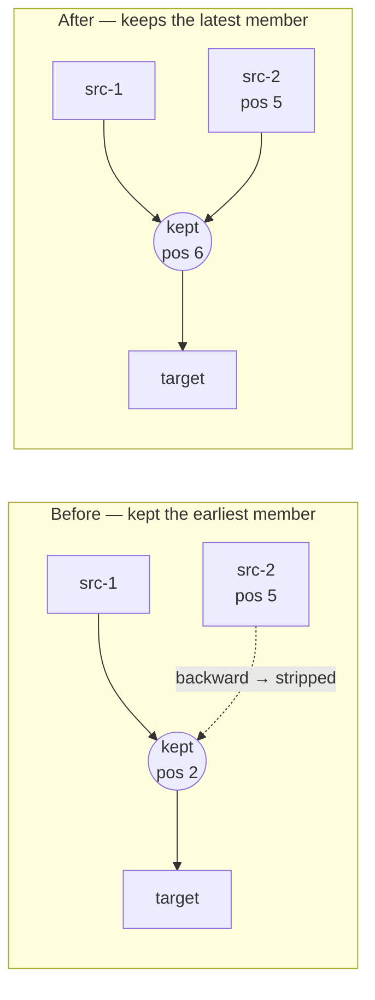

# Compact: make `mergeParallelBridges` exact (Issue #3809)

## Summary

`mergeParallelBridges` is part of the **safe (exact, lossless) compaction
floor**, but on the fleet's IF-forest creatures it changed the outputs and
emitted recurrent synapses that `loadFrom` then stripped. Two defects, both
fixed in `src/compact/ParallelBridgeMerge.ts`. Closes #3809.

1. **Wrong topological position for the merged neuron.** The pass kept
   `group[0]` — the member earliest in the export's neuron order — and
   redirected every other member's inbound synapse onto it. That order *is* the
   activation order `loadFrom` rebuilds, so each later member's source landed
   *behind* the merged neuron and its forward edge became a backward one. On a
   forward-only creature those synapses are stripped at load, silently dropping
   whole contributions. The fix keeps the member **latest** in neuron order
   (every member's source precedes its own bridge, hence the kept one) and
   declines any bridge whose own edges do not already run forward. A `assert`
   on each redirect fails loud if a backward edge could still slip through.
2. **Merging into non-additive targets.** The group key was
   `(target, squash)`, so 158 bridges feeding one **`IF`** neuron on different
   synapse roles were collapsed into a single synapse. An `IF` reads its
   `condition`, `positive` and `negative` synapses as three separate sums, so
   the merge moved terms between them. Now the target must sum the merged
   contributions: `MAXIMUM` / `MINIMUM` / `HYPOT` / `HYPOTv2` targets are
   declined outright, an `IF` target is grouped per synapse type, and the
   `condition` role — whose sum is compared against zero, where a rounding
   difference would flip the branch — is never merged.

The redirect also now moves `toUUID` alongside `toId`; UUIDs are the identity
`loadFrom` resolves first, and the old code only worked because the removed
neuron's UUID happened to be gone from the map.

### Effect on the reported fixture

`test/data/grq-23-forests-constants.json`, after `mergeRedundantConstants` then
`mergeParallelBridges`:

| | Before | After |
| --- | ---: | ---: |
| Worst absolute output delta | `9.4e-2` (`2.3e-1` on another draw) | `<1e-5` |
| Synapses stripped as recurrent at load | 158 | 0 |
| Neurons removed by the merge | 157 (incorrectly) | 157 |

The residual is float32 accumulation, not a semantic difference: collapsing 158
bridges rounds the sum once instead of 158 times. The unit test with dyadic
weights, biases and inputs — where every intermediate is exact in float32 —
asserts a **bit-for-bit identical** output.

### Where the merged neuron now lands

## Evidence

Backend-only change — no web interface to screenshot. Verified by tests:

- All five tests in `test/compact/ParallelBridgeMergeOrdering.ts` **fail against
  the unfixed pass** (the fixture test fails with
  `TopologyError: 🚨 [loadFrom] Recurrent synapse 4270->4264 … depth=-6`) and
  pass after the fix.
- `deno test "test/compact/*.ts"` — 183 passed, 0 failed.
- `./quality.sh` passes (lint, format, type-check, full test suite).

## Test Plan

Added `test/compact/ParallelBridgeMergeOrdering.ts`:

- *a source after the first bridge stays forward* — a bridge whose source sits
  after the first bridge in neuron order; asserts nothing is stripped at load
  and the outputs are unchanged.
- *a backward bridge edge is declined* — a recurrent creature whose bridge is
  fed from behind it; asserts the group is declined.
- *MAXIMUM target is declined* — a non-additive target must not be merged.
- *IF target merges per synapse type, never conditions* — 12 typed bridges into
  an `IF`; asserts only one same-type group merges, the four `condition`
  synapses are untouched, and (with dyadic values) the outputs are bit-for-bit
  identical.
- *GRQ-23-forests fixture — parallel bridge merge no longer drifts* — the
  regression fixture from #3808; asserts bridges still merge, no synapse is
  stripped at load, and the worst output delta stays below `1e-4`.

Modified (documented, per the "no silent test edits" rule):

- `test/compact/CompactTagPreservation.ts` — three tests asserted that
  *`bridge-A`* survives the merge. That is the implementation detail this issue
  changes; they now look up whichever member survives and make the same tag
  assertions on it.
- `test/compact/ParallelMergeCornerCases.ts` — the "kept neuron's source is also
  merged elsewhere" fixture listed `h2` *after* the bridge it feeds, i.e. a
  backward edge no real creature would carry. Reordered so the fixture is
  topologically valid; the scenario under test is unchanged.

Documentation: `docs/api/TRAINING.md` gains the parallel bridge merge as item 5
of the safe-fold list (it was missing) with its three exactness guards.
