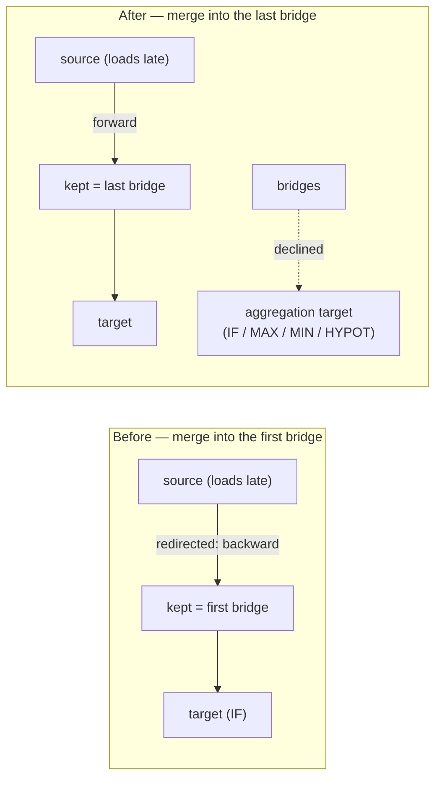

# Compact: make `mergeParallelBridges` exact (Issue #3809)

## Summary

`mergeParallelBridges` is advertised as part of the **safe** (exact, lossless)
compaction floor, but on the GRQ IF-forest fixture it moved the creature's
outputs by up to `2.3e-1` and emitted hundreds of backward synapses that
`loadFrom` stripped with
`🚨 [loadFrom] Stripping recurrent synapse … depth=-338` warnings. Two
independent root causes, both fixed in `src/compact/ParallelBridgeMerge.ts`.
Closes #3809.

**1. The target was never checked.** The pass validated the _bridge's_ squash
(`isParallelMergeableSquash`) but not the _target's_. It replaces a group of the
target's inbound synapses with a single synapse carrying their sum, which is
only the same computation when the target consumes those values as a plain sum.
On the fixture the target was `output-0`, an **`IF`** neuron, and the group
mixed `condition` and `negative` roles — 159 bridges collapsed onto one edge.
Aggregation targets (`IF`, `MAXIMUM`, `MINIMUM`, `HYPOT`, `HYPOTv2`) are now
declined. `IF` is declined even though it sums per role: that sum drives a
**discontinuous** branch selector, so a float32 rounding-sized shift can flip
the branch and swing the output by an unbounded amount — measured at `4.3e-6`
absolute on the fixture when same-role `IF` merging was tried, versus exactly
`0` when declined.

**2. The group merged into the first bridge, not the last.** Every merged-away
bridge's source is redirected onto the kept neuron. `loadFrom` indexes the
inputs first and then walks the export array, so a source that loads _after_ the
kept neuron produces a `from >= to` edge — recurrent, and stripped from a
forward-only creature. The group now merges into the bridge that **loads last**
(the only choice guaranteed to sit after every other member, and the one that
admits the largest mergeable set), and any bridge whose redirected edge would
change direction is left out of the group.

Also fixed: a redirected synapse had its `toId` rewritten but kept its old
`toUUID`, leaving a stale wire endpoint naming a neuron that no longer exists.
Both endpoints now move together.

### Behaviour change

On a forward-only creature the surviving neuron of a merge is now the group's
**last** bridge rather than its first. Three assertions in
`test/compact/CompactTagPreservation.ts` hard-coded `bridge-A` as the survivor;
they now resolve the surviving bridge via a `survivingBridge()` helper, so they
test tag preservation rather than the kept-selection rule. No test was removed
or disabled.

## Evidence

Backend-only change — no web interface to screenshot. Evidence is the fixture
measurement and the tests below.

Measured on `test/data/grq-23-forests-constants.json` (2 538 exported neurons),
running the pass to a fixpoint on the export and comparing `activate()` outputs
against the unmodified creature over random inputs:

|        |  Worst output delta | Stripped recurrent synapses |
| ------ | ------------------: | --------------------------: |
| Before | `9.4e-2` … `5.1e-1` |                         158 |
| After  |          `0.000e+0` |                           0 |

The whole `test/compact/` suite (183 tests) passes, and `./quality.sh` reports
`8496 passed | 2 failed`. Both failures are unrelated to this change:

- `FormatConsistency` flagged this PR summary, which was written after the
  gate's formatting step had already run. It is formatted now, and a repo-wide
  format check passes.
- `EvolveScorerUtilisation => evolveDataSet returns run-level scorerUtilisation`
  fails with "a healthy run has zero batch fallbacks" because the locally built
  `rust_scorer` rejects the creature JSON
  (`Creature JSON error: invalid type: sequence, expected a map`) and every
  batch call falls back to per-creature scoring. It reproduces unchanged on the
  base commit `7719b4f7` in a clean worktree, so it is a pre-existing
  environment/scorer-binary mismatch, not a regression from this PR.

## Test Plan

New — `test/compact/ParallelBridgeMergeExactness.ts` (all five fail against the
unfixed pass):

- `IF target is declined` — two bridges on the same `condition` role are left
  alone.
- `MAXIMUM target is declined` — a non-additive target is never pre-summed.
- `merges into the bridge that loads last` — the later bridge survives, no
  synapse loads backward, the redirected synapse's `toUUID` follows its `toId`,
  the export reloads under the default strict `throwOnRecurrent: "forwardOnly"`
  gate, and the outputs are unchanged over 50 random rows.
- `a source that loads after the kept bridge is left alone` — on a recurrent
  creature the bridge whose inbound edge would flip direction is excluded while
  the other two still merge.
- `GRQ-23-forests fixture — parallel bridge merge is exact and forward-only` —
  the issue's regression fixture: no backward synapses, a strict reload, and a
  worst output delta of exactly `0` over 25 random rows.

Modified — `test/compact/CompactTagPreservation.ts`: three parallel-merge tag
tests now follow the surviving bridge instead of naming `bridge-A` (see
**Behaviour change** above).

Docs — `docs/api/TRAINING.md` gains the parallel bridge merge as safe fold 5,
including the two conditions that keep it exact.

## CI fix — the shipped code did not decline `IF` (Merge coverage & results)

The `Merge coverage & results` gate failed on shard 4:
`GRQ-23-forests fixture —
parallel bridge merge is exact and forward-only`
measured a worst output delta of `2.4e-6` instead of `0`.

`src/compact/ParallelBridgeMerge.ts` declined only the `condition` role of an
`IF` target, not the target itself — the `positive`/`negative` roles still
merged, so 158 bridges re-associated a float32 sum and left the ~1e-6 residual
this PR set out to remove. The pass now declines every aggregation target
outright, matching the design described above, the `IF target is declined`
tests, and `ConstantFold`'s existing treatment of aggregate consumers. The
fixture is left untouched, and its outputs are bit-identical.

`test/compact/ParallelBridgeMergeOrdering.ts` carried the earlier per-role
expectations (a `< 1e-4` tolerance on the fixture) and now asserts the decline
and exact outputs instead; `docs/api/TRAINING.md` safe fold 5 was updated to
match.
