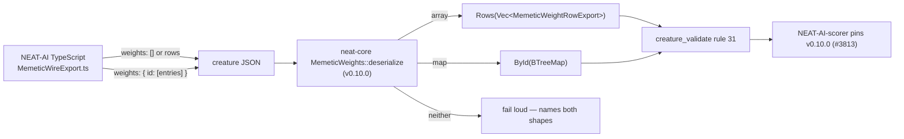

# neat-core accepts both memetic `weights` wire shapes

## Summary

`rust_scorer` rejected every creature carrying a `memetic` block with
`Creature JSON error: invalid type: sequence, expected a map`, because
NEAT-AI-core modelled `memetic.weights` as a map only while NEAT-AI writes it as
an array of `{fromUUID, toUUID, weight}` rows. The code change belongs in
**`stSoftwareAU/NEAT-AI-core`** (`neat-core/src/creature.rs`) — NEAT-AI itself
has no Rust `Creature` struct — so this issue is tracked here purely for
milestone coordination and the fix lands cross-repo. Closes #3812.

Two things were found, and only the second needed work:

1. **The tolerance already exists and is already released.** NEAT-AI-core commit
   [`86e19fe`](https://github.com/stSoftwareAU/NEAT-AI-core/commit/86e19fed92f75ba156b6fd2f394788d1e17e7d1f)
   (PR
   [NEAT-AI-core#569](https://github.com/stSoftwareAU/NEAT-AI-core/pull/569))
   replaced the map-only `BTreeMap` field with a `MemeticWeights` enum that
   dispatches on the JSON shape — `Rows` for the row array, `ById` for the
   id-keyed map — names both shapes when a value is neither, and writes back
   whichever form it read. That commit is tagged **`v0.10.0`**, so the version
   NEAT-AI-scorer pins in #3813 already carries the fix.
2. **The two shapes this issue names as the ones that actually fire were
   untested.** Nothing covered `"weights": []` — the empty row array every
   creature evolved without a memetic pass exports, and the single most common
   failing case — and nothing covered `memetic.ancestry[].weights`, which is a
   memetic record in its own right and carries the same two shapes. That gap is
   closed by the cross-repo commit below.

### Cross-repo change

Branch `issue-3812-memetic-weights-empty-and-ancestry` pushed to
`stSoftwareAU/NEAT-AI-core` (commit `7d01a70`), adding four regression tests to
`neat-core/tests/creature_memetic_weight_forms.rs`. It is tests only — no public
API or behaviour change — so the crate version stays at the released `0.10.0`
rather than forcing a fresh release NEAT-AI-scorer would have to re-pin.

### Deviation from the issue's suggested design

The issue proposed folding rows into the existing `BTreeMap` keyed by
`fromUUID`, with array form and map form deserialising to **identical**
`MemeticExport` values. The shipped design keeps the two forms distinct instead,
and that is the better contract:

- The two forms are **not** equivalent data. The row array is keyed by wire UUID
  (`input-N`, `output-N`, or a neuron `uuid`); the map is keyed by **runtime
  neuron id** with `toId` entries. Folding one into the other would mix two
  vocabularies under one key space, and rule 31 resolves a memetic reference
  through both vocabularies precisely because they are different.
- Preserving the form read is what lets a creature round trip byte-identically —
  the acceptance criterion the equality assertion would have traded away.

What the issue actually asked for — no creature is rejected for its `weights`
shape, and `[]` is not an error — holds in full.

## Evidence

Backend/Rust change with no web interface, so there is no screenshot; the
evidence is the test run and a mutation run proving those tests can fail.

Full NEAT-AI-core gate on the branch:

```text
$ ./quality.sh < /dev/null
...
running 23 tests
test an_empty_row_array_parses_to_no_weights ... ok
test the_empty_row_array_and_the_empty_map_agree_on_carrying_no_weights ... ok
test an_ancestry_snapshot_carries_the_row_form ... ok
test an_ancestry_snapshot_whose_weights_are_neither_form_fails_loud ... ok
test result: ok. 23 passed; 0 failed; 0 ignored; 0 measured; 0 filtered out
✅ All quality checks passed!
```

**Mutation evidence** (NEAT-AI-core `AGENTS.md` requires proof a new test can
fail). Two mutations of `MemeticWeights::deserialize`, both reverted:

| Mutation                                                | Result                                                                                                                       |
| ------------------------------------------------------- | ---------------------------------------------------------------------------------------------------------------------------- |
| Reject an **empty** row array inside `visit_seq`        | 3 failed / 20 passed — exactly the three new empty-form cases go red, and **no pre-existing test notices**: the gap was real |
| Drop `visit_seq` entirely (the pre-#569 map-only model) | 17 failed / 6 passed — the empty-array and ancestry cases among them, reporting the original `invalid type: sequence` error  |

The second mutation reproduces the reported failure verbatim:

```text
the creature parses: Json(Error("invalid type: sequence, expected memetic weights
as an array of {fromUUID, toUUID, weight} rows, or as a map of neuron id to
[{toId, weight}] entries", line: 18, column: 6))
```

Where the fix sits relative to this repo:



## Test Plan

Added to `neat-core/tests/creature_memetic_weight_forms.rs` in
`stSoftwareAU/NEAT-AI-core` (branch
`issue-3812-memetic-weights-empty-and-ancestry`):

- `an_empty_row_array_parses_to_no_weights` — `"weights": []` parses to zero
  rows, passes rule 31 vacuously, and is written back as `[]`.
- `the_empty_row_array_and_the_empty_map_agree_on_carrying_no_weights` — `[]`
  and `{}` agree on every observable: zero entries, identical `biases` and
  `extra`, both validate.
- `an_ancestry_snapshot_carries_the_row_form` — an `ancestry` array holding a
  row-form snapshot, an empty-array snapshot and a map-form snapshot; each reads
  back as a `MemeticExport`, and the whole history round trips.
- `an_ancestry_snapshot_whose_weights_are_neither_form_fails_loud` — a scalar
  `weights` in a snapshot still errors, naming both valid shapes.

Already covered upstream by PR #569 and left unchanged: row form parsing, map
form parsing, both round trips, a map value that is not an array, a scalar
`weights`, and the rule 31 resolution cases. The existing `creature_validate`
rule 31 tests pass unchanged.

No NEAT-AI (this repo) source change: the struct being fixed lives in
NEAT-AI-core, and the scorer-side pin is #3813.
