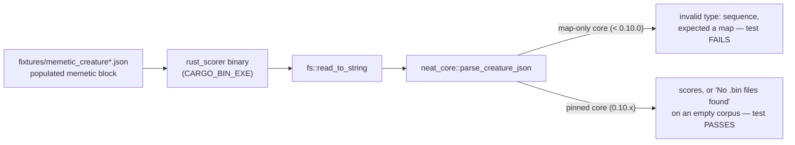

# PR summary — Issue #3813

## Summary

`rust_scorer` died before doing any work on **every** creature carrying a
`memetic` block, so every NEAT-AI evolve run quietly fell back to WASM scoring
hundreds of times per `./quality.sh`:

```text
Error: Creature JSON error: invalid type: sequence, expected a map at line 1 column 567
```

NEAT-AI serialises `memetic.weights` as a JSON **array** — usually the empty
array `[]`, because a creature evolved without a memetic pass still writes the
key — while the Rust `MemeticExport::weights` field was a map.

The deserialiser fix landed in `stSoftwareAU/NEAT-AI-core` **0.10.0**
(`MemeticWeights`, neat-core #569, hardened by neat-core #570 for #3812), and
`stSoftwareAU/NEAT-AI-scorer` already pins that release, so **no version bump
was outstanding** — `neat-core.expected-version` was moved to `0.10.0` in
NEAT-AI-scorer#576, and 0.10.1 is non-breaking patch drift the version gate
already allows. What #3813 was actually missing was a regression gate holding
the guarantee **from the binary's side**, which is what this work adds.

The code change lands in `stSoftwareAU/NEAT-AI-scorer` on branch
`issue-3813-memetic-creature-parse-regression`; this repo carries the
coordination record only. Closes #3813.

### What landed in NEAT-AI-scorer

- `rust_scorer/tests/memetic_creature_parse.rs` — feeds committed fixtures to
  the **compiled** `rust_scorer` binary, so the `fs::read_to_string` →
  `parse_creature_json` path the CLI actually takes is the path under test.
- `rust_scorer/tests/fixtures/memetic_creature.json` — trimmed evolved export
  with a populated array-form `memetic.weights`.
- `rust_scorer/tests/fixtures/memetic_creature_empty_weights.json` — the same
  creature with `"weights": []`, the shape that fires in practice.
- Both fixtures carry `memetic.ancestry[]` snapshots whose `weights` are also
  array-form — one populated, one empty.
- `neat-core.expected-version` — records why the baseline **stays** 0.10.0.
- `CHANGELOG.md` and `docs/archive/pr-summaries/pr-summary-neat-ai-3813.md`.

## Evidence

Backend/CLI change — no web interface to screenshot. The evidence is the
bidirectional verification #3813 asks for, run against two sibling
`NEAT-AI-core` checkouts.

### Against the old, map-only neat-core (0.9.12)

```text
$ ./target/debug/rust_scorer --gpu off rust_scorer/tests/fixtures/memetic_creature.json /tmp/empty
Error: Creature JSON error: invalid type: sequence, expected a map at line 27 column 15
exit=1
$ ./target/debug/rust_scorer --gpu off rust_scorer/tests/fixtures/memetic_creature_empty_weights.json /tmp/empty
Error: Creature JSON error: invalid type: sequence, expected a map at line 27 column 15
exit=1
```

The new CLI-level tests are red there (the library-level assertions cannot even
compile against 0.9.12, which has no `MemeticWeights`):

```text
running 2 tests
test cli_reaches_the_corpus_check_instead_of_dying_on_the_memetic_block ... FAILED
test cli_scores_a_creature_carrying_a_populated_memetic_block ... FAILED

memetic_creature.json: the memetic parse regression is back:
Error: Creature JSON error: invalid type: sequence, expected a map at line 27 column 15
```

### Against the pinned neat-core (sibling clone at 0.10.1)

The manual check from #3810 reproduces clean — the binary gets past the parse
and reaches real work:

```text
$ ./target/debug/rust_scorer --gpu off rust_scorer/tests/fixtures/memetic_creature.json /tmp/empty
Error: No .bin files found in training data directory '/tmp/empty'
$ ./target/debug/rust_scorer --gpu off rust_scorer/tests/fixtures/memetic_creature_empty_weights.json /tmp/empty
Error: No .bin files found in training data directory '/tmp/empty'
```

```text
running 5 tests
test an_empty_memetic_weight_array_parses_to_no_rows ... ok
test a_populated_memetic_weight_array_keeps_its_rows ... ok
test ancestry_snapshots_keep_their_array_form_weights ... ok
test cli_reaches_the_corpus_check_instead_of_dying_on_the_memetic_block ... ok
test cli_scores_a_creature_carrying_a_populated_memetic_block ... ok

test result: ok. 5 passed; 0 failed
```

NEAT-AI-scorer's `./quality.sh` was run end to end:

- shellcheck and every guard script pass, including the neat-core version gate;
- `cargo deny check` reports advisories, bans, licences and sources all OK;
- `cargo fmt`, `clippy -D warnings`, `check`, `build`, `doc` (with
  `RUSTDOCFLAGS=-D warnings`) and the release build are clean;
- the full suite is green — 285 unit tests plus every integration target, 0
  failed.

Two stages could not run in this container because the tools are absent from the
image, not because of this change: `codespell` (no `pip`/`pipx` available to
install it) and `bats`. `markdownlint-cli2` was run over the repository instead
and reports 0 issues in 185 files; CI runs both missing stages for real.

### Where the gate sits



## Test Plan

All tests live in `stSoftwareAU/NEAT-AI-scorer`,
`rust_scorer/tests/memetic_creature_parse.rs`:

- `cli_scores_a_creature_carrying_a_populated_memetic_block` — the binary scores
  both fixtures against `identity_data.bin`; near-zero error and 4 records, so
  the memetic block moves no score component.
- `cli_reaches_the_corpus_check_instead_of_dying_on_the_memetic_block` — the
  #3810 manual check as a test: with an empty data directory the first failure
  must be `No .bin files found`, never `invalid type: sequence, expected a map`.
- `an_empty_memetic_weight_array_parses_to_no_rows` — `"weights": []` parses to
  the row form with no rows, and the rest of the memetic block survives.
- `a_populated_memetic_weight_array_keeps_its_rows` — the populated array keeps
  its `fromUUID` / `toUUID` row.
- `ancestry_snapshots_keep_their_array_form_weights` — both `memetic.ancestry[]`
  snapshots survive with their array-form `weights`, populated and empty.

No NEAT-AI source changed, so no NEAT-AI test changed.
