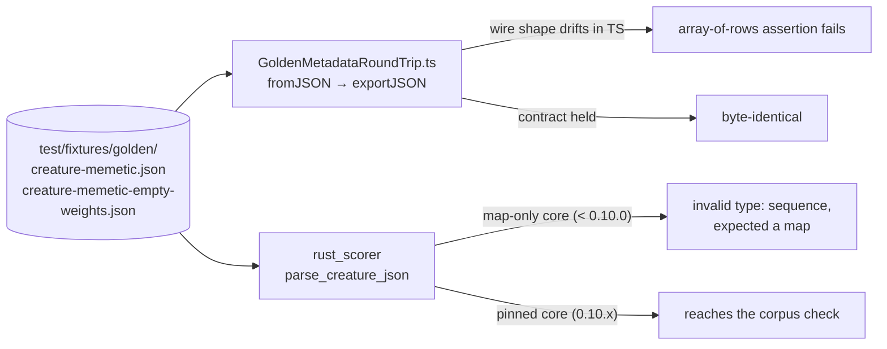

# PR summary — Issue #3814

## Summary

Issue #3810 — `rust_scorer` dying with `invalid type: sequence, expected a map`
on **every** creature carrying a `memetic` block — got past the cross-engine
contract gate because no golden fixture pinned the memetic **wire shape**. The
existing `creature-metadata.json` does carry a `memetic` block, but nothing
asserted that `weights` is an array of `{fromUUID, toUUID, weight}` rows, and no
fixture carried `ancestry[]` or the empty `"weights": []` form that actually
fires in production runs.

This closes that gap on the TypeScript side:

- **`test/fixtures/golden/creature-memetic.json`** — populated `memetic.weights`
  (5 rows), populated `memetic.biases`, and two `ancestry[]` snapshots: one with
  its own populated `weights`/`biases`, one pinning `"weights": []`.
- **`test/fixtures/golden/creature-memetic-empty-weights.json`** — the same
  creature with the production shape: top-level `"weights": []`, populated
  `biases`, and an ancestry snapshot that is also `"weights": []`.
- **`test/creature/GoldenMetadataRoundTrip.ts`** — five new tests round-trip
  both fixtures through export → normalise → import, assert the `memetic` block
  survives byte-identically, and assert the array-of-rows wire shape for **every
  snapshot of every committed fixture**, ancestry included.
- **`test/fixtures/golden/README.md`** — documents the canonical memetic wire
  shape, why `weights` is an array while `biases` is a map, and the rule that
  every engine must parse every fixture committed there (with the `rust_scorer`
  command to check).

Both fixtures are engine output, not hand-typed JSON: each was produced by
loading a hand-authored creature through `Creature.fromJSON` and writing
`exportJSON()`, so the committed bytes are exactly what the reference
implementation emits.

No production source changed — this is the "cannot regress silently again" half
of #3810. Closes #3814.

## Evidence

Backend/test-fixture change with no web interface, so no screenshot. The
evidence is the bidirectional cross-engine verification the issue asks for.

### The fixtures parse with the fixed `rust_scorer`

`rust_scorer` as built by this repo's `./quality.sh` step 7, against the sibling
`neat-core` 0.10.0 — the release carrying the `MemeticWeights` deserialiser fix
(neat-core #569, commit `86e19fe`). An empty corpus directory is used so the
first thing that can fail after the parse is the corpus check; reaching it
proves the creature JSON parsed:

```text
$ for f in creature-metadata creature-memetic creature-memetic-empty-weights; do
    ~/auto-issue-work/NEAT-AI-scorer/target/release/rust_scorer --gpu off \
      test/fixtures/golden/$f.json /tmp/empty-corpus
  done
--- creature-metadata
Error: No .bin files found in training data directory '/tmp/empty-corpus'
exit=1
--- creature-memetic
Error: No .bin files found in training data directory '/tmp/empty-corpus'
exit=1
--- creature-memetic-empty-weights
Error: No .bin files found in training data directory '/tmp/empty-corpus'
exit=1
```

### Reverting the Rust deserialiser fix turns the fixtures red

`rust_scorer` rebuilt in a throwaway worktree against `neat-core` at `3e84d2e`
(0.9.12) — the commit **before** the `MemeticWeights` fix (`86e19fe`, neat-core
#569):

```text
$ /tmp/revertcheck/target/debug/rust_scorer --gpu off \
    test/fixtures/golden/creature-memetic.json /tmp/empty-corpus
Error: Creature JSON error: invalid type: sequence, expected a map at line 71 column 15
exit=1

$ /tmp/revertcheck/target/debug/rust_scorer --gpu off \
    test/fixtures/golden/creature-memetic-empty-weights.json /tmp/empty-corpus
Error: Creature JSON error: invalid type: sequence, expected a map at line 71 column 15
exit=1

$ /tmp/revertcheck/target/debug/rust_scorer --gpu off \
    test/fixtures/golden/creature-metadata.json /tmp/empty-corpus
Error: Creature JSON error: invalid type: sequence, expected a map at line 91 column 15
exit=1
```

Line 71 of the empty-weights fixture is `"weights": []` — the empty array alone
is enough to kill the pre-fix deserialiser, which is exactly the production
shape #3810 hit. That satisfies the acceptance criterion: reverting the Rust fix
makes the scorer-side check fail against the newly committed bytes.

### The TypeScript gate is loud on TS-side drift

Rewriting `creature-memetic.json`'s `memetic.weights` into the map form the Rust
struct used to expect turns three of the new tests red:

```text
golden memetic fixture carries a populated memetic block (#3814) ... FAILED
  AssertionError: creature-memetic.json: memetic weights must be an array of rows, not a map
every golden fixture serialises memetic weights as rows (#3814) ... FAILED
  AssertionError: creature-memetic.json snapshot 0: memetic weights must be an array of rows, not a map
golden memetic fixtures round-trip byte-identically (#3814) ... FAILED
  AssertionError: creature-memetic.json: the memetic block must survive export → normalise → import byte-identically
FAILED | 6 passed | 3 failed
```

Restored, the gate is green:

```text
running 9 tests from ./test/creature/GoldenMetadataRoundTrip.ts
golden fixture covers every creature metadata surface (#3752) ... ok
golden fixture round-trips byte-identically (#3752) ... ok
golden fixture uuid is the deterministic structural uuid (#3752) ... ok
golden fixture round trip is idempotent (#3752) ... ok
golden memetic fixture carries a populated memetic block (#3814) ... ok
golden memetic fixture pins the empty weights array (#3814) ... ok
every golden fixture serialises memetic weights as rows (#3814) ... ok
golden memetic fixtures round-trip byte-identically (#3814) ... ok
golden memetic fixture uuid is the deterministic structural uuid (#3814) ... ok

ok | 9 passed | 0 failed
```

### Where the two halves of the gate sit



## Test Plan

Added to `test/creature/GoldenMetadataRoundTrip.ts` (the four Issue #3752 tests
are unchanged):

- `golden memetic fixture carries a populated memetic block (#3814)` — the
  populated fixture has non-empty array-form `weights`, non-empty `biases`, an
  `ancestry[]` snapshot with its own populated `weights`/`biases`, and an
  ancestry snapshot pinning `"weights": []`.
- `golden memetic fixture pins the empty weights array (#3814)` — the
  empty-weights fixture's top-level and ancestry `weights` are arrays of length
  zero, shipped alongside populated `biases`.
- `every golden fixture serialises memetic weights as rows (#3814)` — walks the
  full snapshot tree of **every** committed fixture and asserts each `weights`
  is an array whose rows carry exactly `fromUUID`, `toUUID` and `weight`. This
  is the assertion that would have caught #3810.
- `golden memetic fixtures round-trip byte-identically (#3814)` — export →
  normalise → import for both fixtures: the `memetic` block matches
  byte-for-byte, the whole file re-serialises verbatim, and a second cycle does
  not drift.
- `golden memetic fixture uuid is the deterministic structural uuid (#3814)` —
  strips the recorded uuid and confirms `CreatureUtil.makeUUID` recomputes it.

Deleting or emptying either fixture fails the gate at load time rather than
silently reducing coverage, because `readFixtures` rejects on a missing file and
`memeticOf` asserts the block is present.

Documentation updated in the same change: `test/fixtures/golden/README.md`
(canonical wire shape, per-fixture table, the `rust_scorer` verification
command), `docs/README.md` and `AGENTS.md` (both pointed at "the golden metadata
fixture", singular).

### Quality gate

`./quality.sh` is green apart from one pre-existing, unrelated failure:
`analyzeParallel with requireGpu=false returns structured Rust error when GPU
unavailable (Issue #2116)`
in `test/ErrorGuidedStructuralEvolution/AnalyzeParallelGpuGuard.ts`, which
expects the Discovery library to classify a missing GPU adapter as
`GpuPermanent` and gets `data_validation` in this container. Confirmed
pre-existing by stashing every change in this branch and re-running that single
test — it fails identically. This PR changes no production source, only test
fixtures, one test file and documentation.

```text
FAILED | 8554 passed (5 steps) | 2 failed | 4 ignored (6m51s)
```

The second failure in that run was `deno fmt --check` on this summary file,
which had not yet been formatted; `deno fmt` was run and the file is now clean.
