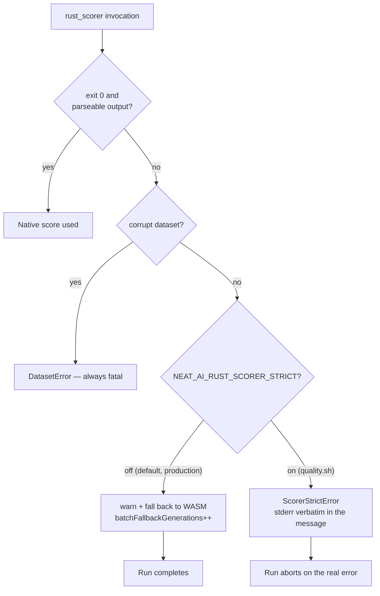

# Fail loud: treat a rust_scorer failure as fatal under `quality.sh`

## Summary

A `rust_scorer` exec or parse failure was logged and reconciled to a successful
run via the WASM fallback. That is the right production behaviour, but in CI it
let an entirely dead native scoring path look green — Issue #3810 had the scorer
rejecting **every** creature carrying a `memetic` block for an unknown length of
time, visible only as stderr noise plus one utilisation assertion.

This adds an opt-in strict mode, `NEAT_AI_RUST_SCORER_STRICT=1`, and turns it on
in `quality.sh`. Closes #3815.

- `src/errors/ScorerStrictError.ts` (new) — typed error carrying the scorer's
  stderr **verbatim** (never trimmed or whitespace-collapsed), its exit code, and
  a `reason` (`EXEC_FAILURE` / `INVALID_OUTPUT` / `BATCH_FALLBACK`). The stderr
  is appended to the message under a `--- rust_scorer stderr ---` heading so the
  real diagnostic *is* the failure text. Exported from `mod.ts`.
- `src/config/RustScorerConfig.ts` — new `strict` field, resolved from
  `NEAT_AI_RUST_SCORER_STRICT` in `getEnvRustScorerConfig()`, default `false`.
- `src/score/RustScorerBridge.ts` — under strict, a non-zero exit, non-JSON
  stdout, a non-finite `error` value, or a runner exception throws instead of
  warning and returning `undefined`.
- `src/score/BatchRustScorerBridge.ts` — under strict, a non-zero exit or an
  unreconcilable stdout throws `ScorerStrictError` (with the reconciler's
  `BatchScorerError` preserved as `cause`) rather than the retryable
  `BatchScorerError`.
- `src/architecture/Fitness.ts` — under strict the batch **fallback itself** is
  fatal: the generation aborts instead of quietly re-scoring on the per-creature
  worker path.
- `quality.sh` — the test step now exports `NEAT_AI_RUST_SCORER_STRICT=1` (and
  explicitly `0` on the `--wasm-scorer` comparison run, so a leftover operator
  export cannot leak in).

Default behaviour is unchanged: without the flag, production still degrades
gracefully to WASM. A missing or too-old binary stays a graceful skip in **both**
modes, so contributors without `rust_scorer` installed are unaffected — only
genuine exec/parse failures throw.

`test/creature/EvolveScorerUtilisation.ts` keeps its
`batchFallbackGenerations === 0` assertion as the belt-and-braces second layer:
if the strict wiring in `quality.sh` were ever removed, that assertion still
fails on any generation that fell back.

## Evidence

Backend/CLI change — no web interface to screenshot. Verified by the tests
listed below plus a full `./quality.sh` run (which now exercises the real
`rust_scorer` with strict mode on).



Strict-mode failure text (from the new unit test) keeps the multi-line stderr
intact instead of collapsing it into a single warning line:

```text
Rust scorer batch call failed (exit 101) for 1 creature(s) in /tmp/…
--- rust_scorer stderr ---
Error: failed to deserialise creature 9f1c-4d2a
  caused by: unknown field `memetic`, expected one of `neurons`, `synapses`
  at src/creature.rs:214
```

## Test Plan

- `test/score/RustScorerStrictMode.ts` (new, 9 cases) — both branches of every
  failure mode:
  - per-creature non-zero exit: falls back with strict off; throws
    `EXEC_FAILURE` with `stderr` byte-identical to the scorer's output, and the
    message quoting it, with strict on;
  - per-creature non-JSON stdout and non-finite `error`: fall back with strict
    off, throw `INVALID_OUTPUT` with strict on;
  - an unresolvable binary stays a graceful skip **with strict on**;
  - batch non-zero exit: `BatchScorerError` (retryable) with strict off,
    `ScorerStrictError` with verbatim stderr with strict on;
  - batch reconciliation failure: throws `INVALID_OUTPUT` with the
    `BatchScorerError` preserved as `cause`.
- `test/architecture/FitnessBatchStrictMode.ts` (new, 2 cases) — with strict on,
  `Fitness.calculate()` rejects with the scorer's stderr and the worker path is
  never reached (`evaluateCallCount === 0`, `lastBatchFallbackOccurred === false`);
  with strict off, the same failure falls back and every creature still scores
  finitely.
- `test/architecture/FitnessBatchFallbackCounted.ts` — unchanged assertions;
  `strict: false` is now pinned explicitly with a comment, because it asserts the
  graceful production fallback that `quality.sh` would otherwise make fatal.
- Existing scorer tests that build a `RequiredRustScorerConfig` now declare
  `strict: false` explicitly — no assertion changed.
- `./quality.sh` — green with `NEAT_AI_RUST_SCORER_STRICT=1` on the real
  `rust_scorer` binary.

## Docs

- `docs/TROUBLESHOOTING.md` — `NEAT_AI_RUST_SCORER_STRICT` added to the
  environment-variable reference, plus a CI symptom entry.
- `docs/troubleshooting/CI.md` — how to read a `ScorerStrictError`, and why
  muting the gate is the wrong fix.
- `quality.sh --help` — documents the forced strict-mode export under "Native
  gates (fail loud, no silent WASM fallback)".
