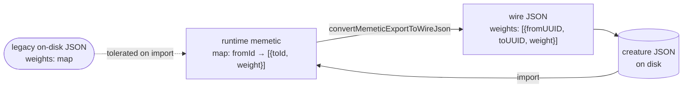

# Define the canonical memetic `weights` wire shape and emit only that

## Summary

Issue #3810 happened because the memetic `weights` wire format had **two** legal
shapes: TypeScript's wire type admitted both a row array and a legacy map, the
runtime type was map-only, and Rust was map-only — so a producer could
legitimately emit either and the Rust scorer died on the one it did not expect.
Making Rust tolerant stopped the bleeding; this change removes the ambiguity so
the next field with a dual shape does not repeat it. Closes #3816.

**One normative definition.** `test/fixtures/golden/README.md` §"The canonical
memetic wire shape" is now the single normative location, and records _why_:
`weights` is an array of `{ fromUUID, toUUID, weight }` rows — `[]` is the only
canonical empty value, and an omitted key, `null` and `{}` are all
non-canonical; `biases` is an object keyed by wire identity, empty as `{}`. The
from → to asymmetry is explained, as is why the runtime type stays a map keyed
by the integer neuron id. `src/blackbox/MemeticWireData.ts` and
`docs/snapshot-schema.json` link back to it rather than restating it.

**One producer, one shape.** `convertMemeticExportToWireJson`
(`src/creature/MemeticWireExport.ts`) now writes both keys on every snapshot
instead of passing an unexpected value through, and recurses through the whole
ancestry chain. Three holes are closed:

| Input                                     | Before                | After                        |
| ----------------------------------------- | --------------------- | ---------------------------- |
| snapshot with no `weights` / `biases` key | key absent on export  | `[]` / `{}`                  |
| `biases` arriving as an array             | bare `[]` on the wire | `{}`                         |
| ancestry nested more than one level       | left as a runtime map | canonicalised at every depth |

**Import stays tolerant, forever.** `normaliseMemeticData`
(`src/architecture/NormaliseCreatureExport.ts`) and `convertSnapshotInPlace`
(`src/creature/CreatureSerialization.ts`) still accept the legacy map for
creature JSON already on disk; both branches now carry a comment marking them
backward-compatibility only, not a supported output.



## Evidence

Backend/serialisation change — no web interface to screenshot. The evidence is
the test run: the three new export-shape tests fail against the unfixed
`convertMemeticExportToWireJson` and pass after it.

Before the fix (`deno test test/creature/MemeticCanonicalWireShape.ts`):

```
export fills in canonical values for a snapshot missing weights (#3816) ... FAILED
  AssertionError: missing-keys export snapshot 0: memetic weights must be an array of rows, not a map
export never mixes shapes across nested ancestry (#3816) ... FAILED
  AssertionError: nested ancestry export snapshot 2: memetic weights must be an array of rows, not a map
export emits biases as a map even when the runtime value is an array (#3816) ... FAILED
  AssertionError: array-biases export snapshot 0: memetic biases must be an object, not an array or absent
FAILED | 4 passed | 3 failed
```

After the fix, in the full `./quality.sh` run:

```
./test/creature/MemeticCanonicalWireShape.ts => export emits canonical weight rows for a populated memetic (#3816) ... ok
./test/creature/MemeticCanonicalWireShape.ts => export emits the canonical empty value for an empty memetic (#3816) ... ok
./test/creature/MemeticCanonicalWireShape.ts => export fills in canonical values for a snapshot missing weights (#3816) ... ok
./test/creature/MemeticCanonicalWireShape.ts => export never mixes shapes across nested ancestry (#3816) ... ok
./test/creature/MemeticCanonicalWireShape.ts => export emits biases as a map even when the runtime value is an array (#3816) ... ok
./test/creature/MemeticCanonicalWireShape.ts => runtime-id export emits the canonical memetic shape too (#3816) ... ok
./test/creature/MemeticCanonicalWireShape.ts => import stays tolerant of the legacy map weights shape (#3816) ... ok
```

The golden fixtures are unchanged and their cross-engine gate
(`test/creature/GoldenMetadataRoundTrip.ts`, #3814) still round-trips them
byte-identically, so this is not a wire-format change for any downstream engine
— it removes shapes the TypeScript side could previously emit but never should
have.

### `./quality.sh` — one pre-existing failure, not from this change

```
FAILED | 8544 passed (5 steps) | 1 failed | 41 ignored (4m26s)

evaluateDir: a short final record names the file and the byte counts
  AssertionError: Expected error to be instance of "DatasetError", but was "ScorerStrictError".
```

`test/score/ScorerDataFailureClassification.ts:159` fails identically on a clean
checkout of the milestone branch with this work stashed — verified by re-running
it under the exact environment `quality.sh` exports
(`NEAT_AI_RUST_SCORER_STRICT=1` plus a resolved `rust_scorer` binary). It is
unrelated to memetic serialisation: strict mode (#3815) turns the native
scorer's failure on a corrupt dataset into `ScorerStrictError` before the
corrupt-data classification can raise `DatasetError`. Filed as **#3831** with
the reproduction command.

## Test Plan

Added `test/creature/MemeticCanonicalWireShape.ts` — seven "what" tests
asserting on the emitted JSON of a freshly exported creature:

- populated memetic → canonical rows, values preserved through the integer-id →
  wire-uuid rewrite, ancestry included
- empty memetic → `"weights": []` and `"biases": {}`
- snapshot missing `weights` / `biases` → canonical empty values
- ancestry nested two levels deep → canonical at every depth (no mix)
- `biases` arriving as an array → emitted as a map, never a bare `[]`
- `exportJSONWithRuntimeIds` (the `PopulateRuntimeIdsFromCreature` caller) →
  same canonical shape
- **backward compatibility**: a creature saved with the legacy map shape still
  loads, keeps its weight, bias and ancestry values, and re-exports canonically

Added `test/creature/MemeticWireShapeAssertions.ts` — the canonical-shape
assertions, now shared with the golden fixture gate so the two gates cannot
drift apart. `test/creature/GoldenMetadataRoundTrip.ts` imports them instead of
holding its own copy; its assertions are unchanged.
