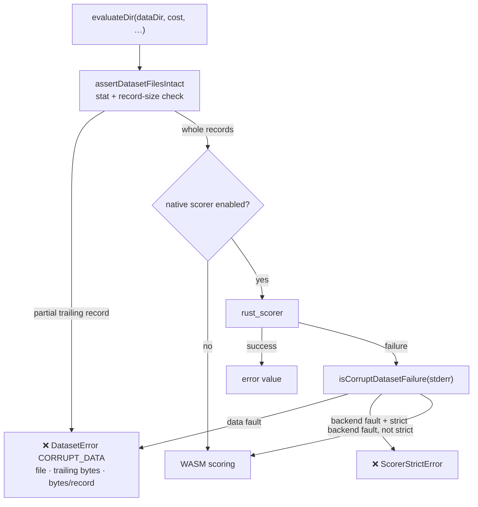

# Strict `rust_scorer` no longer misclassifies a corrupt dataset

## Summary

With a real `rust_scorer` resolved and `NEAT_AI_RUST_SCORER_STRICT=1` (the
environment `quality.sh` exports), a truncated `.bin` dataset surfaced as a
`ScorerStrictError` instead of a `DatasetError`. The native scorer hit the fault
first, its stderr was not recognised as a data fault, and strict mode escalated
it — losing the diagnostic that names the file, the trailing byte count and the
record size. `./quality.sh` was red on any host that had the scorer built.

Two changes, both preserving strict mode's purpose (a dead native path must
never reconcile to a green run):

1. **`evaluateDir` pre-flight (`src/architecture/DatasetIO.ts`,
   `src/creature/CreatureActivation.ts`).** `assertDatasetFilesExist` is now
   `assertDatasetFilesIntact` and takes an optional record shape. It checks each
   dataset file's length against `(inputs + outputs) * 4` off the `stat` it
   already performed, so a corrupt corpus is classified as `CORRUPT_DATA` —
   with the full diagnostic — before any backend runs. No extra syscall, and
   the classification no longer depends on which backend would have scored.
2. **Stderr classification (`src/score/ScorerFailureClassification.ts`).** The
   scorer's actual wording is `not a whole multiple of the 12-byte record size`;
   the pattern required `multiple of the record size` with no size qualifier, so
   it never matched. The qualifier is now optional, and the scorer's other
   corrupt-dataset phrases (`N bytes past the last whole record`,
   `spliced across file boundaries`) are recognised too. This keeps the
   per-creature *and* batch bridges classifying a data fault as a `DatasetError`
   before strict mode can wrap it.

Backend failures (missing binary, dead GPU, crash) are untouched: they still
fall back in normal mode and still throw `ScorerStrictError` in strict mode.

Closes #3831.

## Evidence

Backend-only change — no web interface to screenshot.

**Root cause, observed directly.** Running the built scorer against a dataset
truncated exactly as the test truncates it:

```text
$ rust_scorer --cost MSE /tmp/creature.json /tmp/dataSet-28545cc4bbd4c600
Error: Training file /tmp/dataSet-28545cc4bbd4c600/0.bin has size 292 bytes,
which is not a whole multiple of the 12-byte record size (4 bytes past the last
whole record); records would be spliced across file boundaries
EXIT=1
```

That stderr fails `/not\s+a\s+(whole\s+)?multiple\s+of\s+the\s+record\s+size/i`
because of the `12-byte` qualifier, so `assertNotCorruptDataset` returned and
strict mode threw.

**Before** — the reported failure, reproduced on a clean tree:

```text
evaluateDir: a short final record names the file and the byte counts => FAILED
error: AssertionError: Expected error to be instance of "DatasetError",
       but was "ScorerStrictError".
FAILED | 4 passed | 1 failed
```

**After** — same command, same environment:

```text
ok | 16 passed | 0 failed (194ms)
```

The new strict-path test was confirmed load-bearing: dropping the record shape
from the `evaluateDir` pre-flight turns it red again
(`FAILED | 6 passed | 1 failed`).

### Where a corrupt dataset is now classified



## Test Plan

Added:

- `test/architecture/DatasetIO.ts`
  - `assertDatasetFilesIntact - partial trailing record throws CORRUPT_DATA
    (Issue #3831)` — asserts reason, `path`, and that the message carries the
    file name, `Trailing 4 bytes (incomplete record)` and `12 bytes/record`.
  - `assertDatasetFilesIntact - whole record counts pass the length check` —
    a well-formed file is not rejected.
- `test/score/ScorerDataFailureClassification.ts`
  - `isCorruptDatasetFailure: the scorer's own whole-multiple wording is a data
    fault` — the verbatim stderr the binary emits, plus the size-qualified and
    `bytes past the last whole record` variants.
  - `evaluateDir: strict rust scoring keeps a corrupt dataset a DatasetError
    (Issue #3831)` — drives `evaluateDir` with `strict: true` and a runner that
    fails in the scorer's own wording; asserts the full `CORRUPT_DATA`
    diagnostic rather than `ScorerStrictError`. This is the regression test for
    the reported failure and does not depend on the ambient environment.

Modified (renames only, no assertions weakened):

- `test/architecture/DatasetIO.ts` — the two existing
  `assertDatasetFilesExist` cases follow the function's new name.
- `test/score/ScorerDataFailureClassification.ts` — the corrupt-dataset setup
  and diagnostic assertions of the previously failing test were extracted into
  `makeCorruptDataDir` / `assertCorruptDiagnostic` and are now shared with the
  new strict-path test. The assertions themselves are unchanged.

Docs: `docs/troubleshooting/CI.md` records that a corrupt dataset is a
`DatasetError`, never a `ScorerStrictError`, so operators reading a
`ScorerStrictError` know it is a genuine backend fault.

Full gate: `./quality.sh` (which builds `rust_scorer` and runs the suite with
`NEAT_AI_RUST_SCORER_STRICT=1`).
