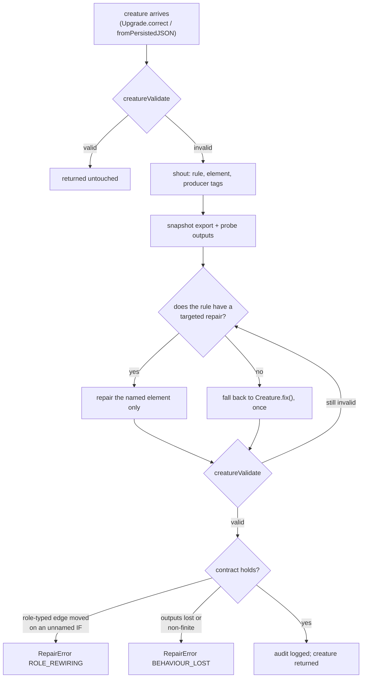

# A repair pass can no longer hand back a creature worse than it was given

## Summary

#3845 stopped the bleeding by making the load-time repair a no-op when
`validate()` passes. That gate is a safety belt, not a fix: a **partly** invalid
creature — one broken rule out of thirty, on an otherwise excellent topology —
still went through the same blunt `Creature.fix()` pass that cost a valid
champion 90.7 % of its score (0.36900 → 0.03437), and the gate would have waved
it straight through to be mangled.

This rebuilds the repair path around the six principles the outage taught, in
the new `src/repair/` module:

1. **Never return something worse.** `verifiedRepair()` probes the creature
   before and after and refuses a result that lost outputs the creature used to
   produce (`RepairError` `BEHAVIOUR_LOST`), reusing the `BehaviourGuard` probes
   from #3841.
2. **Repair minimally and locally.** `ValidationError` now carries `neuronIndex`
   — the element the failing rule named — and `applyTargetedRepair()` dispatches
   per rule against **that one element** instead of running every heuristic over
   the whole creature.
3. **Preserve semantics you do not understand.** `findRoleRewiring()` refuses a
   result that moved, invented or downgraded role-typed `IF` structure on an
   `IF` no failing rule named (`RepairError` `ROLE_REWIRING`) — the #3845 damage
   exactly.
4. **Substitution is not repair.** Every targeted repair removes or downgrades;
   none re-points an edge at a neuron of its choosing.
5. **Be idempotent and auditable.** The validity gate makes a second run a no-op
   by construction, and every change is logged as _rule → element → action_
   beside a UUID-level structural diff (`RepairAudit`).
6. **Prove it on the shapes you actually receive.** One fixture per structural
   family — point-wise, grafted `IF` forests (including a zero-weight leaf),
   `IF` outputs with relays, aggregates (`MINIMUM`/`MAXIMUM`/`HYPOTv2`), and
   genuine legacy v1.x/v2.x — with a standing test that every valid one
   round-trips both ingest paths untouched.

A creature that still fails validation once every move is spent throws its own
`ValidationError`: nothing invalid is ever returned as though it were repaired.

The design record is [`docs/REPAIR_CONTRACT.md`](../../REPAIR_CONTRACT.md).

**On item 4 of the issue** — whether a provably safe repair makes the #3845
"only when invalid" gate redundant — the gate **stays**, now as an optimisation
rather than the only safety belt. The repo owner's invariant stands on its own
(repairing means the creature is invalid, and no creature should need repair
today), and the verification is not free: it costs an export snapshot and 24
forward passes per ingest, which is the wrong trade on a path the whole fleet
takes and no creature needs. That reasoning is recorded in the contract doc.

Closes #3848.

## Evidence

This is a backend/library change with no web interface, so there is no
screenshot to capture. The evidence is the test suite below and `./quality.sh`,
which passes cleanly.

The repair path as it now runs:



An audit line the pass now emits, from the test run — the repair states which
rule failed, on which element, and exactly what it changed:

```text
🚨 [Upgrade.correct] repairing an INVALID creature — this is an upstream defect,
   not a routine condition. rule=NO_OUTWARD_CONNECTIONS
   detail="constants neuron constant-stranded has no outward connections" …
[Upgrade.correct] repaired creature still activates — worst 0.000e+0,
   mean 0.000e+0 against an output scale of 1.123e+0 over 24 comparisons
🚨 [Upgrade.correct] repair complete — NO_OUTWARD_CONNECTIONS →
   constant-stranded → removed the constant neuron nothing reads.
   Changed: synapses-removed 0; synapses-added 0; weights-changed 0;
   neurons-removed 1 ["constant-stranded"]; neurons-added 0; neurons-altered 0
```

## Test Plan

Added `test/repair/VerifiedRepair.ts` — one test per principle:

- a validation failure names the element it failed on (`neuronIndex` survives
  rehydration from NEAT-AI-core);
- principle 2 — repairing a stranded constant removes **only** that neuron: no
  synapse dropped, none invented, no weight moved;
- principle 2 — an inbound-less hidden neuron keeps its **uuid** and every
  consumer, rewritten as the constant it already computes rather than deleted
  and substituted;
- principle 5 — the repair is idempotent (a second `Upgrade.correct()` produces
  a byte-identical export);
- principle 5 — every change is reported as _rule → element → action_;
- a creature that validates is returned untouched and reports nothing;
- principle 3 — re-sourcing an `IF` branch off its bias-1 constant (the #3845
  damage, reproduced exactly) is refused with `RepairError` `ROLE_REWIRING`;
- principle 3 — downgrading an `IF` no rule named is refused, and the same
  downgrade is accepted once `IF_CONDITIONS` names that neuron;
- principle 3 — an edge lost along with a source neuron the repair legitimately
  removed is **not** a violation;
- principle 1 — a result that lost the creature's outputs is refused with
  `RepairError` `BEHAVIOUR_LOST`;
- a creature no repair can rescue throws `ValidationError` rather than being
  returned as repaired.

Added `test/repair/StructuralFamilies.ts` and
`test/fixtures/StructuralFamilies.ts` — principle 6, the standing per-family
test:

- every structural family is valid to begin with;
- every family round-trips `Upgrade.correct()` **and**
  `Creature.fromPersistedJSON()` structurally identical;
- every family computes exactly what it did before the load
  (`isExactBehaviourPreserved`);
- widening the input count leaves every family untouched.

Extended `test/docs/ErrorsDocMatchesValidationError.ts` — `ValidationError`
carries the named element, and `docs/api/ERRORS.md` documents both that field
and `RepairError`.

No existing test was modified or removed; the #3845 gate tests in
`test/reconstruct/UpgradeCorrectNoOp.ts` still pass unchanged.
