# Creature Factory emits a valid `IF` seed, or none at all (Issue #3851)

## Summary

When a caller's activation rule set forces `IF` (GRQ teams pass it through as
`hiddenSquash`), the Creature Factory emitted `IF` hidden neurons whose inward
synapses carried no `condition` / `positive` / `negative` role. An `IF` with no
roles has nothing to branch on, so the seed failed `validate()` at birth and was
only usable because a downstream `fix()` invented the wiring — structural design
work neither the factory nor evolution ever chose, and different from run to
run.

`creatureForProblem` (and therefore `creatureForDataset` and
`Creature.forProblem` / `Creature.forDataset`) now wires those roles itself via
the new `src/architecture/SeedSynapseRoles.ts`: each structurally-constrained
neuron's inward synapses are ordered by source and assigned `condition` /
`positive` / `negative` round-robin, so every role reads a real source, every
source stays in play, and the same spec always yields the same seed. When the
seed topology cannot satisfy the rule — fewer than three sources per `IF`
neuron, e.g. `inputs: 2` — the factory throws a `TopologyError`
(`reason: "INVALID_SQUASH"`) naming the squash and the spec field that chose it,
rather than emitting a broken node and relying on a repair that may not be
there.

Seeds that do not select `IF` are byte-for-byte unchanged: no synapse gains a
role, and the existing capacity / output-squash / weight-init heuristics are
untouched.

Closes #3851.

## Evidence

Backend library change — no web interface to screenshot. Verified by tests and
by building and activating an `IF`-forced seed directly.

Before (on `Develop`), a factory seed with `hiddenSquash: "IF"`:

```text
VALIDATE FAILED: 1000000) 'IF' should have a condition(s)
```

After, the same seed validates and runs:

```text
activate: Float32Array(1) [ 0.039853256195783615 ]
round-trip ok, uuid: 7b44f50a-94da-54fe-9d1a-271b651f10f7
```

Full quality gate: `./quality.sh` →
`ok | 8725 passed (5 steps) | 0 failed |
41 ignored (9m40s)`, exit 0.

```mermaid
flowchart LR
    A[ProblemSpec<br/>hiddenSquash: IF] --> B[Creature constructor]
    B --> C{≥ 3 inward per IF neuron?}
    C -- Yes --> D[Assign condition / positive / negative<br/>round-robin by source]
    C -- No --> E[Throw TopologyError<br/>naming 'IF' and hiddenSquash]
    D --> F[Seed passes validate&#40;&#41; — no repair]
```



## Test Plan

New file `test/architecture/CreatureFactorySeedIfRoles.ts` — all seven cases
fail on `Develop` where they exercise the defect, pass after the change:

- `creatureForProblem: an IF-forced seed validates without any repair` —
  `creatureValidate()` passes and `repairInvalidIfNeuronsInCreature()` reports
  no repair was needed.
- `creatureForProblem: every emitted IF neuron carries all three roles` — each
  `IF` hidden neuron has ≥ 3 inward edges covering all three roles.
- `creatureForProblem: IF role assignment is deterministic, not arbitrary` — two
  builds of the same spec produce identical role maps.
- `creatureForDataset: an IF-forced seed validates without any repair` — the
  dataset entry point inherits the fix.
- `Creature.forProblem: the static forwarder emits valid IF seeds too`.
- `creatureForProblem: a seed too narrow for IF fails loud, naming the squash` —
  `inputs: 2` throws `TopologyError` with `reason: "INVALID_SQUASH"`, naming
  `'IF'` and `hiddenSquash`.
- `creatureForProblem: a seed that does not force IF is untouched` — the guard
  in the other direction: no synapse carries a role.

Docs updated: `docs/api/CREATURE.md` (new "Structurally-constrained hidden
squashes (`IF`)" section with the flow diagram) and `CHANGELOG.md`.
