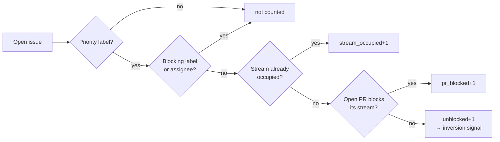
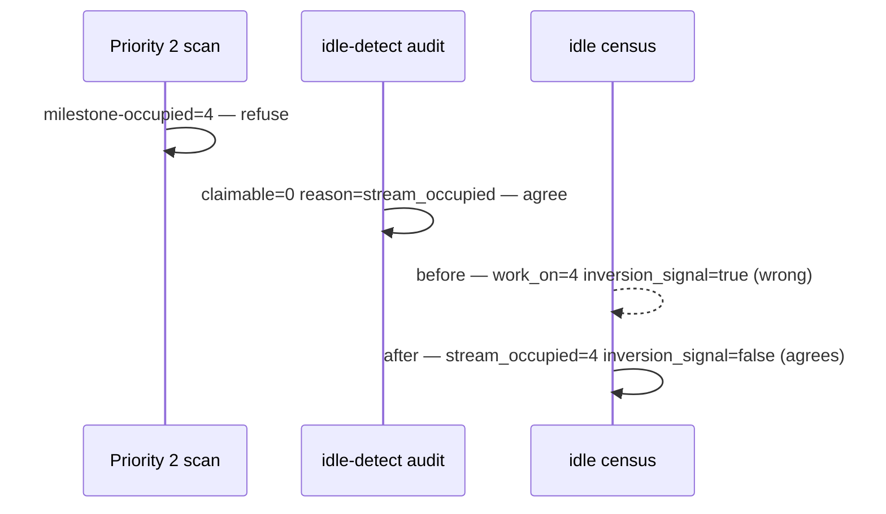

## Summary

The idle-decision census was counting work the claim scan had already,
correctly, refused. Closes #3852.

The Priority 2 scan will not claim an issue whose work stream (milestone, or
`""` for the default branch) already hosts a worker-assigned open issue — that
is `isMilestoneOccupied`, logged as the `milestone-occupied` skip. The
idle-detect audit mirrors the gate as `stream_occupied`. The census did **not**,
so every sibling of an in-flight claim kept counting as claimable work.

That is the inversion this issue reports. On 2026-08-23, while one NEAT-AI issue
was being worked, the three instruments disagreed for seven consecutive census
lines (09:25:58Z → 09:42:03Z):

```
[s1] no eligible work: … top-skips=filtered-out=5,milestone-occupied=4,pr-blocked=4
[idle-detect] repo=stSoftwareAU/NEAT-AI total_open=5 claimable=0 reason=stream_occupied
[idle-census] repo=stSoftwareAU/NEAT-AI … work_on=4 … pr_blocked=0 inversion_signal=true
```

The scan and the audit were right; the census was wrong. The false signal did
real harm twice over — it suppressed the idle-task filer
(`[idle-hooks] skipping=idle-task-filer reason=unblocked_work_exists`) and,
after three cycles, escalated into this very issue against a repo whose work was
simply already being done.

**The fix is in the worker, not in NEAT-AI.** The census is
`worker/deno/lib/idle_decision_census.ts` in `stSoftwareAU/VibeCoder`, so the
code change lands there as a cross-repo PR; this repo carries only the summary.
`buildIdleDecisionCensus` now excludes priority issues whose stream is occupied,
attributing them ahead of PR blocking exactly as `classifyIssues` does, and
reports them as `stream_occupied=<n>` on the `[idle-census]` line so the
deferral stays observable instead of silently vanishing.

Occupancy is resolved against `workerUser` only — the same narrower set the
audit uses — so the two instruments cannot disagree and a sibling host's claim
never silences this host's inversion signal.

## Evidence

Backend/CLI change with no web interface, so no screenshot applies. The evidence
is the log disagreement quoted above and the tests below.

Claimability, after the change:



Where the three instruments sat before and after:



`./quality.sh` in `stSoftwareAU/VibeCoder`: type check, lint, fmt, markdownlint,
mermaid and every chokepoint gate PASSED. `deno tests` reports 10 failures, all
pre-existing on the base tree and unrelated to this change — they are
environment-dependent host-work-dir assertions (`fleet_health_test.ts`,
`setup_workdir_reminder_test.ts`, `optional_feature_env_test.ts`) that fail
identically with the change stashed.

## Test Plan

Added to `worker/deno/tests/idle_decision_census_test.ts` in
`stSoftwareAU/VibeCoder`. All six fail against the unfixed census (the first
five on the absent `streamOccupied` field, the formatter test on the absent log
field) and pass after it:

- `census - work-on issues behind an in-flight claim in the same stream are not
  counted (Issue #3852)`
  — the regression test for the logged incident: one assigned issue plus three
  `work-on` siblings and one `low-priority` sibling now yield `workOn=0`,
  `lowPriority=0`, `streamOccupied=3`, no inversion.
- `census - occupancy is per work stream, not per repo (Issue #3852)` — a free
  `v2` milestone stream still reports its work as claimable.
- `census - a sibling worker's assignment does not occupy the stream (Issue
  #3852)`
  — another account's assignment does not silence this host's signal.
- `census - stream occupancy is attributed ahead of PR blocking (Issue #3852)` —
  reason precedence matches `classifyIssues`, so `pr_blocked` still marks only
  issues that would otherwise be claimable now.
- `census - idle-task counts ignore stream occupancy (Issue #3852)` —
  `idle-task` claiming is gated by repo busyness, so its count is untouched.
- `formatter - per-repo line carries the stream_occupied count (Issue #3852)` —
  the deferral is observable in the `[idle-census]` line.

Full file: `deno test tests/idle_decision_census_test.ts` → 22 passed, 0 failed.
Neighbouring suites re-run green: `run_core_idle_census_test.ts`,
`idle_inversion_streak_test.ts`, `idle_detect_diagnostics_test.ts` → 48 passed.

## Follow-up

#3858 records a **second**, distinct disagreement found in the same log and not
addressed here: at 06:53:23Z the audit called #3851 claimable while the scan
refused it, with no open PR and no assignment in play. The remaining candidate
is the scan's `untrusted-operational-label` gate, which neither the census nor
the audit models and which names a _permanent_ condition. Its root cause also
lives in `stSoftwareAU/VibeCoder`; #3858 is filed here only because the run's
`gh` guard refuses issue-create against that repo.
