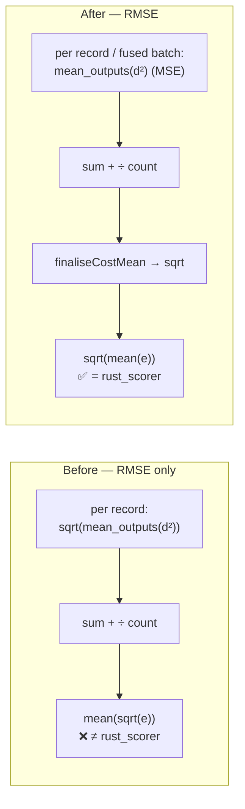

# RMSE is root-of-mean on both scoring engines

## Summary

`RMSE` disagreed between the two scoring engines. `evaluateDir` accumulated
`RMSE.calculate` once per record and divided by the record count — reporting
`mean(sqrt(e))` — while the native `rust_scorer` roots the shared MSE
squared-error sum once at finalisation (`CostKind::finalise_mean`) and reports
`sqrt(mean(e))`. Because `sqrt` is concave the two are equal only when every
per-record error is identical, so on real data the number a caller got depended
on whether `NEAT_AI_RUST_SCORER_ENABLED` happened to be set.

Rust is right: `sqrt(mean(e))` is the formula documented in
[`src/costs/RMSE.ts`](../../../src/costs/RMSE.ts) and in
[`docs/api/COSTS_AND_ACTIVATIONS.md`](../../api/COSTS_AND_ACTIVATIONS.md). The
defect is that RMSE was accumulated as though it were a mean-style cost, which
it is not. The TypeScript path now accumulates MSE's squared-error sum and
applies the root at finalisation, which also lets RMSE ride MSE's fused WASM
batch kernel instead of falling off it.

New [`src/costs/CostAggregation.ts`](../../../src/costs/CostAggregation.ts) owns
that decision in one place — `accumulationCostFor` picks the accumulator,
`finaliseCostMean` closes the sum — mirroring the scorer's `finalise_mean` so a
future accumulation site cannot re-root per record.

Closes #3853.

**Consumer-visible behaviour change.** Reported RMSE magnitudes rise on the
TypeScript path (~2% on the test fixture; the gap grows with error variance), so
GRQ scores computed with `costName: "RMSE"` will move. No other cost changes.

**Output-range penalties** are now accumulated separately from the cost and
added in error units _after_ the root — folding them into RMSE's squared-error
sum would penalise under the root. For every mean-style cost the result is
unchanged, since `mean(cost + penalty) = mean(cost) + mean(penalty)`.



## Evidence

Backend/CLI change — there is no web interface to screenshot. The evidence is
the new live cross-engine parity test, which runs the real `rust_scorer` binary
(`../NEAT-AI-scorer/target/release/rust_scorer`) and `evaluateDir` with the
scorer forced off, over the same dataset, for all seven built-in costs on a
forward-only and a recurrent creature.

**With the fix reverted** (mean-of-roots restored), the parity test fails on
RMSE and only RMSE — the other six costs already agreed:

```text
rust_scorer parity: forward-only creature ... FAILED
  AssertionError: RMSE (forwardOnly=true): TypeScript reported 0.24628885358156327,
  rust_scorer reported 0.2513605759476053
rust_scorer parity: recurrent creature ... FAILED
  AssertionError: RMSE (forwardOnly=false): TypeScript reported 0.2462888518591968,
  rust_scorer reported 0.2513605848989801
```

**With the fix applied**, both engines agree on all 7 costs × {forward-only,
recurrent}:

```text
deno test test/score/RustScorerLiveCostParity.ts test/costs/RmseRootOfMean.ts \
          test/costs/CostAggregation.ts
rust_scorer parity: forward-only creature agrees with evaluateDir on every built-in cost ... ok
rust_scorer parity: recurrent creature agrees with evaluateDir on every built-in cost ... ok
RMSE evaluateDir: forward-only creature reports sqrt(mean squared error) ... ok
RMSE evaluateDir: recurrent creature reports sqrt(mean squared error) ... ok
RMSE evaluateDir: output-range penalty stays additive on top of the root ... ok
CostAggregation ... 5 passed
ok | 10 passed | 0 failed
```

`./quality.sh` passes.

## Test Plan

Added:

- `test/score/RustScorerLiveCostParity.ts` — **live** two-engine parity. Runs
  the real `rust_scorer` binary against `evaluateDir` (scorer forced off) over
  one dataset for all seven built-in costs, on a forward-only and a recurrent
  creature. Resolves the binary the way `quality.sh` does
  (`NEAT_AI_RUST_SCORER_BINARY_PATH` → `PATH` → sibling NEAT-AI-scorer checkout)
  and is `ignore`d by name when the scorer is not installed, so contributors
  without it are unaffected while `quality.sh` — which requires the binary —
  always runs it. This is the gap the issue identified: nothing previously
  compared the two engines' actual numbers on real data.
- `test/costs/RmseRootOfMean.ts` — regression tests for the defect. Assert
  `evaluateDir(RMSE) == sqrt(evaluateDir(MSE))` on both the fused (forward-only)
  and per-record (recurrent) paths, plus a guard assertion that the fixture
  genuinely separates mean-of-roots from root-of-mean so the test cannot pass
  vacuously. A third test pins the output-range penalty as additive in error
  units for RMSE exactly as it is for MSE. All three fail against the unfixed
  code.
- `test/costs/CostAggregation.ts` — unit tests for the new helpers: happy path,
  every non-RMSE built-in and a custom cost (identity accumulation), and edge
  cases (zero error sum, single record). The `finaliseCostMean` expectations
  reproduce the native scorer's own `finalise_mean` doctest values (`8.0, 2` →
  `4.0` for MSE, `2.0` for RMSE).
- `test/_costFixtures.ts` — the deterministic creature and dataset shared by the
  two suites above. Targets sit above the creature's output range because MSLE
  is the signed `log(target) - log(output)` and the native scorer rejects a
  negative average error outright.

Not modified or removed: no existing test was changed.

**Deliberately excluded from the parity fixture** (known divergences tracked
separately, per the issue): output-range penalties, which `rust_scorer` has no
concept of, and `feedbackLoop=true`, which its recurrent path ignores. The
fixture uses no output ranges and `feedbackLoop=false` rather than hiding either
behind a wider tolerance.

**Scope note.** The training and validation loops (`TrainingEpoch`,
`CrossValidationTrainer`, `HoldoutValidator`, `PredictiveCodingTrainer`,
`PruningTemplate`, `DnaSharingBakeOff`) also average `cost.calculate` per
record. Those are single-engine TypeScript reporting paths with no `rust_scorer`
counterpart, so they carry no cross-engine divergence and are outside this
issue, which names `evaluateDir` and the two scoring engines.
