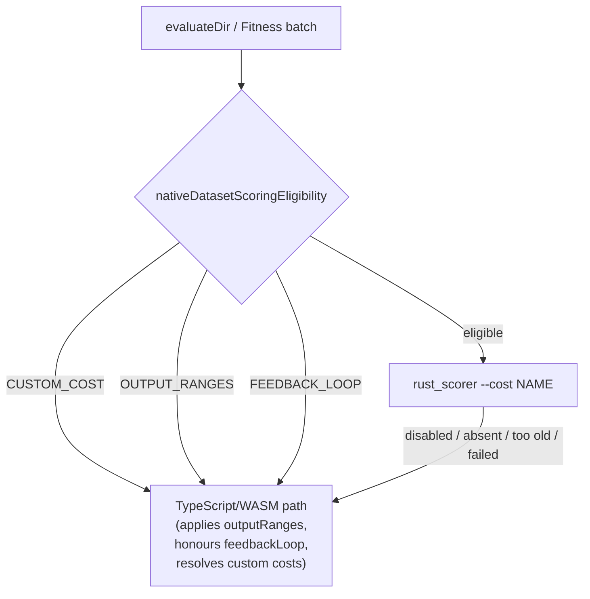

# Make native dataset-scoring delegation honest (Issue #3854)

## Summary

The goal of Issue #3854 is **one** dataset-scoring implementation, with the
TypeScript/WASM path demoted to the cases `rust_scorer` provably cannot serve —
custom costs and reinforcement learning. Getting there safely means the boundary
has to be explicit first: a silent delegation to an engine with different
semantics is worse than no delegation at all, and three such silent divergences
existed.

This change makes the boundary a single predicate,
`src/score/NativeDatasetScoringEligibility.ts`, and has **both** call sites ask
it rather than each re-deriving the rule — `evaluateDir`
(`src/creature/CreatureActivation.ts`) and the batch partition in
`Fitness.calculate` (`src/architecture/Fitness.ts`). Adding a native capability
now means deleting a named refusal reason, not loosening a condition at a call
site.

| Refusal         | Trigger                                             | Why the native engine cannot serve it                        |
| --------------- | --------------------------------------------------- | ------------------------------------------------------------ |
| `CUSTOM_COST`   | user-registered cost, or a `customCost` module      | `rust_scorer` cannot resolve a JavaScript `CostInterface`    |
| `OUTPUT_RANGES` | `outputRanges` configured                           | the out-of-range penalty (Issue #1620) has no native concept |
| `FEEDBACK_LOOP` | recurrent creature scored with `feedbackLoop: true` | the native recurrent path resets state per record            |

Three bugs fixed, all measured against the real binary before the change:

- **`outputRanges` penalty was dropped entirely** whenever the scorer was
  enabled. `evaluateDir` delegated before `outputRanges` was consulted, and the
  batch path bypasses the workers that apply it. Measured on a 64-record
  dataset: native `0.0557` vs TypeScript `147.39`.
- **`feedbackLoop` diverged on recurrent creatures.** The native recurrent path
  resets network state per record unconditionally — `feedbackLoop: false`
  semantics. Measured: native `0.05232947` vs TypeScript `0.05199585`.
- **The batch path off-loaded custom costs.** `NeatConfig.costName` keeps its
  `"MSE"` default when a `customCost` module is configured (Issue #3776), so the
  batch scorer was handed `--cost MSE` while the workers evaluated the user's
  cost. That breaks the documented promise in
  `docs/api/COSTS_AND_ACTIVATIONS.md` that custom costs are never off-loaded.
  `Fitness` is now told about the custom cost explicitly.

It also adds the test the issue says every later stage depends on: nothing
anywhere compared the two engines' actual numbers on real data.
`test/score/WasmJsScoreParity.ts` lost its second engine in Issue #1236,
`scripts/parity-gate.sh` is a NEAT-AI-core WASM re-pin gate, and the scorer's
own `cost_parity.rs` transcribes the TypeScript formulae as constants rather
than executing them.

Stages 1–3 of the issue's plan (flip the defaults, promote `enabled` to a
`NeatOptions` key, close the native gaps, delete the duplicate) are **not** in
this change: they hinge on the issue's open questions, which are product
decisions. They are captured in follow-up issue stSoftwareAU/NEAT-AI#3861.

Closes #3854.

## Evidence

This is a backend/library change with no web interface, so there is no
screenshot to capture. The evidence is the live parity run and the measured
before/after numbers above.



**Live parity lane** — real `rust_scorer` binary versus `evaluateDir` with the
native path switched off, same dataset, all seven built-in costs × two topology
styles:

```
running 15 tests from ./test/score/RustScorerDatasetParity.ts
Dataset scoring parity: rust_scorer and TypeScript agree for CROSS_ENTROPY (forwardOnly) ... ok
Dataset scoring parity: rust_scorer and TypeScript agree for CROSS_ENTROPY (recurrent) ... ok
Dataset scoring parity: rust_scorer and TypeScript agree for MSE (forwardOnly) ... ok
Dataset scoring parity: rust_scorer and TypeScript agree for MSE (recurrent) ... ok
Dataset scoring parity: rust_scorer and TypeScript agree for MAE (forwardOnly) ... ok
Dataset scoring parity: rust_scorer and TypeScript agree for MAE (recurrent) ... ok
Dataset scoring parity: rust_scorer and TypeScript agree for MAPE (forwardOnly) ... ok
Dataset scoring parity: rust_scorer and TypeScript agree for MAPE (recurrent) ... ok
Dataset scoring parity: rust_scorer and TypeScript agree for MSLE (forwardOnly) ... ok
Dataset scoring parity: rust_scorer and TypeScript agree for MSLE (recurrent) ... ok
Dataset scoring parity: rust_scorer and TypeScript agree for HINGE (forwardOnly) ... ok
Dataset scoring parity: rust_scorer and TypeScript agree for HINGE (recurrent) ... ok
Dataset scoring parity: RMSE is still a known divergence (#3853 …) ... ok
Dataset scoring parity: outputRanges penalty survives with the native scorer enabled ... ok
Dataset scoring parity: feedbackLoop is honoured with the native scorer enabled ... ok
ok | 15 passed | 0 failed
```

**The parity lane genuinely runs the binary.** Pointing
`NEAT_AI_RUST_SCORER_BINARY_PATH` at a stub that always answers
`{"error":0.123456}` logged 14 invocations (one probe, thirteen scoring calls)
and failed 12 of the 15 tests. The three that still passed are exactly the three
that must not delegate — the `outputRanges` case, the `feedbackLoop` case, and
the RMSE known-divergence check.

**RMSE stays visible rather than suppressed.** RMSE (Issue #3853, mean-of-roots
versus root-of-mean) is recorded in a `KNOWN_DIVERGENCES` map and asserted to
_still_ diverge. When #3853 lands, that assertion fails with a message telling
the author to delete the entry, so a fixed divergence cannot leave a cost
permanently excluded from the parity assertions.

**Full quality gate:** `./quality.sh` — `8774 passed | 0 failed | 41 ignored`.

## Test Plan

Added `test/score/RustScorerDatasetParity.ts` — live numeric parity, skipped
when no binary can be resolved (`quality.sh` resolves one for the default run):

- 12 agreement tests: 6 built-in costs × {forwardOnly, recurrent}.
- 1 known-divergence test for RMSE that fails once the divergence is fixed.
- `outputRanges penalty survives with the native scorer enabled` — regression
  for the dropped penalty; also asserts the fixture actually exercises the
  penalty, so it cannot pass vacuously.
- `feedbackLoop is honoured with the native scorer enabled` — regression for the
  recurrent divergence; also asserts carried state changes the result.

Added `test/score/NativeDatasetScoringDelegation.ts` — pins the boundary itself
using the in-process runner seam, so it runs without a binary:

- 8 predicate tests: every refusal reason, plus the two eligible cases that must
  **not** regress (`feedbackLoop` on a forward-only creature; a recurrent
  creature without `feedbackLoop`).
- 5 `evaluateDir` tests counting scorer invocations — the stub returns an error
  value no TypeScript evaluation of the fixture can produce, so a leaked
  delegation shows up in both the call count and the returned number.
- 3 `Fitness` batch tests: `outputRanges` and a configured `customCost` each
  keep the generation on the worker path; a plain built-in cost still batches.

Added `test/score/NativeScorerFixtures.ts` — deterministic creature (fixed
weights, logistic squashes so every cost is well defined) and seeded dataset,
plus the binary resolver. No `Math.random()`, no timing APIs.

No existing test was removed, commented out, or weakened.
