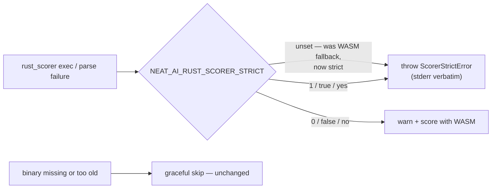

# Stage 1: default `NEAT_AI_RUST_SCORER_STRICT` to true

## Summary

Strict mode has been opt-in since #3815, so production defaulted to the
degrading path: a genuine `rust_scorer` exec or parse failure logged a warning,
fell back to WASM scoring and reconciled to a green run — the exact failure mode
that hid #3810. `getEnvRustScorerConfig()` now resolves `strict` to **true**
when `NEAT_AI_RUST_SCORER_STRICT` is unset, so the loud behaviour is what an
operator gets without opting in.

`NEAT_AI_RUST_SCORER_STRICT=0` (or `strict: false`) is left in front as the
escape hatch, for an operator who would rather a degraded run than a failed one.
Nothing else moves: a missing or too-old binary is still a **graceful skip**, so
`deno test` stays green with no `rust_scorer` on `PATH`, and `quality.sh` keeps
its explicit `=1` on the native lane and `=0` on the WASM lane (stage 3 owns
that one). Closes #3864.



## Evidence

Backend/CLI change with no web interface to screenshot. Evidence is the test
suite.

New file `test/score/RustScorerStrictDefault.ts` resolves the real
`getEnvRustScorerConfig()` in a child process with a cleared environment, so the
"unset" case is genuinely unset whatever the parent lane exported and no test
file races on the shared process environment (Issue #3234). Against the unfixed
`?? false` it failed:

```text
getEnvRustScorerConfig: strict defaults on, and 0 opts back out ... FAILED
error: AssertionError: Values are not equal: an operator who sets nothing gets loud failures
-   false
+   true
```

After the flip, that file plus the existing strict-mode coverage passes:

```text
deno test --allow-all test/score/RustScorerStrictDefault.ts test/score/RustScorerStrictMode.ts
ok | 11 passed | 0 failed (337ms)
```

The strict-off halves of `test/score/RustScorerStrictMode.ts` were checked
individually: every case builds its config through `buildConfig({ strict: … })`,
so each passes the flag explicitly and none relied on the default. No test was
deleted or disabled.

## Test Plan

- **Added** `test/score/RustScorerStrictDefault.ts`:
  - `strict` is `true` when `NEAT_AI_RUST_SCORER_STRICT` is unset, and `false`
    when it is `0` — the regression test for the flip and its escape hatch.
  - Every false-like spelling (`0`, `false`, `FALSE`, `no`, and `no` with
    surrounding whitespace and mixed case) opts out; every other value,
    including empty and unparseable ones, leaves strict on rather than silently
    disabling the gate.
- **Unchanged and still passing** — `test/score/RustScorerStrictMode.ts` (all
  nine cases, both the strict-on throws and the strict-off fallbacks, plus "an
  unavailable binary stays a graceful skip in strict mode").
- **Regression sweep** — `test/score/`, `test/architecture/Fitness*.ts`,
  `test/NEAT/FitnessBatchRustScorer.ts`,
  `test/creature/EvolveScorerUtilisation.ts`: all green.
- **`./quality.sh`** — 8830 passed on both lanes, with one **pre-existing**
  failure that is not this change:
  `Dataset scoring parity: RMSE is still a
  known divergence (#3853)`. The
  locally built `rust_scorer` has since fixed that divergence, so the stale
  `KNOWN_DIVERGENCES` entry fails loudly by design. Reproduced on the milestone
  base commit `7d4081e6` in a clean worktree with no part of this change applied
  — `14 passed | 1 failed`, same assertion. Already tracked by **#3883**;
  deleting that entry belongs there, not here.

## Files changed

- `src/score/RustScorerBridge.ts` — `?? false` → `?? true` in
  `getEnvRustScorerConfig()`, with the module doc updated.
- `src/config/RustScorerConfig.ts` — `strict` doc comment now says
  `Default: true` and explains who should opt out.
- `src/score/BatchRustScorerBridge.ts`, `src/errors/ScorerStrictError.ts` — doc
  comments no longer describe strict as a CI-only opt-in.
- `docs/TROUBLESHOOTING.md`, `docs/troubleshooting/CI.md` — env table default
  and the surrounding prose.
- `CHANGELOG.md` — `Unreleased → Changed` entry.
