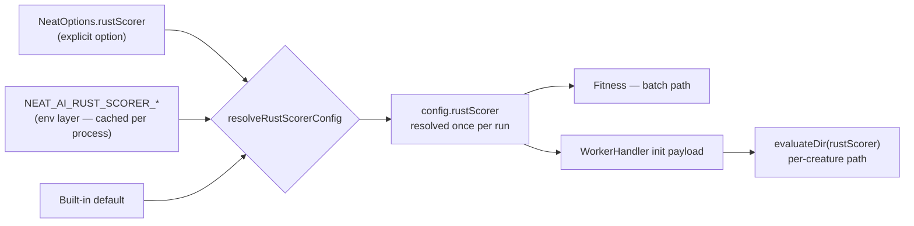

# Stage 1: promote the Rust scorer config to a `NeatOptions.rustScorer` key

## Summary

The Rust scorer was configurable **only** through the environment. This repo's
own option audit said so: `docs/OPTION_AUDIT_SLICE_E.md` recorded
`NEAT_AI_RUST_SCORER_ENABLED` → `RustScorerConfig.enabled` with no
options-object counterpart, and `RustScorerConfig` was classified `internal` in
`scripts/lib/optionAuditRollup.ts`. Before the native path becomes the default
way to score a dataset, an embedder needs to turn it on from the options object
they already pass, not by mutating process env.

`rustScorer?: RustScorerConfig` is now a first-class option, resolved once per
run and threaded to both scoring call sites. Closes #3865.

**Precedence — an explicit option beats the environment, and the environment
beats the built-in default.** A field set on `NeatOptions.rustScorer` wins
outright; a field omitted falls through to the matching `NEAT_AI_RUST_SCORER_*`
variable, and then to the default. The rule is written down at every surface
that carries it (`resolveRustScorerConfig`, `NeatOptions.rustScorer`,
`NeatArguments.rustScorer`, `docs/config/WORKERS.md`) because it is the part
future readers get wrong.

No default changed. `enabled` still defaults to `false`; the strict default flip
is its own sub-issue. With no `rustScorer` key and no env vars,
`config.rustScorer` **is** `getEnvRustScorerConfig()` — the same object — so
behaviour is byte-identical to before.

### What changed

- **`src/score/RustScorerBridge.ts`** — new
  `resolveRustScorerConfig(overrides?)` layering the option over the env-derived
  config. Only the **env layer** stays memoised in the process-level
  `envRustScorerCache`; the merged result belongs to one run and is deliberately
  never written back, so a per-run option cannot leak into another run.
  `timeoutMs` goes through `parseNumber`, so a CLI-shaped `"1500"` is coerced
  and garbage fails loud.
- **`src/config/NeatOptions.ts` / `NeatArguments.ts` / `NeatConfig.ts`** — the
  option, its resolved counterpart, and the one resolution site, following the
  `wasmCache` / `plateauDetection` pattern exactly.
- **One resolved value, two call sites.** `Neat` hands `config.rustScorer` to
  `Fitness` (batch path) instead of it calling `getEnvRustScorerConfig()`, and
  `evolveDir` hands it to each `WorkerHandler`, which forwards it in the
  `initialize` payload so `WorkerProcessor` passes it to `evaluateDir`'s
  existing `rustScorer` parameter. The two drifting apart is exactly what #3854
  was opened to stop. `scoreDir` passes it too.
- **Audit** — `optionAuditRollup.ts` reclassifies the entry from the internal
  `RustScorerConfig` to the top-level `rustScorer` key, so the audit no longer
  reports it as env-only. `docs/OPTION_AUDIT_SLICE_E.md` and
  `docs/OPTION_AUDIT_CONSOLIDATED.md` are updated to match, and
  `test/scripts/AuditOptionUsage.ts` re-pins the top-level surface at 107.
- **Docs** — a "Native Rust scorer" section in `docs/config/WORKERS.md` with the
  field table and the precedence rule, a precedence note on the
  `NEAT_AI_RUST_SCORER_*` table in `docs/TROUBLESHOOTING.md`, and the
  `RustScorerConfig` types exported from `mod.ts`.

### Resolution flow



## Evidence

Backend/library change with no web interface, so there is nothing to screenshot.
The evidence is the test suite plus the audit gate.

`./quality.sh` passes on both lanes:

```text
ok | 8787 passed (5 steps) | 0 failed | 41 ignored (5m40s)
exit=0
```

The audit no longer reports the key as env-only:

```text
$ deno run --allow-read scripts/option-audit-rollup.ts
🔎 220 enumerated rows (107 top-level, 113 nested) · 220 classified
✅ zero coverage gaps — every option key is classified
```

The failure this guards against is a **precedence inversion** — env silently
overriding an explicit `rustScorer.enabled: false`. It turns the native path on
for an embedder who asked for it off, and every score it produces still looks
plausible. Each direction is asserted independently so one cannot mask the
other.

## Test Plan

`test/config/RustScorerOption.ts` — resolver precedence. Every case resolves in
a child process with a **cleared** environment (Issue #3234), which also makes
the "unset" case genuinely unset whatever the lane exported:

- an explicit option beats the environment — `rustScorer: { enabled: false }`
  survives `NEAT_AI_RUST_SCORER_ENABLED=1`, both through
  `resolveRustScorerConfig` and through `createNeatConfig`;
- the environment beats the built-in default, and `createNeatConfig` with no
  option still honours it;
- an absent option returns `getEnvRustScorerConfig()` _itself_, and
  `config.rustScorer` deep-equals it;
- a partial option leaves untouched fields on their env values, and a CLI-shaped
  `timeoutMs: "1500"` coerces to `1500`;
- resolving an option never pollutes the memoised env layer.

`test/architecture/FitnessRustScorerOption.ts` — the resolved config actually
drives scoring, asserted on the outcome (scorer invocations, creatures
batch-scored, worker calls) rather than on how it got there:

- `enabled: true` batch-scores the whole population even when the env layer says
  off — one `rust_scorer` run, zero worker calls;
- `enabled: false` never invokes the scorer even when the env layer says on —
  zero runs, every creature on the per-creature worker path.

`test/scripts/OptionAuditRollup.ts` (existing) now reconciles `rustScorer` as a
classified top-level key with zero gaps and zero orphans.
