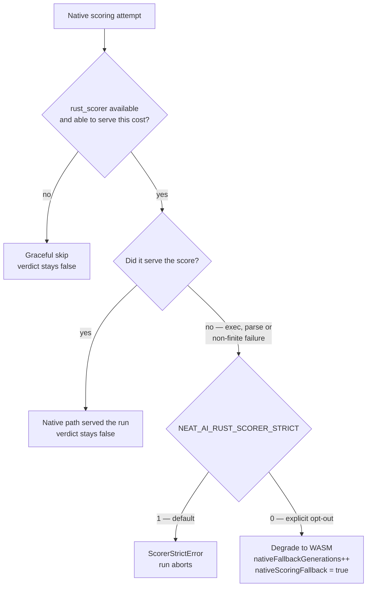
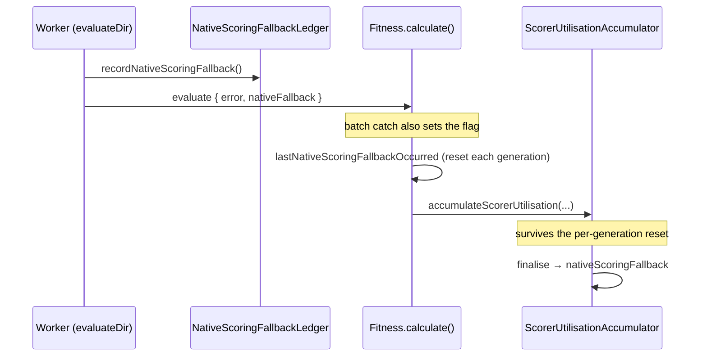

# Stage 1: a native-scoring fallback is now a run-level verdict

## Summary

A `rust_scorer` fallback was observable but never a verdict. `Fitness` set
`lastBatchFallbackOccurred` inside the batch `catch`, `EvolveGenerationTail`
published it, and `NeatEvolution` logged it — but the flag is **reset at the top
of every generation**, so a run that degraded in every generation and recovered
on WASM each time still finished reporting success. Worse, the **per-creature**
`rust_scorer` path (`tryScoreWithRustScorer` returning `undefined`) set no flag
at all: a run where every creature quietly scored on WASM reported perfectly
clean. That is the class of failure Issue #3810 exposed in production.

This change adds the run-level aggregate that survives the per-generation reset,
and widens it to cover both native paths. Closes #3866.

**The decision the issue asked for.** Since #3864 made
`NEAT_AI_RUST_SCORER_STRICT` default to `true`, a degradation already throws, so
the naive "if the flag is set, fail the run" would be near-dead code — and would
silently revoke the operator's explicit `=0` opt-out. So:

- **Strict on (the default)** — a degradation throws `ScorerStrictError` and
  never reaches the verdict. Unchanged.
- **Strict off (explicit `NEAT_AI_RUST_SCORER_STRICT=0`)** — the run **still
  completes**; the library does not unilaterally revoke a deliberate choice. It
  finishes carrying `scorerUtilisation.nativeScoringFallback === true`, plus one
  error line at run end, and hands the verdict to the caller.
- **A graceful skip is not a fallback** — no binary, scoring disabled, or a
  binary too old for the configured `--cost` all mean native scoring was never
  available. Nothing degraded, so the verdict stays `false`. This is what keeps
  `deno test` clean for contributors without `rust_scorer`.

### What changed

- **`src/score/NativeScoringFallbackLedger.ts`** (new) — a per-isolate
  record/consume flag. The per-creature path runs inside evaluation workers, so
  it needs a channel back to the main thread.
- **`src/score/RustScorerBridge.ts`** — `recordNativeScoringFallback()` at each
  of the four genuine degradation points (exec failure, unparseable stdout,
  non-finite error, mid-flight throw). The three early returns that mean "never
  available" record nothing.
- **`src/multithreading/workers/WorkerProcessor.ts` / `WorkerHandler.ts`** — the
  worker consumes its ledger after `evaluateDir` and rides the result back on
  the evaluate response as `nativeFallback`.
- **`src/architecture/Fitness.ts`** — a new per-generation
  `lastNativeScoringFallbackOccurred` accumulating the batch catch **plus**
  every worker-reported per-creature fallback. The pre-existing
  `lastBatchFallbackOccurred` keeps its exact reset-and-publish semantics.
- **`src/creature/ScorerUtilisationTotals.ts`** — the run aggregate:
  `nativeFallbackGenerations` (count) and `nativeScoringFallback` (the verdict).
  `finaliseScorerUtilisationTotals` is the single run-end choke point every
  `evolve*` loop passes through, so a set verdict is logged **once** there as an
  error — the per-occurrence warnings are exactly what got buried in #3810.
- **`src/creature/EvolveGenerationTail.ts`** — publishes the wider flag;
  optional, so scorers that never touch the native path (episodic / RL) need not
  supply it, and a caller publishing only `batchFallbackOccurred` still
  contributes its degradation.

### Fallback verdict — decision flow



### Where the verdict comes from



## Evidence

Backend/library change — no web interface to screenshot. Verified by tests and
the full quality gate.

**Both `quality.sh` lanes pass** on the rebased branch:

| Lane                                                 | Result                                                |
| ---------------------------------------------------- | ----------------------------------------------------- |
| `./quality.sh` (Rust scorer, binary built by step 8) | `ok \| 8843 passed \| 0 failed \| 41 ignored (9m19s)` |
| `./quality.sh --wasm-scorer`                         | `ok \| 8843 passed \| 0 failed \| 41 ignored (8m48s)` |

Targeted run of the new and adjacent suites: `44 passed | 0 failed`.

The run-end verdict line, from the new `Fitness` test's captured output:

```text
[NEAT-AI] Native scoring degraded to WASM in 2 of 2 generation(s); this run did
NOT score on the native path. Result field:
scorerUtilisation.nativeScoringFallback=true.
```

## Test Plan

The issue names two regressions that fail in **opposite** directions; both are
covered, because asserting only the first is how this lands as a broken
`deno test` for every contributor without the binary.

**Added — `test/score/NativeScoringFallbackVerdict.ts`** (8 tests)

- _False green:_ a live scorer that exits non-zero, returns unparseable stdout,
  or returns a non-finite error records a fallback.
- _False green:_ `evaluateDir` — the per-creature path the batch flag has never
  been able to see — records the fallback while still returning a finite error.
- _False green:_ per-creature fallbacks in consecutive generations survive the
  per-generation reset and set the run aggregate.
- _False red:_ an unresolvable `binaryPath` is a graceful skip, mirroring
  `test/score/RustScorerStrictMode.ts:249`.
- _False red:_ a binary too old to advertise `--cost` is a graceful skip.
- _False red:_ a run with no fallback at all finishes with the verdict `false`.
- A caller publishing only `batchFallbackOccurred` still counts as a native
  fallback.

**Added — `test/architecture/FitnessNativeScoringFallback.ts`** (3 tests)

- A worker-reported per-creature fallback sets the wider flag across two
  generations while `lastBatchFallbackOccurred` stays `false` — the pre-#3866
  flag reports clean on exactly this run.
- A forced batch failure across two generations sets both flags; each generation
  recovers on WASM and clears its own flag, so only the run aggregate still sees
  it. Asserts every creature ends each generation with a finite score — the
  strict-off opt-out is not revoked.
- An unresolvable `binaryPath` completes two generations with the verdict unset.

**Modified — `test/creature/EvolveScorerUtilisation.ts`** (documented change)

`ScorerUtilisationTotals` gained a **boolean** alongside its numeric counts, so
the test's "every field is a finite non-negative integer" loop no longer holds
for the whole struct. It now asserts `nativeScoringFallback` is a `boolean`
explicitly and applies the numeric invariants to the counts. Two assertions were
added: a healthy `evolveDataSet` run has `nativeFallbackGenerations === 0` and
`nativeScoringFallback === false`. This test runs on **both** lanes, including
the one with `rust_scorer` disabled, so it pins the false-red direction at the
`evolve*` integration level. No assertion was weakened or removed.

**Modified — `test/scripts/VerifyBatchScorerUtilisation.ts`**

Three `ScorerUtilisationTotals` fixtures gained the two new fields to satisfy
the widened interface. Values match each fixture's meaning; no assertion
changed.

**Unchanged and still passing** —
`test/architecture/FitnessScorerUtilisation.ts`,
`test/architecture/FitnessBatchFallbackCounted.ts` (deleting it is stage 3,
blocked on #3863), `test/architecture/FitnessBatchStrictMode.ts`,
`test/architecture/FitnessBatchPathUsed.ts`,
`test/creature/EvolveGenerationTail.ts`,
`test/creature/ScorerUtilisationTotals_test.ts`,
`test/score/RustScorerStrictMode.ts`. The run aggregate is purely additive.

## Documentation

- `docs/event-driven-evolution.md` — the new fields, plus a "🚨 The run-level
  fallback verdict" subsection stating the strict-on / strict-off /
  graceful-skip decision with a Mermaid flow and a caller snippet.
- `docs/api/EVOLUTION.md` — the widened `ScorerUtilisationTotals` interface.
- `docs/troubleshooting/CI.md` — the `NEAT_AI_RUST_SCORER_STRICT=0` opt-out no
  longer buys silence.
