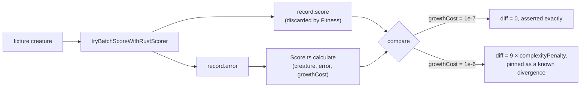

# Stage 2 evidence: the Score.ts vs scoring.rs divergence on the discarded `score` field

## Summary

`rust_scorer` returns a `score` beside every `error`, and
`BatchScorerReconciler` validates it as a required finite field
(`src/score/BatchScorerReconciler.ts:67`, `:77`). `Fitness` then reads
`record.error` and drops `record.score` on the floor, recomputing the score with
`Score.ts`'s `calculate` (`src/architecture/Fitness.ts:334`, `:341`). Decision 4
of #3863 turns on how far apart those two numbers are, and nothing anywhere
compared them.

This change measures the gap. `test/score/RustScorerDatasetParity.ts` now
captures `record.score` from the batch bridge — the same call `Fitness` makes —
and compares it against `Score.ts`'s `calculate` over the **scorer's own
error**, so the error term cancels and what is measured is the penalty
arithmetic alone.

**The two formulae are bit-identical.** For all seven built-in costs ×
{forwardOnly, recurrent} the difference is exactly `0`, not merely within
tolerance. The one real divergence is not in the formula at all: `rust_scorer`
hardcodes its growth cost at `DEFAULT_COST_OF_GROWTH` and exposes no flag
(`rust_scorer/src/cli.rs`, `const GROWTH_COST` — "CLI is KISS: no flag"), while
`Fitness` passes whatever `costOfGrowth` the run configured. Both findings are
pinned as assertions, so a formula move on either side fails the lane instead of
silently shifting every consumer's reported score.

No production code path changes — `creature.score` is still the TypeScript
recompute. Adopting the scorer's field is #3863's decision and a follow-up's
work. Closes #3867.

## Evidence

Backend-only change, so there is no web surface to screenshot. The evidence is
the measurement itself and the failure-detection checks below.

### Where the number comes from



Feeding the scorer's own error into both sides is what makes this a measurement
of the _score formula_. It is also why RMSE is covered here despite its
`KNOWN_DIVERGENCES` entry: #3853 lived in the cost aggregation, not the score.

### Measured divergence — none

`costOfGrowth = 1e-7` (the default, and the scorer's hardcoded value),
forwardOnly fixture:

| cost          | `rust_scorer` `score` | `Score.ts` `calculate` | diff |
| ------------- | --------------------- | ---------------------- | ---- |
| MSE           | 0.9522512061500982    | 0.9522512061500982     | 0    |
| RMSE          | 0.7814855284173664    | 0.7814855284173664     | 0    |
| MAE           | 0.7945472814521647    | 0.7945472814521647     | 0    |
| MAPE          | 0.7614756240334001    | 0.7614756240334001     | 0    |
| MSLE          | 0.7233794087409091    | 0.7233794087409091     | 0    |
| HINGE         | 0.5333548388089976    | 0.5333548388089976     | 0    |
| CROSS_ENTROPY | 0.4570692901557273    | 0.4570692901557273     | 0    |

The recurrent runs of the same seven agree identically. Both engines evaluate
`1 - error - complexityPenalty - versionPenalty` over the same integer counts
and the same constants (`MAGNITUDE_DECADE_CAP = 12`, `MAGNITUDE_COST = 100`,
`versionPenalty = 1e-6`, `SEMANTIC_MAJOR_VERSION = 4`), in the same order — so
there is no scale or sign convention to reconcile.

### Measured divergence — the growth cost is not plumbed

At `costOfGrowth = 1e-6`, forwardOnly MSE: the scorer's `score` does not move
(still computed at 1e-7) while `Score.ts` charges 10× the complexity penalty.
The divergence is **3.51e-6**, exactly `9 × complexityPenalty`, because every
term of the complexity penalty is linear in the growth cost. Pinned to that
characterisation, so a scorer release that starts honouring a growth cost fails
here rather than passing silently.

### The equality is not vacuous

Every weight and bias in the default fixture sits below 1.0, where
`valuePenalty()` returns 0 on both sides — so the sweep alone would still pass
if the magnitude curve or `MAGNITUDE_COST` (#3881) diverged.
`buildScoringCreature` gained a `magnitudeScale` parameter (default `1`, so
every existing caller is unchanged) and one case runs at ×400, where the
magnitude term dominates the complexity penalty (2.06e-6 against a 3.9e-7
baseline).

Failure detection was verified by breaking each formula in turn and confirming
the assertions fire:

| injected change in `Score.ts`          | result                                                                                           |
| -------------------------------------- | ------------------------------------------------------------------------------------------------ |
| `MAGNITUDE_COST` 100 → 90              | magnitude case FAILS; the inert sweep still passes (which is exactly why the scaled case exists) |
| synapse term `growthCost / 10` → `/ 5` | all 16 new score-formula tests FAIL                                                              |

### Test run

```text
Score formula parity: rust_scorer score equals Score.ts for CROSS_ENTROPY (forwardOnly) ... ok
Score formula parity: rust_scorer score equals Score.ts for CROSS_ENTROPY (recurrent) ... ok
Score formula parity: rust_scorer score equals Score.ts for MSE (forwardOnly) ... ok
Score formula parity: rust_scorer score equals Score.ts for MSE (recurrent) ... ok
Score formula parity: rust_scorer score equals Score.ts for RMSE (forwardOnly) ... ok
Score formula parity: rust_scorer score equals Score.ts for RMSE (recurrent) ... ok
Score formula parity: rust_scorer score equals Score.ts for MAE (forwardOnly) ... ok
Score formula parity: rust_scorer score equals Score.ts for MAE (recurrent) ... ok
Score formula parity: rust_scorer score equals Score.ts for MAPE (forwardOnly) ... ok
Score formula parity: rust_scorer score equals Score.ts for MAPE (recurrent) ... ok
Score formula parity: rust_scorer score equals Score.ts for MSLE (forwardOnly) ... ok
Score formula parity: rust_scorer score equals Score.ts for MSLE (recurrent) ... ok
Score formula parity: rust_scorer score equals Score.ts for HINGE (forwardOnly) ... ok
Score formula parity: rust_scorer score equals Score.ts for HINGE (recurrent) ... ok
Score formula parity: the magnitude penalty reaches the score identically ... ok
Score formula parity: rust_scorer ignores a non-default growth cost (known divergence) ... ok
```

### Pre-existing failure, not caused by this branch

`Dataset scoring parity: RMSE is still a known divergence (#3853 …)` fails on
any machine with a current `rust_scorer`. It reproduces on the branch point
(`08d72377`) with this change stashed, is tracked by #3883, and PR #3887 is
already open for it. Left alone here.

## Test Plan

Added to `test/score/RustScorerDatasetParity.ts` (live lane; skipped when no
`rust_scorer` binary resolves, as the rest of the file already is):

- `Score formula parity: rust_scorer score equals Score.ts for <COST>
  (<topology>)`
  — 14 tests, one per built-in cost × topology. Asserts exact equality between
  `record.score` and `Score.ts`'s `calculate` over the scorer's own error.
- `Score formula parity: the magnitude penalty reaches the score identically` —
  runs the ×400 fixture, first asserting the fixture actually moves the
  complexity penalty so the equality cannot go vacuous.
- `Score formula parity: rust_scorer ignores a non-default growth cost (known
  divergence)`
  — pins the growth-cost divergence to `9 × complexityPenalty` and asserts it
  still reproduces.

Modified `test/score/NativeScorerFixtures.ts`: `buildScoringCreature` gained an
optional `magnitudeScale` (default `1`). Existing callers
(`NativeDatasetScoringDelegation.ts`, `MagnitudePenaltyEngineParity.ts`, and the
rest of the parity file) are unchanged and were re-run green.

Documentation: `docs/api/COSTS_AND_ACTIVATIONS.md` records what the parity lane
now covers and the growth-cost caveat. The finding is written up as a comment on
#3863 so decision 4 has numbers attached.
