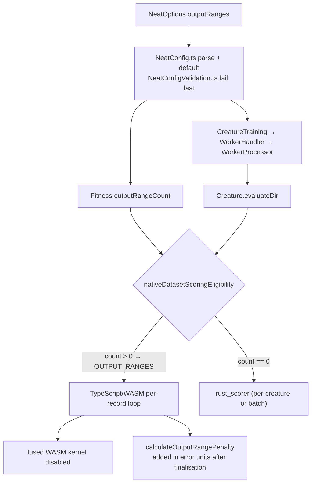

# Stage 2 evidence: `outputRanges` usage audit

## Summary

Evidence-only issue. Audited the whole `outputRanges` surface so decision 3 of
#3863 rests on an inventory rather than on nobody's actual knowledge, and posted
the report as a comment on #3863 under decision 3. Closes #3868.

No code, no test and no documentation on the `outputRanges` surface was changed
— the issue puts retirement out of scope, and
`test/docs/ApiReferenceSourceFacts.ts` would fail on an undocumented removal.
The only file this PR adds is this summary, which archives the report in-repo.

Report:
<https://github.com/stSoftwareAU/NEAT-AI/issues/3863#issuecomment-5419385533>

### What the audit found

- **85** `outputRanges` tokens in `src/` + `test/` (217 counting the
  `OutputRange*` types and the exported helper), across **14 `src/` files** and
  **7 `test/` files**, plus `mod.ts`, `scripts/lib/optionAuditRollup.ts`, 5 live
  docs and 1 `CHANGELOG.md` line.
- **Load-bearing**: `OutputRangePenalty.ts` (the quadratic penalty),
  `OutputRangeConfig.ts`, `CreatureActivation.ts:572-577` (a non-empty
  `outputRanges` **disables the fused WASM kernel** — a throughput consequence,
  not just a penalty) and `:662-663`, `NeatConfig.ts:773-786` (parse/default),
  `NeatConfigValidation.ts:179-197` (fail fast on `max < min`,
  `penaltyWeight < 0`), `Fitness.ts:162-184, 286-292` (`outputRangeCount` keeps
  the generation off the batch scorer),
  `NativeDatasetScoringEligibility.ts:49,
  108-110` (the `OUTPUT_RANGES`
  refusal) and `mod.ts:170-177` — **four public symbols**.
- **Incidental plumbing**: the two `NeatOptions` `Omit` key lists and both
  declarations, `NeatArguments`, `CreatureTraining` → `WorkerHandler` →
  `WorkerProcessor`, `Neat.ts`, and `Creature.evaluateDir`'s 4th positional
  parameter — a public method signature, so retirement is wider than an option
  key.
- **Publicly documented**: `docs/api/CONFIGURATION.md:253-260`,
  `docs/config/REGULARISATION.md:41-85, 113`,
  `docs/api/COSTS_AND_ACTIVATIONS.md:92`, plus `IN USE` in the option-audit
  slices. A documented option with no known consumer is still a compatibility
  promise — stated explicitly in the report rather than inferring disuse from a
  code search.
- **Non-test consumers**: none in this repo (`bench/` 0, `README.md` /
  `COMPARISON.md` 0, `scripts/` only the audit registry). The public
  `NEAT-AI-Examples` repo has **0** hits today. The private production
  consumer's FX code is the single live consumer, already recorded on #3863 and
  in `docs/OPTION_AUDIT_SLICE_D.md`. The native scorer repo has **no**
  output-range concept and no open issue asking for one.
- **Cost of each end state**: keeping costs 0 files now and makes the refusal
  permanent; retiring costs a deprecation cycle across a published JSR package
  (2 modules, 4 exports, a public method parameter, ~5 test files, 4 doc
  sections, major bump) and must follow the downstream FX migration or it
  silently drops that consumer's out-of-range penalty.
- **Recommendation**: confirm the sequenced answer already recorded — keep
  today, retire in the 7.0.0 cut (#3874) once the FX migration lands. Critically
  for #3861 stage 3: retiring `outputRanges` does **not** allow the TypeScript
  dataset-scoring path to be deleted, because `CUSTOM_COST` is permanent under
  decision 2. Size stage 3 accordingly.

## Evidence

Backend-only audit — nothing renders, so there is no screenshot to capture. The
evidence is the inventory itself, gathered from the working tree at `08d72377`
and reproducible with:

```bash
grep -ro '\boutputRanges\b' src test | wc -l          # 85
grep -rlE 'outputRanges|OutputRange' src | wc -l      # 14
grep -rlE 'outputRanges|OutputRange' test | wc -l     # 7
grep -rn outputRanges bench scripts README.md COMPARISON.md
gh search code "outputRanges" --repo stSoftwareAU/NEAT-AI-Examples   # 0 hits
```

Where the option is load-bearing on the scoring path:



## Test Plan

No tests were added or modified: the issue produces a report and forbids changes
to the `outputRanges` surface, so there is no behaviour to pin. The existing
guards that already cover this surface were left untouched and run in the gate:

- `test/architecture/OutputRangePenalty.ts` — 12 cases on the penalty maths.
- `test/config/OutputRangeConfig.ts` — 9 cases on parsing, defaults and
  validation.
- `test/architecture/OutputRangeIntegration.ts` — 3 end-to-end cases.
- `test/score/NativeDatasetScoringDelegation.ts` — the `OUTPUT_RANGES` refusal
  and the batch-partition behaviour.
- `test/score/RustScorerDatasetParity.ts` — enabling the native scorer must not
  change an `outputRanges` score.
- `test/docs/ApiReferenceSourceFacts.ts` — ties the documented option and helper
  to source facts, so an undocumented removal fails.

`./quality.sh` was run: **8867 passed, 2 failed**. Both failures are
pre-existing on `milestone/3861-one-dataset-scoring-implementation-stages-1-3`
at `08d72377` and unrelated to this PR, which adds one untracked Markdown file
and touches no code. Reproduced with only that file present:

- `test/score/RustScorerDatasetParity.ts:123` — "RMSE is still a known
  divergence (#3853)" now fails **because the divergence is gone**
  (`native=0.2185140834472997`, `typescript=0.2185140834472997`, identical). The
  test's own message says the `KNOWN_DIVERGENCES` entry must be deleted now that
  #3860 landed the root-of-mean fix. That deletion belongs to the #3853 lane,
  not to an evidence-only audit.
- `test/ErrorGuidedStructuralEvolution/AnalyzeParallelGpuGuard.ts:112` —
  environmental: the container has no GPU adapter and the Rust discovery library
  classifies the failure as `data_validation` rather than `GpuPermanent`.
