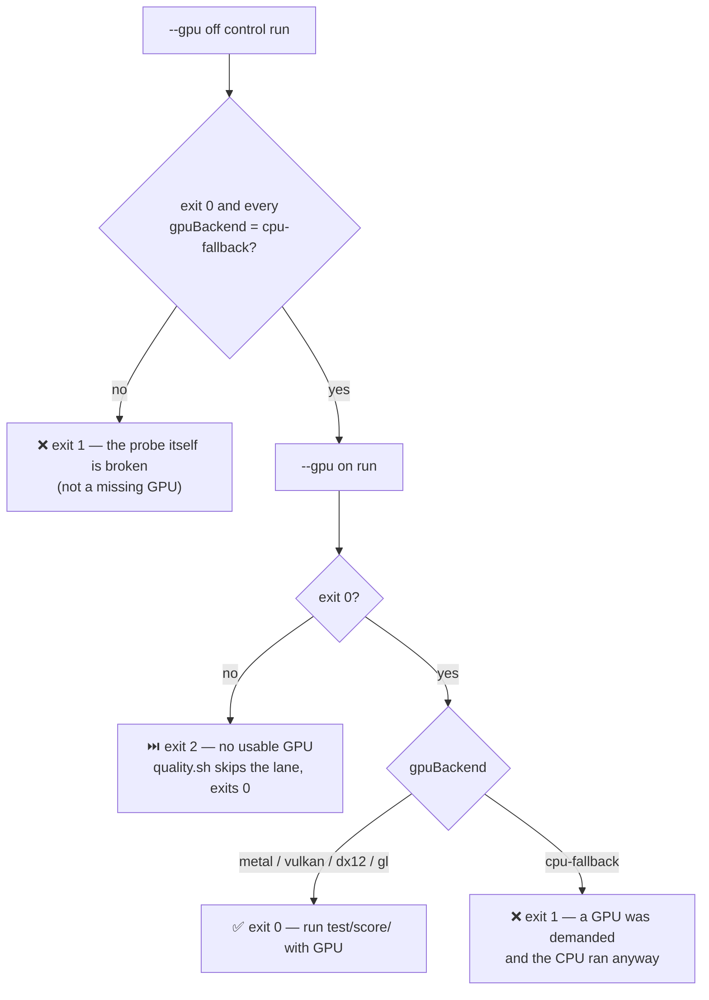

# Stage 2: add an opt-in GPU scorer lane to quality.sh

## Summary

`quality.sh` forces `NEAT_SCORER_GPU=off` on every test lane, so CI has never
exercised the GPU scoring path. That suppression is deliberate — `rust_scorer`
defaults to `--gpu auto`, directory/batch scoring then builds a Metal/wgpu
context per process, and four parallel evolve tests each holding one OOM the
host (jetsam SIGKILL / exit 137) — and it is left in place.

This adds `./quality.sh --gpu-scorer`: an **opt-in** GPU smoke lane appended
_after_ the existing lanes, never in place of one. A plain `./quality.sh` is
byte-for-byte unchanged. Closes #3869.

**Subset and serialisation, and why they fit the budget** (`quality.sh:353`):

| Lever             | Choice        | Why it fits                                                                                                                 |
| ----------------- | ------------- | --------------------------------------------------------------------------------------------------------------------------- |
| **Subset**        | `test/score/` | The jetsam signature is _evolve_ tests, which sit near the ~4060 MB / 4192 MB heap ceiling. The scorer subset contains none.  |
| **Serialisation** | `DENO_JOBS=1` | The OOM is four parallel contexts. One worker holds at most one, so the multiplier is removed rather than merely made smaller. |

The lane sets `NEAT_SCORER_GPU=auto` **explicitly** — `auto` _is_ the
`rust_scorer` default — so a leftover `export NEAT_SCORER_GPU=off` in the
operator's shell cannot quietly turn it back into a second CPU lane. That
mirrors the reasoning already applied to the backprop flags.

### Failure detection: the verdict comes from the scorer, not the env var

The regression risk the issue names is a lane that _looks_ like GPU coverage
and is not — `auto` finds no adapter, the scorer silently scores on CPU, the
lane goes green. So a pre-flight
([`scripts/check_gpu_scorer.ts`](../../../scripts/check_gpu_scorer.ts)) scores a
tiny two-creature fixture twice and
[`scripts/lib/gpuScorerProbe.ts`](../../../scripts/lib/gpuScorerProbe.ts)
classifies the pair from `rust_scorer`'s own `gpuBackend` JSON field:



The `--gpu off` control run is what keeps the skip honest: without it a broken
binary or fixture is indistinguishable from a host with no GPU, and a real
fault would be reconciled to a clean skip. Single-creature mode always reports
`cpu-fallback`, so the probe rejects that payload shape rather than measuring
the CPU by accident.

Two test helpers pinned `NEAT_SCORER_GPU: "off"` into the child env of every
scorer subprocess they spawned. They now call a shared `scorerGpuEnv()` that
defaults to `off` and carries the lane's value through — otherwise the new lane
would have exported `auto` while every scorer call still ran on the CPU.

No GPU/CPU numeric divergence was surfaced (this host has no adapter, so the
lane skipped). Per the issue, such a finding would belong with
stSoftwareAU/NEAT-AI-scorer#579, not here.

## Evidence

Backend/CLI change — no web interface to screenshot.

**The pre-flight, run against the real `rust_scorer` on this GPU-less host:**

```text
$ deno run --allow-read --allow-write --allow-env --allow-run --allow-ffi \
    --config ./deno.json scripts/check_gpu_scorer.ts
⏭️  GPU scorer lane skipped — rust_scorer --gpu on exited 1: this host has no usable GPU backend.
stderr:
Error: No compatible GPU adapter found and --gpu on was requested (use --gpu auto to fall back to CPU, or --gpu off to skip GPU detection entirely)
EXIT=2
```

The `--gpu off` control run succeeded and reported `cpu-fallback` for both
probe creatures, which is what makes that a clean skip rather than a failure.

**`./quality.sh --gpu-scorer` on the same host** ran the default lane
(`NEAT_SCORER_GPU=off`), probed the backend, and skipped the smoke lane with a
clear message — exit 0. See the Test Plan for the shimmed cases that cover the
proceed and fail-loud branches, which cannot be reached without an adapter.

## Test Plan

New — `test/scripts/GpuScorerProbe.ts` (12 cases, pure classifier):

- `readReportedBackends` returns one label per creature; rejects non-JSON, a
  single-creature payload, a missing `gpuBackend`, and an empty result map.
- `classifyGpuProbe` confirms a real backend, and reports every distinct one.
- Skips when `--gpu on` finds no adapter, quoting the scorer's own reason.
- **Fails loud** when `--gpu on` exits 0 reporting `cpu-fallback` — the
  Issue #3869 regression.
- **Fails loud** when the `--gpu off` control run fails (a broken probe is not
  a missing GPU), when `--gpu off` reports a GPU backend, and on unreadable
  `--gpu on` output.

New — `test/score/ScorerGpuEnv.ts` (4 cases): `scorerGpuEnv()` defaults to
`off`, carries `auto` through, honours an explicit `off`, and treats a blank
value as unset.

New in `test/scripts/QualityScript.ts` (6 cases, a shimmed `deno` on `PATH`
choosing the pre-flight's exit code, so all three branches run on a host with
no GPU):

- `--help` documents `--gpu-scorer`, the subset, `DENO_JOBS=1`, and says
  plainly that GPU is **not** exercised by default.
- `--dry-run` without the flag plans no GPU lane.
- `--dry-run --gpu-scorer` plans the probe **and** the smoke lane, alongside
  the default Rust lane.
- `--gpu-scorer` emits exactly two `deno test` calls: the default lane with
  `NEAT_SCORER_GPU=off` and the whole suite, then the GPU lane with
  `NEAT_SCORER_GPU=auto`, `DENO_JOBS=1` and `test/score/`.
- Pre-flight exit 2 → clean skip, gate still exits 0, only one lane runs.
- Pre-flight exit 1 → gate fails loud and the GPU lane does not run.

Unchanged and still passing: the existing
`quality.sh rust-scorer tests set NEAT_SCORER_GPU=off (no Metal OOM)` case,
which pins that the default lane did not move.

Full gate: `./quality.sh --gpu-scorer`.
