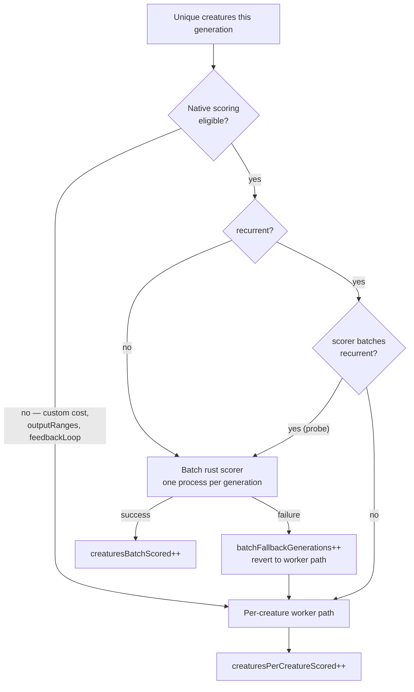

# Stage 2: batch recurrent creatures in directory mode

## Summary

`Fitness` partitioned every population before batch scoring: `forwardOnly`
creatures went to the one-pass `rust_scorer` batch, recurrent ones fell to the
per-creature worker path, because directory mode rejected any
`forwardOnly=false` creature. NEAT-AI-scorer#579 (merged, `4a1cd5c`) threads
each creature's own flag through the batch loop, so that partition can go — for
binaries new enough to have it.

This change retires the partition **per creature**, gated on a probed
capability:

- **`src/score/RecurrentDirectoryProbe.ts`** (new) — asks the resolved binary
  the functional question once and caches the answer: score a one-creature
  directory holding a genuinely recurrent creature (a real `output-0 → hidden-0`
  back edge) over a four-record dataset. `--help` advertises nothing about
  recurrent directory support and there is no `--version`, so a text probe would
  be guessing. An older binary refuses at load time and the probe answers
  `false`, which keeps the pre-existing partition — no failure, no behaviour
  change. The probe costs one subprocess per scorer configuration per process,
  and only when a population actually holds a recurrent creature.
- **`src/architecture/Fitness.ts`** — the hard-coded
  `forwardOnlyGuaranteed:
  true` at the batch eligibility call is replaced by
  each creature's real value, so `feedbackLoop: true` recurrent creatures still
  refuse with `FEEDBACK_LOOP` and still score on the TypeScript path, whatever
  the scorer version. The eligibility predicate is now consulted per creature,
  splitting the queue into batched / worker-path rather than forwardOnly /
  recurrent.
- **The partition INFO line survives**, extended so operators can see recurrent
  creatures batching:
  `Batch scorer partition: N forwardOnly batched, M recurrent batched, K per-creature`.
- **`src/score/RustScorerBridgeInternal.ts`** — `resolveProbeState` now caches
  the _promise_, so concurrent first callers share one `--help` spawn and one
  state object. That object is where the recurrent answer is memoised, so
  without this two racing callers would each probe.

Closes #3870.

### Behaviour notes for the reviewer

- A run whose cost is custom or whose `outputRanges` are set now emits the
  partition line reading
  `0 forwardOnly batched, 0 recurrent batched, N
  per-creature` where
  previously it emitted nothing. That is the accurate signal — it says the
  native path is not being used at all.
- Gap 2 of the issue (`feedbackLoop: true` on a recurrent creature) is
  deliberately **not** closed: the `FEEDBACK_LOOP` refusal at
  `NativeDatasetScoringEligibility.ts:111` is untouched and now pinned by a live
  test that the batched number matches the _stateless_ TypeScript number and
  differs from the carried-state one.

## Evidence

Backend/CLI change — no web interface to screenshot. The evidence is the live
parity lane running the **real** `rust_scorer` binary against the TypeScript
engine over the same corpus, plus the full quality gate.



Live parity against `../NEAT-AI-scorer/target/release/rust_scorer`:

```text
Batch recurrent parity: rust_scorer batch and TypeScript agree for CROSS_ENTROPY ... ok
Batch recurrent parity: rust_scorer batch and TypeScript agree for MSE ... ok
Batch recurrent parity: rust_scorer batch and TypeScript agree for RMSE ... ok
Batch recurrent parity: rust_scorer batch and TypeScript agree for MAE ... ok
Batch recurrent parity: rust_scorer batch and TypeScript agree for MAPE ... ok
Batch recurrent parity: rust_scorer batch and TypeScript agree for MSLE ... ok
Batch recurrent parity: rust_scorer batch and TypeScript agree for HINGE ... ok
Batch recurrent parity: a batched recurrent creature is scored stateless, not with carried state ... ok
Batch recurrent parity: a mixed batch scores every creature in one invocation ... ok
ok | 9 passed | 0 failed
```

Full gate:

```text
./quality.sh
ok | 8869 passed (5 steps) | 0 failed | 4 ignored (6m20s)
```

Measured while writing the semantics assertion: for the parity fixture the
carried-state and stateless errors differ by 2.6 % (scale 1) and 8.2 % (scale
3), so the "scored stateless, not with carried state" assertion has real
discriminating power rather than sitting inside the 1e-5 parity tolerance.

## Test Plan

**Added**

- `test/score/RecurrentDirectoryProbe.ts` — the probe answers `true` for a
  scoring binary and `false` for one that refuses with the pre-#579 message, for
  unusable output, and for an unavailable binary; the probe is never spawned
  when the binary is unavailable; concurrent and repeat callers share one
  subprocess; probe files are cleaned up.
- `test/architecture/FitnessRecurrentBatch.ts` — against a supporting scorer: a
  mixed population batches in one invocation with no worker call and the INFO
  line reads `2 forwardOnly batched, 2 recurrent batched, 0 per-creature`; an
  all-recurrent population batches too; a `feedbackLoop` run never hands a
  recurrent creature to the scorer and scores it on the worker path; the
  capability is probed once across three generations.
- `test/architecture/FitnessScorerDoubles.ts` — `legacyScorer` / `modernScorer`
  stand-ins that decide from the creature files they are handed, exactly as the
  binary does, so no test encodes the probe's shape.
- `test/score/RustScorerDatasetParity.ts` — batch-mode recurrent parity against
  `evaluateDir` for every built-in cost; a mixed batch scored in one invocation
  with each creature's number matching its own TypeScript reference (the two
  members are weight-scaled apart so a swap between stems would fail); the
  batched recurrent number matches the stateless engine and not the
  carried-state one. On a binary without the capability each case asserts the
  batch is **refused** rather than skipping silently.

**Modified — documented business-logic change**

- `test/architecture/FitnessForwardOnlyPartition.ts` — these four cases were
  written against a scorer that rejects recurrent batches, which is no longer
  the only kind. Every case now uses the explicit `legacyScorer` double, so it
  pins the older-binary half of the contract (the partition, unchanged) instead
  of assuming it. Two spawn-count assertions moved from "no scorer process" /
  "one scorer process" to accounting for the one capability probe the legacy
  binary refuses; no assertion about which creatures batch was weakened.
