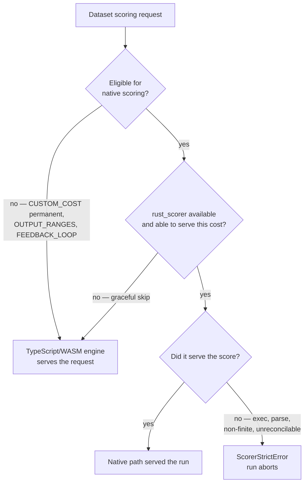

## Summary

Stage 3 of #3861: delete the duplicate dataset-scoring path — as far as the
recorded decisions in #3863 actually allow. Closes #3871.

The deletion that survived every decision is the **fallback**: a `rust_scorer`
that is present and fails no longer degrades to the TypeScript/WASM engine. It
throws a `ScorerStrictError` carrying the scorer's stderr verbatim, always. That
degrading path is what let Issue #3810 keep an entirely dead native scorer
reconciling to a green run, and decision 5 of #3863 authorised removing it
("`deno test` requires a locally built `rust_scorer` — yes … Removing the
TypeScript/WASM dataset-scoring fallback in stage 3 is acceptable").

What did **not** survive the decisions is the deletion of the TypeScript engine
itself. Per-target verdicts are below.

### Per-target verdict, as the acceptance criteria require

| # | Target | Verdict |
| --- | --- | --- |
| 1 | `Fitness.ts` — batch partition, fallback `catch`, `creaturesForWorkerPath`, `lastBatchFallbackOccurred` | **Partly done.** The fallback `catch` and `lastBatchFallbackOccurred` are gone. The **partition and `creaturesForWorkerPath` stay** — cancelled by decisions 2 and 3. |
| 2 | `CreatureActivation.ts` — the `evaluateDir` WASM accumulator and the `if (eligibility.eligible)` branch | **Cancelled.** Decision 2 makes `CUSTOM_COST` permanent, so the accumulator must survive; decision 3 (sequenced) keeps `OUTPUT_RANGES` until the FX migration lands. This is the demotion the issue predicted, recorded in the code at `src/creature/CreatureActivation.ts`. |
| 3 | `quality.sh` — the WASM lane | **Done.** `--wasm-scorer` and `--test-both-scorers` removed (both drove `run_test_suite "wasm"`), along with the lane itself. |
| 4 | `test/score/RustScorerStrictMode.ts` — the strict-off halves | **Done.** All three strict-off cases deleted; the strict-on cases stay and no longer pass `strict` at all. |
| 5 | `test/architecture/FitnessBatchFallbackCounted.ts` | **Done.** Deleted — it tests a fallback that no longer exists, exactly as #3866's own acceptance criteria anticipated. |

### Why targets 1 and 2 shrank

Decision 2 is quoted here as #3863 asked: *"Custom cost functions remain
supported. `Costs.registerCustomCost()` and `CostInterface` stay public API.
Custom costs are passed in as a JavaScript file, so they can only be evaluated
on the TypeScript path. The `CUSTOM_COST` refusal in
`src/score/NativeDatasetScoringEligibility.ts` is **permanent**. Stage 3 may
demote the TypeScript dataset-scoring path for this case; it must not delete
it."*

A permanent refusal means a permanent per-creature remainder, so `Fitness`'s
batch partition cannot collapse to one unconditional call and `evaluateDir`'s
accumulator cannot be removed. Decision 3's sequenced answer (keep
`outputRanges` until stSoftwareAU/GRQ#4363 lands) reaches the same conclusion
independently. The #3868 audit comment on #3863 states it directly: *"Retiring
`outputRanges` does not let stage 3 delete the TypeScript dataset-scoring path.
`CUSTOM_COST` is permanent by decision 2 and `FEEDBACK_LOOP` is unresolved."*

Decisions 1 and 4 needed no work here: #3853 already landed the RMSE
finalisation, and #3867 measured `scoring.rs` and `Score.ts` as bit-identical at
the default growth cost, so nothing in this PR turns on which formula wins.

### Consequential removals

Deleting the last degrading path made three things unreachable, so they went
with it rather than being left reporting a value that can never change:

- **`strict`.** `NEAT_AI_RUST_SCORER_STRICT=0` and `rustScorer: { strict: false }`
  selected the degrading path. Both are now **refused** with a
  `ConfigurationError` naming the issue — not ignored. Silently dropping an
  operator's explicit "degrade rather than fail" is the same masked-fault class
  the issue exists to remove. `=1` / `strict: true` stay accepted as no-ops, so
  existing configurations and CI exports keep working.
  `RequiredRustScorerConfig.strict` is removed.
- **The native-scoring fallback ledger and verdict (#3866).**
  `src/score/NativeScoringFallbackLedger.ts`, the `nativeFallback` field on the
  worker evaluate response, `Fitness.lastNativeScoringFallbackOccurred`, and the
  `batchFallbackGenerations` / `nativeFallbackGenerations` /
  `nativeScoringFallback` fields on `scorerUtilisation`. #3866 built these as the
  interim guard for the window between stage 1 and stage 3 — its own acceptance
  criteria say *"`test/architecture/FitnessBatchFallbackCounted.ts` still passes.
  Deleting it is stage 3."* With no degrading path left, every one of those
  fields is pinned false/zero. The backend split
  (`batchScorerInvocations`, `creaturesBatchScored`,
  `creaturesPerCreatureScored`) is unchanged.

### Never-deletable list — verified present

- `src/creature/EpisodicFitness.ts` (329 lines) and
  `src/creature/RLEpisodeFitness.ts` (511 lines): both updated only to drop the
  `lastBatchFallbackOccurred` reset the removed `ScorerUtilisationSource` field
  required — exactly the breakage the issue warned about. RL and episodic suites
  run green (below).
- `traceDir`: untouched (`src/Creature.ts`, `src/creature/CreatureTraining.ts`).
- Discovery validators, the training-loop error sites: untouched.
- The custom-cost path: untouched, and now permanent by decision 2.
- `WasmCreatureActivation`: untouched — still powers `activate()`, training,
  discovery and RL, and still serves dataset scoring for every refused request.
- RL scorers: out of scope, no `dataDir`, unaffected.
- `test/score/RustScorerDatasetParity.ts` and
  `test/score/NativeDatasetScoringDelegation.ts`: both present and passing.

## Evidence

Backend/CLI change with no web surface, so no screenshot applies. The evidence
is the test suite and the quality gate.

Scoring boundary after this change — a refusal routes to the TypeScript engine,
a failure does not:

Targeted runs (all green):

- `test/score/` + `test/architecture/Fitness*.ts` + `test/NEAT/FitnessBatchRustScorer.ts`
  + `test/creature/EvolveGenerationTail.ts` + `test/costs/` — `59 passed | 0 failed`
- RL and episodic: `test/creature/evolveRL_test.ts`,
  `test/creature/EvolveRLStatistics_test.ts` — green, which is the concrete
  severe-failure check the issue names.
- `test/scripts/QualityScript.ts` — `35 passed | 0 failed`, including a new case
  asserting `--wasm-scorer` / `--test-both-scorers` are refused by name.

Manual check the issue requires — **a machine with no `rust_scorer` on `PATH`**:
the library still treats an absent or too-old binary as a graceful skip, pinned
by `test/architecture/FitnessNativeScoringFallback.ts` ("no rust_scorer
installed is a graceful skip") and `test/score/RustScorerStrictMode.ts` ("an
unavailable binary stays a graceful skip"), both of which run with an
unresolvable `binaryPath` and assert the run completes on the WASM engine.
`./quality.sh` is deliberately stricter and fails loud when the binary cannot be
resolved — that is decision 5, and `docs/TROUBLESHOOTING.md` /
`docs/troubleshooting/CI.md` now say so instead of promising a fallback.

## Test Plan

Added:

- `test/score/RustScorerStrictDefault.ts` — rewritten: a false-like
  `NEAT_AI_RUST_SCORER_STRICT` raises a `ConfigurationError` naming #3871, while
  `1`, `true`, empty and unparseable values still resolve. Runs in a child
  process with a cleared environment (Issue #3234).
- `test/architecture/FitnessNativeScoringFallback.ts` — rewritten to the two
  surviving directions: an unresolvable binary completes on WASM; a resolvable
  binary that fails aborts and never reaches the worker path.
- `test/scripts/QualityScript.ts` — new case: the retired lane flags are refused
  with a message naming the removal.

Modified (behaviour changed, so the assertions changed with it — documented
here as required):

- `test/score/RustScorerStrictMode.ts` — the three strict-off fallback cases
  removed (target 4). Survivors no longer pass `strict`.
- `test/architecture/FitnessBatchStrictMode.ts` — the "strict mode off … still
  falls back and completes" case removed; the fatal case stays.
- `test/architecture/FitnessScorerUtilisation.ts`,
  `test/NEAT/FitnessBatchRustScorer.ts`,
  `test/architecture/FitnessForwardOnlyPartition.ts` — the "falls back to worker
  path" cases now assert the generation aborts with `ScorerStrictError`, no
  creature is scored, and the worker path is never entered.
- `test/creature/ScorerUtilisationTotals_test.ts`,
  `test/creature/EvolveScorerUtilisation.ts`,
  `test/creature/EvolveGenerationTail.ts`,
  `test/architecture/FitnessBatchPathUsed.ts`,
  `test/scripts/VerifyBatchScorerUtilisation.ts` — fallback-tally assertions
  dropped with the fields.

Deleted:

- `test/architecture/FitnessBatchFallbackCounted.ts` (target 5) — asserts a
  fallback that no longer exists.
- `test/score/NativeScoringFallbackVerdict.ts` — asserts the #3866 verdict that
  no longer has a source.

## Pre-PR Security Self-Check

- **Input validation:** `assertStrictOptOutRetired` validates the one new input
  path (an env value / option field) and rejects the retired value with a typed
  `ConfigurationError`.
- **Secrets:** none staged; the diff touches source, tests, docs and
  `quality.sh` only.
- **Injection surface:** no new SQL, shell, filesystem or HTTP calls. The
  `rust_scorer` invocation is unchanged and still passes an argv array, never a
  concatenated command string.
- **Output encoding:** scorer stderr is carried on the typed error as it already
  was; the log lines that interpolated it were removed, not added.
- **Authentication/authorisation:** not applicable — library code.
- **Error handling:** the change moves in the fail-loud direction; every removed
  branch replaced a thrown error with a warning.
- **Dependencies:** none added or changed.
