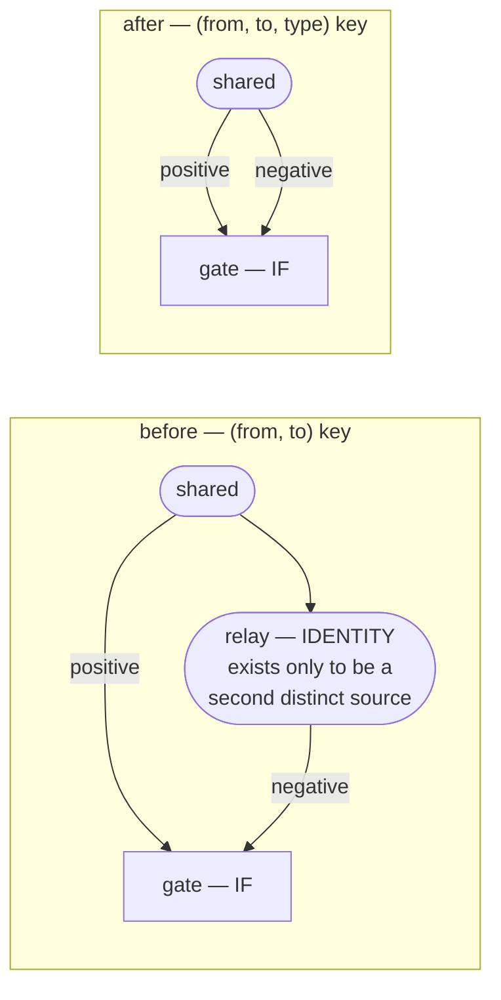

# Key synapses by `(from, to, type)`

## Summary

A synapse is now identified by the **triple** `(from, to, type)` rather than the
ordered `(from, to)` pair, so one source can feed both branches of an `IF`
neuron directly. Closes #3873.

An `IF` neuron keeps a **separate sum per role**
(`if (condition_sum > 0) positive_sum + bias else negative_sum + bias`), so a
term that must apply whichever way the `IF` branches needs two synapses into
that neuron from one source. The pair key forbade that, and the workaround was
an IDENTITY relay neuron whose only job was to be a second distinct source — 455
of them had accumulated on the production creature.

The rule, verbatim from the issue:

- Uniqueness is `(from, to, type)`; an ordered pair may appear at most once per
  role, so at most four times.
- **Only an `IF` target may carry more than one role from one source.** Every
  other squash sums its inward synapses regardless of role, so two synapses from
  one source there are exactly one with the summed weight — redundancy with no
  meaning, which evolution must not be able to create.
- The canonical sort order is the same triple, so it stays total.
- The wire format is unchanged — `type` was already in the JSON, and every
  existing creature satisfies the stricter rule already.



### What changed

| Area                                                | Change                                                                                                                                                                |
| --------------------------------------------------- | --------------------------------------------------------------------------------------------------------------------------------------------------------------------- |
| `src/architecture/SynapseKey.ts`                    | New — the single TypeScript home for the key: `compareSynapses`, `synapseRoleRank` (delegating to core's `SynapseType` discriminant), `isRoleReadingTarget`           |
| `src/Creature.ts`                                   | `connect`, `disconnect`, `connectBatch`, `disconnectBatch`, `getSynapse`, `hasConnection`, `setSynapseFrozen` take the role; new `getSynapses` and `occupyingSynapse` |
| `src/creature/CreatureTopology.ts`                  | `binarySearchSynapse`, `findInsertionPoint`, `getSynapse`, `connectionSet` keyed by the triple; new `assertSynapseSlotFree` refuses what the key has no room for      |
| `src/architecture/SynapseOrderGuard.ts`             | The debug-gated sorted-order invariant is the triple                                                                                                                  |
| `src/architecture/Offspring.ts`                     | Crossover keys by `(from, to, type)` into an `IF` target and by the pair elsewhere                                                                                    |
| `src/compact/SynapsePruning.ts`                     | Duplicate merging keys per role for an `IF` target only                                                                                                               |
| `src/architecture/RepairInvalidIfNeurons.ts`        | Downgrading an `IF` to `IDENTITY` now sums the rows the role strip merges, instead of leaving a duplicate pair `fix()` rejects                                        |
| `src/reconstruct/CRISPR.ts`                         | Grafts ask `occupyingSynapse` — so a graft can add a second role into an `IF` without a relay                                                                         |
| `src/mutate/*`, `IF/MAXIMUM/MINIMUM/HYPOT`          | Targeted disconnects remove the role they chose; `ModWeight` no longer collapses two roles into one mutable synapse                                                   |
| `src/blackbox/MemeticUpdate.ts`, `RestoreSource.ts` | The memetic record is `(fromId, toId)`-keyed and cannot say which role — it now refuses rather than mis-restore                                                       |
| `deno.json`, `wasm_activation/pkg/`                 | Vendored NEAT-AI-core advanced to `53443e70`, which carries the relaxed rules and `validate_topology_typed`                                                           |

`Creature.disconnect(from, to)` with no role removes **every** role the pair
carries (the issue asked for that call to be decided explicitly); pass a role to
remove one. Call sites that had already chosen a specific synapse now pass its
role.

Mutation operators keep asking the **pair-level** question — `AddConnection`,
`AddBackCon`, `AddSelfCon` and `AddNeuron` add untyped synapses and
`getAvailableConnections` reports a slot taken when the pair carries any role.
Evolution therefore still cannot create a second role from one source; the new
shape is reachable through `connect`/`connectBatch`/CRISPR, which is what
NEAT-AI-Forests needs to drop the relay from grafts.

## Evidence

Backend/library change with no web interface to screenshot. The evidence is the
tests below plus the conformance corpus, which is the executable statement of
what NEAT-AI-core now does:

```text
$ deno test --allow-all test/creature/TypedSynapseKey.ts
ok | 14 passed | 0 failed (25ms)

$ deno test --allow-all test/validate/CreatureValidateConformance.ts
conformance synapses: if-shared-source-feeds-both-branches (synapses.json) ... ok
conformance synapses: synapses-not-sorted-by-type (synapses.json) ... ok
conformance synapses: duplicate-synapse-roles-into-non-if (synapses.json) ... ok
ok | 60 passed | 0 failed (24ms)
```

The behaviour-equivalence claim is asserted, not argued:
`typed key: the direct
pair activates like the IDENTITY relay it replaces`
activates both shapes over four inputs and asserts identical outputs, then
asserts the direct creature carries one neuron fewer.

### Full quality gate

```text
$ ./quality.sh   # fmt / lint / deno check / build.sh --verify-only / deno test
FAILED | 8798 passed (5 steps) | 4 failed | 41 ignored (5m32s)
```

`deno fmt --check`, `deno lint`, `deno check src test`, and
`./build.sh --verify-only` (which confirms `wasm_activation/pkg` matches
`stSoftwareAU/NEAT-AI-core@53443e70`) are all clean.

The four test failures **predate this work**. Each was reproduced on the base
commit `90cd8c4f` with this branch stashed:

- `every social preview uses GitHub's 1280x640 canvas`,
  `every social preview has a transparent background`,
  `every social preview still draws artwork` — `test/docs/BrandAssets.ts` and
  `test/docs/BrandTransparency.ts`, from the `new socials` change (#3872). The
  `docs/branding/*.png` assets those tests read are absent here.
- `Dataset scoring parity: RMSE is still a known divergence (#3853 …)` — the
  divergence has since been fixed, so the `KNOWN_DIVERGENCES` entry the test
  guards is stale and the test now fails _because_ the engines agree. Out of
  scope here.

Two failures the change did introduce were found and fixed rather than explained
away — `mergeDuplicateSynapses - same from/to merges even when type
differs`
(see Test Plan below) and
`Issue #3845: a genuinely invalid creature is still repaired`, which caught a
real defect: downgrading an `IF` to `IDENTITY` strips the branch roles, and one
source could now have fed that `IF` twice, so the strip left a duplicate pair
`fix()` rejects. `repairInvalidIfNeuron` now sums those rows into one, so the
repair no longer swaps one invalid creature for another.

## Test Plan

Added `test/creature/TypedSynapseKey.ts` (14 tests):

- an `IF` target accepts both roles from one source, and they survive the load
- the direct pair activates identically to the IDENTITY relay it replaces, with
  one neuron fewer
- `connect` adds a second role into an `IF`; refuses an exact triple repeat;
  refuses a second role into a non-`IF` target
- synapses stay sorted by `(from, to, type)` after out-of-order inserts
- `disconnect` removes one role or every role; `hasConnection` answers per pair
  and per role
- `connectBatch` keys by the triple and enforces the `IF`-only rule
- an export round-trip keeps both roles; a repeated pair into a non-`IF` target
  is still merged on load
- `fix()` keeps both roles into an `IF` target
- breeding carries both roles into the offspring
- `mergeDuplicateSynapses` coalesces by target: the exact triple merges, the
  other role is left alone

Added three cases to the `creatureValidate` conformance corpus
(`test/fixtures/validate/synapses.json`) with their `coverage.json` sites —
`if-shared-source-feeds-both-branches` (`OK_IF_SHARED_SOURCE`),
`synapses-not-sorted-by-type` (`SORT_FAILURE_TYPE`) and
`duplicate-synapse-roles-into-non-if` (`DUPLICATE_SYNAPSE_NON_IF`).

### Modified existing test — documented

`test/compact/CompactUtils.ts::mergeDuplicateSynapses - same from/to merges even
when type differs (Issue #2086)`
asserted that a `condition` and a `positive` from one source into an **`IF`**
target merge into one synapse. That is exactly the behaviour this issue changes,
so it cannot stand: an `IF` sums each role separately. The case keeps every
assertion (`merged: 1`, weight `0.8`, type `condition`) against an `IDENTITY`
target, where the Issue #2086 rule still binds, and a companion case
`mergeDuplicateSynapses - an IF target keeps one synapse per role (Issue #3873)`
pins the new behaviour. No test was removed or commented out.
