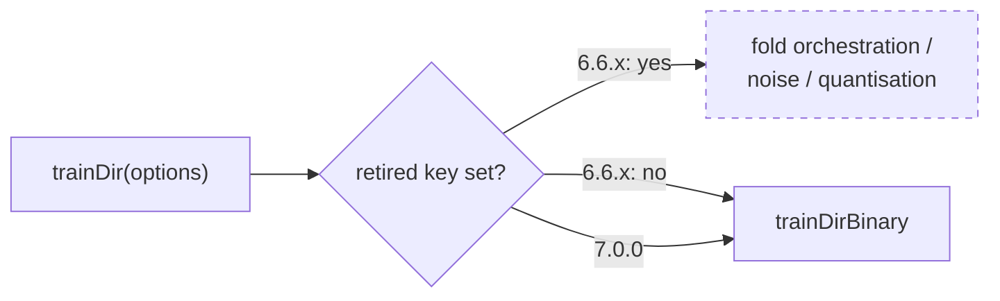

# 7.0.0 — retire `crossValidation`, `dataFuzzing` and `dataQuantisation`

## Summary

Three off-by-default experimental options had zero adopters in either consumer
(GRQ `Develop`, NEAT-AI-Examples). Each was gated behind its own `enabled` flag,
so the default path was already byte-identical to the feature not existing. This
change deletes them outright and bumps `deno.json` to `7.0.0`, because removing
a public option is a major API break. Closes #3874.

Removed, per the issue's **Remove** table — and nothing else. `outputRanges`,
`mcmc`, `predictiveCoding`, `squashBudget`, `customCost`, `randomImmigrants` and
every load-bearing default are untouched.

| Surface                 | What went                                                                                                                                                                                                                        |
| ----------------------- | -------------------------------------------------------------------------------------------------------------------------------------------------------------------------------------------------------------------------------- |
| Option surfaces         | `NeatOptions` fields + their `CoerceNumeric` mirror and both `keyof` unions, `NeatArguments` fields, `NeatConfig` fields, `TrainOptions` fields                                                                                  |
| Parsers                 | `parseCrossValidation`, `parseDataFuzzing`, `parseDataQuantisation`, their re-exports, and `src/config/parsers/DataParsers.ts`                                                                                                   |
| Config modules          | `CrossValidationConfig.ts`, `DataFuzzingConfig.ts`, `DataQuantisationConfig.ts`                                                                                                                                                  |
| Implementations         | `CrossValidationTrainer.ts`, `KFoldSplitter.ts`, `DataFuzzing.ts`, `DataQuantisation.ts`, `applyDataAugmentation`, `trainDirSingleFold`                                                                                          |
| Training gates          | `Training.ts`, `TrainingSetup.ts`, `TrainingEpoch.ts`, `TrainingPredictiveCoding.ts`, `PredictiveCodingTrainer.ts`, `NeatScheduling.ts`, and the three now-dead skip reasons in `RustTrainDirBridge.ts`                          |
| Public docs             | `README.md`, `docs/config/TRAINING.md`, `docs/api/{CONFIGURATION,TRAINING}.md`, `docs/config/RECIPES.md`, `docs/comparison/*`, `docs/troubleshooting/TRAINING.md`, `docs/{CONFIGURATION_GUIDE,TROUBLESHOOTING,API_REFERENCE}.md` |
| Version + release notes | `deno.json` → `7.0.0`; `CHANGELOG.md` **Removed** entry naming the three keys                                                                                                                                                    |

**Breaking for embedders:** `DataFuzzingConfig`, `RequiredDataFuzzingConfig` and
`DEFAULT_DATA_FUZZING_CONFIG` are no longer exported from `mod.ts`, and setting
any of the three keys is now a type error. No call-site change is expected in
either consumer — neither ever set them.

### Deliberately left alone

- `docs/archive/**` — historical record, per the issue.
- `docs/OPTION_AUDIT_CONSOLIDATED.md`, `docs/OPTION_AUDIT_SLICE_D.md` — the
  #3505 audit write-ups. They record what the audit found in August 2026, not
  the current API surface; rewriting them would falsify the record. The
  machine-readable roll-up that _is_ live, `scripts/lib/optionAuditRollup.ts`,
  drops the three entries and notes the 7.0.0 retirement in its slice-D comment,
  so the reconciliation script still reports zero coverage gaps.
- `randomImmigrants` — unused but #3560 closed as KEEP; the issue explicitly
  excludes it.

## Evidence

Backend/library change with no web interface, so there is nothing to screenshot.
The evidence is the test suite and the type-checker.

Removing the branches is only safe if the default path never touched them. That
is what the new gate test pins, end to end:



`test/config/RetiredExperimentalOptions.ts` trains the same seed creature twice
from an identically re-seeded RNG — once plain, once with all three retired keys
force-enabled through an untyped cast — and asserts the error and iteration
count are identical. Before the removal that assertion fails (the enabled
branches change the outcome); after it, the keys are inert:

```
running 3 tests from ./test/config/RetiredExperimentalOptions.ts
Retired options - resolved config carries no retired keys ... ok (1ms)
Retired options - supplying them does not resurrect them ... ok (125µs)
Retired options - trainDir ignores them ... ok (15ms)

ok | 3 passed | 0 failed (21ms)
```

`./quality.sh` (format, lint, bash check, `deno check` over 2534 files,
discovery verification, WASM sync, full test suite) passes.

## Test Plan

Added:

- `test/config/RetiredExperimentalOptions.ts`
  - `resolved config carries no retired keys` — `createNeatConfig({})` produces
    no `crossValidation` / `dataFuzzing` / `dataQuantisation` key.
  - `supplying them does not resurrect them` — passing all three (untyped, as a
    JSON-sourced caller would) leaves them off the resolved config; no parser
    silently reinstates them.
  - `trainDir ignores them` — regression test for the behaviour the removal
    claims: identical error and iteration count with and without the keys.

Modified (existing coverage of the deleted behaviour, removed with it — no test
was weakened to make the suite green):

- `test/architecture/training/TrainingSamples.ts` — dropped the
  `applyDataAugmentation` cases; the sample-index cases stay.
- `test/architecture/training/RustTrainDirBridge.ts` — dropped the three
  skip-reason cases for gates that no longer exist.
- `test/config/parsers/TrainingParsers.ts` — dropped the retired parser cases.

Deleted with their subjects: `test/architecture/CrossValidation.ts`,
`test/architecture/KFoldSplitter.ts`, `test/config/CrossValidationConfig.ts`,
`test/config/parsers/DataParsers.ts`, `test/propagate/DataFuzzing.ts`,
`test/propagate/DataFuzzingIntegration.ts`,
`test/propagate/DataQuantisation.ts`.

## Follow-up (not in this PR)

Consumer bump PRs in GRQ and NEAT-AI-Examples once 7.0.0 is published. Neither
sets any of the three keys, so no call-site change is expected — a consumer that
did would fail `deno check` on the 7.x pin, which is the intended failure
detection.
