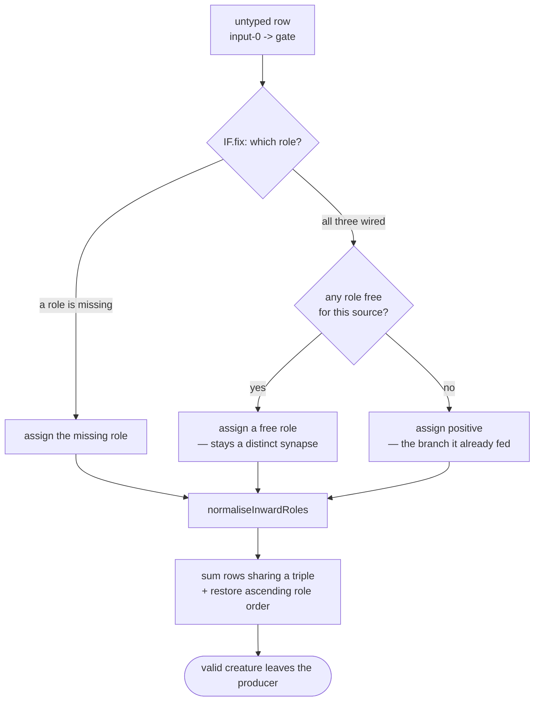

# Sum the role `IF.fix` duplicates, and re-sort what it rewrote

## Summary

`IF.fix` gives an `IF` neuron the three inward roles it needs by writing
`synapse.type` **in place**. That single write is the producer of both symptoms
Issue #3880 reports from the GRQ fleet on 6.6.42, and it explains why they are
one defect and not two:

- the role it hands out may be one that source **already carries** into this
  neuron, leaving two rows of one `(from, to, type)` triple —
  `TopologyError: duplicate synapse input-1216 -> forest-…-if0`;
- the rewritten row keeps its slot in the canonically-sorted `creature.synapses`
  array while its role rank changes, so the `(from, to)` run is left in
  descending role order —
  `TopologyError: synapses not sorted 2142->5417 type:
  condition last type: negative`.

Neither was repaired before returning, so the creature entered the population
invalid and the fault surfaced stages later — in a stranger's breeding attempt,
or as `rust_scorer` refusing to compile a whole batch.

The fix, in the producer:

1. **Prefer a role the source still has free.** `IF.fix` now tracks which roles
   each source already feeds this neuron and picks from what is left, so the
   common case creates no duplicate at all.
2. **Sum when nothing is free.** Where the source holds all three roles the
   spare row is summed into the row it would duplicate. It is given `positive`,
   which is exactly what an untyped row into an `IF` already contributed (the
   activation's `default` branch), so the sum is behaviour-preserving.
3. **Normalise before returning.** The new
   `src/architecture/CoalesceInwardSynapses.ts` restores the canonical
   `(from, to, type)` order and sums any row the rewrite duplicated. The
   existing `stripRolesAndCoalesceSources` now shares that helper rather than
   carrying its own copy of the merge.

Closes #3880.

## Evidence

This is a library/CLI change with no web interface, so there is no screenshot to
capture; the evidence is the reproduction and the tests.

**Reproduced first, at `HEAD`, with the issue's own error strings.** A gate
whose source `input-0` already feeds it a role, plus one spare untyped row,
driven through `IF.fix`:

```text
TopologyError: 1) duplicate synapse input-0 -> gate
    at creatureValidate (src/architecture/CreatureValidate.ts:149:10)

TopologyError: 1) synapses not sorted 0->3 type: condition last type: negative
    at creatureValidate (src/architecture/CreatureValidate.ts:149:10)
```

The second line is the field message verbatim, down to the role pair
(`type: condition last type: negative`).

With the two producer tests staged against the unfixed `src/`:

```text
FAILED | 3 passed | 2 failed
  Issue #3880: IF.fix never hands a source a role it already carries
  Issue #3880: IF.fix leaves each (from, to) run in ascending role order
```

and after the fix:

```text
ok | 5 passed | 0 failed (33ms)
```

Where the write happens, and what now settles it:



## Test Plan

New `test/fix/IfRoleAssignmentCoalesce.ts` — five cases, each building a real
creature and driving it through the real code path:

- **`IF.fix` never hands a source a role it already carries** — `input-0` holds
  all three roles plus a spare untyped row with the field dump's weight
  (`-4.7776948980020784e-05`). Asserts one row per role in ascending order, that
  `creatureValidate` passes, and that the surviving `positive` weight is the
  **sum** of the two rows. Run under three pinned RNG values so every branch of
  the role choice is covered. Fails without the fix
  (`duplicate synapse input-0 -> gate`).
- **`IF.fix` leaves each `(from, to)` run in ascending role order** — the spare
  row takes a role the source has free; asserts both rows survive and the run
  stays ordered. Fails without the fix (`duplicate synapse` at one RNG value,
  `synapses not sorted` at another).
- **`coalesceInwardDuplicates` sums two rows of one role on an `IF` target** —
  the shape named in the acceptance criteria: one source, one `IF` target, two
  rows of the same role with small opposite-sign weights. Asserts one summed row
  survives and the source's other role is untouched.
- **`coalesceInwardDuplicates` sums every role on a non-`IF` target** — every
  other squash sums its inward synapses regardless of role, so all of one
  source's rows there are one row with the summed weight.
- **`normaliseInwardRoles` restores canonical order with nothing to merge** —
  the ordering half on its own, with no duplicate to sum.

No existing test was modified or removed. `./quality.sh --wasm-scorer` passes
(the container has no native `rust_scorer` binary, which the default mode
requires).

## Security self-check

- No new external input surface: both new functions take a `Creature` already
  inside the process, and every value read is a numeric weight or an internal
  role enum.
- No secrets, credentials or hidden files staged.
- No new SQL, shell, filesystem or HTTP calls, and no user data rendered to any
  sink.
- No new dependency.
