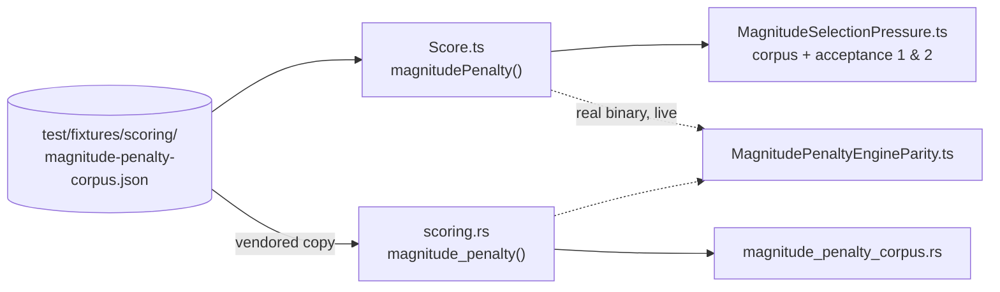

# Make weight/bias magnitude carry real selection pressure

## Summary

Closes #3881. **Must merge together with**
[stSoftwareAU/NEAT-AI-scorer#584](https://github.com/stSoftwareAU/NEAT-AI-scorer/pull/584)
— the two engines score the same creatures, and `NEAT_AI_RUST_SCORER_STRICT`
exists to catch them disagreeing.

`valuePenalty` was `1 / (1 + 1 / value)`: already 0.990 at `|w| = 100` and
0.9999 at 1000, then compressed further above 0.999. Past about two decades it
could no longer tell a sensible weight from an absurd one. At the fleet's
`growthCost` of 1e-7 the whole magnitude term was worth at most **1e-9** of
score while one hidden neuron costs **1e-7**, so nothing opposed drift and
production weights reached `1.156e+195`. This was never a clamping problem — the
clamp works; the incentive behind it was missing.

Three changes, mirrored exactly in `rust_scorer/src/scoring.rs`:

1. **Curve** — `0.999 * log10(v) / 12` up to a 12-decade cap, then an asymptotic
   tail that stays below 1. Every decade costs the same, so growth is never
   free.
2. **Aggregate** — the mean of the per-value penalty over _every_ weight and
   bias, not `(max, avg)`. This is the half that matters: growing a _typical_
   weight a full decade moved the score by ~1e-12, so all the pressure sat on
   one synapse out of 38,624. The published population shows the result — 51 of
   53 samples share an identical `max|w|` of 1.631e+08 while `avg|w|` drifted to
   4544.
3. **Coefficient** — the magnitude term carries its own `MAGNITUDE_COST` (100)
   instead of sharing the squash term's `/100`.

Two things this branch adds on top of that:

- **The `MAX_SAFE_INTEGER` clamp is now a named contract, not a repeated
  detail.** It lived inline in `sumOfValuePenalties` and was missing from the
  two Issue #1045 incremental paths, so `updateScoreForWeightChange` on the
  exact magnitude that opened this issue threw
  `Value: 1.1559466326634707e+195 is too large` where a full recalculation
  clamped, warned and charged for it. Every call site now goes through
  `magnitudePenalty()` — the mirror of Rust's `magnitude_penalty()`.
- **A shared corpus** (`test/fixtures/scoring/magnitude-penalty-corpus.json`,
  vendored byte for byte into the scorer repo) states the curve as data across
  magnitudes 1 → 1e20, so a port is checked against the contract rather than
  against one implementation's habits.

### Rollout

Every score moves. GRQ's score floors (#4299/#4326/#4377) will read a fleet-wide
shift as a collapse, so this needs a deliberate baseline rescore rather than
landing mid-run.

## Evidence

Backend/CLI change — no web interface to screenshot. Verified by test execution
and by running the real `rust_scorer` binary.

### The curve, before and after

| max&#124;w&#124; | old `valuePenalty` | new `magnitudePenalty` |
| ---------------: | -----------------: | ---------------------: |
|               10 |       0.9090909091 |                0.08325 |
|              100 |       0.9900990099 |                 0.1665 |
|             1e03 |       0.9998735419 |                0.24975 |
|             4544 |       0.9998938605 |               0.304482 |
|         1.631e08 |       0.9999497737 |               0.683687 |
|             1e13 |       0.9999676727 |               0.999077 |
|         9.007e15 |       0.9999735007 |               0.999248 |
|         1.16e195 |       0.9999977785 |               0.999248 |

The old column's last five rows agree to four significant figures — that is the
bug. The new column separates `|w| = 4544` from `|w| = 1.631e8` by 0.38, so a
decade of drift is charged for wherever it happens.

### Live cross-engine agreement

The real `rust_scorer` binary (built from
[NEAT-AI-scorer#584](https://github.com/stSoftwareAU/NEAT-AI-scorer/pull/584))
scored against `calculate()` in-process, over creatures whose every weight and
bias sits at the given magnitude:

| &#124;w&#124; | TypeScript penalty | Rust penalty      | relative |
| ------------: | -----------------: | ----------------- | -------: |
|            10 |  1.100283555489e-6 | 1.100283555522e-6 | 3.03e-11 |
|          4544 |  3.312600959204e-6 | 3.312600959172e-6 | 9.77e-12 |
|      1.631e08 |  7.104651478129e-6 | 7.104651478088e-6 | 5.82e-12 |
|          1e13 |  1.038066101788e-5 | 1.038066101785e-5 | 3.43e-12 |

The residual is float summation order — the two engines accumulate the same
per-value penalties in a different sequence. That measurement is now a committed
lane (`test/score/MagnitudePenaltyEngineParity.ts`), skipped when no binary
resolves, exactly like `RustScorerDatasetParity.ts`.

### Where the contract lives

### Acceptance

| # | Criterion                                                        | Where it is pinned                                                                         |
| - | ---------------------------------------------------------------- | ------------------------------------------------------------------------------------------ |
| 1 | `max\|w\|≈10` vs `≈1e8` differ comparably to a structural change | `MagnitudeSelectionPressure.ts` — "a decade of growth costs more than a structural change" |
| 2 | Still discriminates at the fleet's magnitudes today              | same file — "the penalty still discriminates where the fleet lives"                        |
| 3 | Both engines identical on a shared corpus, 1 → 1e20              | the corpus + both gates + the live lane above                                              |
| 4 | `avg\|w\|` trends down, clamp lines stop                         | observable only over a fleet window after rollout                                          |

Criterion 4 is a post-rollout observation and cannot be asserted in a test.

### Quality gate

`test/score` and `test/architecture` show the same pre-existing failures as a
pristine `origin/Develop` worktree (commit `f04b3f18`) — 8 `CrossValidation`
tests, plus `Dataset scoring parity: RMSE is still a known divergence` once a
current `rust_scorer` binary is resolvable. That last one is the #3853
`KNOWN_DIVERGENCES` entry failing loudly now the divergence is fixed on both
sides; it reproduces on `origin/Develop` with the same binary, is unrelated to
this change, and is filed as #3883.

## Test Plan

Added:

- `test/score/MagnitudeSelectionPressure.ts` — 8 tests: the corpus, the range
  and monotonicity of the corpus, constant cost per decade, the clamp beyond
  `MAX_SAFE_INTEGER`, acceptance 1, acceptance 2, and the two incremental paths
  meeting an overflowing weight/bias (the regression that threw before this
  change).
- `test/score/MagnitudePenaltyEngineParity.ts` — 5 tests driving the real
  binary; skipped when none resolves.
- `test/fixtures/scoring/magnitude-penalty-corpus.json` and its `README.md` —
  the language-neutral contract.

Modified (documented, per the no-silent-test-edits rule):
`test/score/Penalty.ts` and `test/architecture/Score.ts` asserted the _old_
curve's values — 5000, 1e10 and 1.84e8 pinned at 0.9998949, 0.9999584 and
0.9999501, i.e. the saturation this issue is about. They now assert the new
values at a tighter tolerance (1e-9, was 1e-3) plus the separation the old curve
lacked. No test was removed or commented out.

In the scorer repo: `rust_scorer/tests/magnitude_penalty_corpus.rs` (5 tests)
reads the vendored corpus, and `scoring.rs`'s unit tests were updated the same
way.
