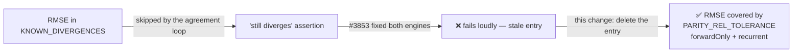

# Delete the stale RMSE `KNOWN_DIVERGENCES` entry (Issue #3883)

## Summary

`test/score/RustScorerDatasetParity.ts` keeps a `KNOWN_DIVERGENCES` map of costs
the two dataset-scoring engines are known to disagree on, and asserts every
entry **still** disagrees — so an entry cannot quietly suppress a cost forever.
That guard fired: Issue #3853 fixed RMSE on both engines (both now compute
`sqrt(mean(e))`), leaving the entry stale and failing `./quality.sh` on every
machine with a current `rust_scorer`.

Removing the RMSE entry puts RMSE back under the ordinary `PARITY_REL_TOLERANCE`
assertions for both topology styles, exactly as the failure message asked. The
map is now empty, which is the healthy state; the doc comment records that and
says an entry is only ever added alongside an open issue.

The failure never reached CI because `resolveRustScorerBinary()` returns
`undefined` there — no scorer binary is installed and there is no sibling
checkout — so the whole live parity lane is `ignore`d in CI while being red
locally.

Closes #3883.

## Evidence

Backend/CLI change only — no web interface to screenshot. Evidence is the test
run against the real `rust_scorer` binary
(`../NEAT-AI-scorer/target/release/rust_scorer`).

**Before** (reproduces the issue verbatim on `origin/Develop`):

```text
Dataset scoring parity: RMSE is still a known divergence (#3853 …) ... FAILED (2ms)

error: AssertionError: RMSE now agrees between the engines
(native=0.2185140834472997 typescript=0.2185140834472997). …

FAILED | 14 passed | 1 failed (74ms)
```

**After**:

```text
Dataset scoring parity: rust_scorer and TypeScript agree for RMSE (forwardOnly) ... ok (1ms)
Dataset scoring parity: rust_scorer and TypeScript agree for RMSE (recurrent) ... ok (1ms)
…
ok | 16 passed | 0 failed (61ms)
```

RMSE gains two live parity tests (one per topology) and loses the "still a known
divergence" test — 15 registered tests become 16.



## Test Plan

- `test/score/RustScorerDatasetParity.ts` — RMSE is no longer excluded, so the
  existing agreement assertions now cover it on both `forwardOnly` and
  `recurrent` creatures against the real `rust_scorer` binary. No test was
  removed or commented out: the "still a known divergence" registration loop is
  unchanged and simply has no entries to register.
- Full gate: `./quality.sh < /dev/null` — `8867 passed | 1 failed`. The one
  failure is
  `analyzeParallel with requireGpu=false returns structured Rust
  error when GPU unavailable (Issue #2116)`,
  which is **pre-existing and unrelated**: it fails identically on a clean
  `origin/Develop` worktree with this branch stashed, because the Discovery FFI
  rejects the payload with `errorKind: "data_validation"` before it can classify
  GPU availability. Filed as #3886 rather than folded into this change.

## Documentation

- `CHANGELOG.md` — the (still unreleased) Issue #3854 entry claimed RMSE "is
  recorded there as a known divergence and asserted to still reproduce"; that is
  no longer true, so it now describes the map generically and notes it is empty.
  New **Fixed** entry for Issue #3883.
