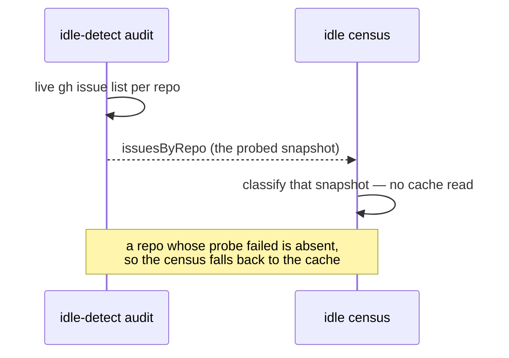

## Summary

The idle census and the idle-detect audit disagreed about `stSoftwareAU/NEAT-AI`
because they read **different snapshots of the same issues**, not because either
one had the gates wrong. Closes #3897.

The audit probes each repo with a live `gh issue list`. The census read the
shared `issues_all` cache, whose TTL is 600 s and which a _sibling host's_ claim
never invalidates. A claim landing mid-cycle was therefore visible to one
instrument and not the other, and the resulting contradiction is
indistinguishable in the log from a genuine gate bug — which is what the
inversion signal exists to report, and what escalated into this issue under
Issue #321.

**The fix is in the worker, not in NEAT-AI.** Both instruments live in
`stSoftwareAU/VibeCoder` (`worker/deno/lib/idle_detect_diagnostics.ts`,
`idle_decision_census.ts`, `run_core.ts`), so the code change lands there as a
cross-repo PR; this repo carries only the summary. The audit now publishes the
issue list it just probed, and the loop hands it to the census at the same gate,
so the census classifies exactly what the audit classified. A repo whose probe
failed carries **no** snapshot — never an empty one — so the census falls back
to the cache rather than reporting the repo as having nothing to do.

This is the residual half of the inversion. The half the issue's own hints point
at — a _permanent_ skip reason (`merged-pr-permanent`) on issues the census
called claimable — was already fixed upstream by VibeCoder#429 / PR #435, merged
2026-08-26 16:27Z; NEAT-AI#3868 is the strand it now reports, named by merged PR
#3888. The inversion did **not** clear after that merge, and the log below is
why.

## Evidence

Backend/CLI change with no web interface, so no screenshot applies. The evidence
is the worker log, the `gh` timeline, and the tests below.

Hours after PR #435 merged, NEAT-AI still held `inversion_signal=true` and still
triggered `ALERT mis_classification`:

```text
20:31:05Z  NEAT-AI#3871 assigned to stservice   (gh api …/issues/3871/timeline)
20:31:08Z  [idle-detect] repo=stSoftwareAU/NEAT-AI total_open=4 claimable=1 reason=has_claimable
20:32:32Z  [idle-census] repo=stSoftwareAU/NEAT-AI … work_on=3 pr_blocked=0 stream_occupied=0 merged_pr_blocked=1 inversion_signal=true
20:32:32Z  [idle-detect] ALERT mis_classification claimable_total=16 repos=…,stSoftwareAU/NEAT-AI
```

Four open issues, one snapshot apart. The audit saw #3871's assignment three
seconds after it landed and excluded its two milestone-#3861 siblings as
`stream_occupied`, leaving `claimable=1`. The census, running 87 seconds later
on a pre-claim cache entry, reported `stream_occupied=0 work_on=3` — an
inversion against a claim scan that was right.



No extra API call: the audit already fetched the list, and the census's own read
was a cache hit in the common case.

`./quality.sh` in `stSoftwareAU/VibeCoder`: type check, lint, fmt, markdownlint,
mermaid, deno tests and every chokepoint gate **PASSED**.

## Test Plan

Added in `stSoftwareAU/VibeCoder`. Four fail against the unfixed tree (two on
the absent `issues` field, two on the absent `issuesByRepo` plumbing) and pass
after it; two more pin the fallback so a missing snapshot can never read as an
empty repo.

- `worker/deno/tests/idle_detect_diagnostics_test.ts`
  - `auditClaimableState - publishes the live snapshot it classified (Issue #3897)`
  - `auditClaimableState - a failed probe publishes no snapshot (Issue #3897)`
- `worker/deno/tests/run_core_idle_census_test.ts`
  - `run_core - the audit's live issue snapshot reaches the census (Issue #3897)`
  - `run_core - an audit with no snapshot leaves the census on its own read (Issue #3897)`
- `worker/deno/tests/idle_decision_census_test.ts`
  - `resolveCensusIssues - the audit's live snapshot wins over the cache (Issue #3897)`
  - `resolveCensusIssues - a repo the audit could not probe falls back to the cache (Issue #3897)`

Suites re-run green together: `idle_decision_census_test.ts`,
`idle_detect_diagnostics_test.ts`, `run_core_idle_census_test.ts`,
`run_core_idle_detect_audit_test.ts`, `run_core_idle_hooks_visibility_test.ts` →
88 passed, 0 failed.

## Note for a human

NEAT-AI#3868 is genuinely stranded, and no worker can lift it: merged PR #3888
already did its work, so the scan refuses it permanently as
`merged-pr-permanent`. It needs a trusted author to either close it or re-apply
`work-on` with a date after the merge.
