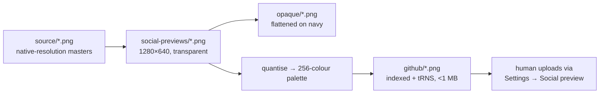

# Social preview uploads: transparent PNGs under 1 MB

## Summary

The GitHub **Settings → Social preview** upload set in
`docs/brand/social-previews/github/` was a flattened navy JPEG set: GitHub
refuses files of 1 MB or larger, and the canonical transparent PNGs are 752
KB–1.2 MB, so the previous fix bought headroom with a format that cannot carry
an alpha channel at all.

This replaces the twelve JPEGs with twelve **transparent** 1280×640 PNGs, each
well under the cap. The encoder now median-cuts the fitted transparent PNG onto
a 256-colour palette and writes an indexed PNG with a `tRNS` chunk — one byte
per pixel instead of four, which is where the headroom comes from. Fully
transparent pixels are held out of the median cut and given their own palette
entry, so the pad stays exactly transparent whatever the colour budget.

All twelve family repos' uploads are generated and committed in this hub repo.
After this lands, a human re-uploads each PNG via the matching repo's Settings →
Social preview (GitHub exposes no API for that slot).

Closes #3903.

| Upload                        | Before (JPEG) | After (transparent PNG) |
| ----------------------------- | ------------: | ----------------------: |
| `neat-ai.png`                 |        214 KB |                  183 KB |
| `neat-ai-backpropagation.png` |        278 KB |                  189 KB |
| `neat-ai-core.png`            |        243 KB |                  179 KB |
| `neat-ai-discovery.png`       |        274 KB |                  196 KB |
| `neat-ai-examples.png`        |        253 KB |                  170 KB |
| `neat-ai-explore.png`         |        235 KB |                  171 KB |
| `neat-ai-forests.png`         |        228 KB |                  169 KB |
| `neat-ai-lamarck.png`         |        161 KB |                  142 KB |
| `neat-ai-ockham.png`          |        260 KB |                  190 KB |
| `neat-ai-rebase.png`          |        233 KB |                  224 KB |
| `neat-ai-scorer.png`          |        204 KB |                  148 KB |
| `neat-ai-snapshot.png`        |        213 KB |                  163 KB |

Every upload fits at the full 256-colour budget, so no image needed the narrower
fallbacks. The `source/` masters, the canonical transparent PNGs and the
`opaque/` set are unchanged.

## Evidence

Playwright MCP was not available in this run — no `browser_*` tools were
surfaced by the harness and the container has no Chromium binary
(`which chromium chromium-browser google-chrome playwright` returns nothing).
The comparison below is therefore rendered by the repository's own rasteriser
(`@resvg/resvg-js`, the same one that generates the previews), composing the
committed uploads over a white page and the brand-navy page:

Left in each pair is the new `github/` upload, right is the canonical master.
The transparent pad composites cleanly on both backgrounds — the previous JPEG
set would have shown a navy rectangle on the white page.

Measured fidelity of the quantised upload against its master:

| Preview              | Mean RGB delta (visible pixels) | Alpha off by >8 |
| -------------------- | ------------------------------: | --------------: |
| `neat-ai.png`        |                      4.07 / 255 |          2.02 % |
| `neat-ai-rebase.png` |                      5.02 / 255 |          1.26 % |

The alpha differences sit on anti-aliased edges, which is the accepted trade-off
recorded in the issue.

## Test Plan

New — `test/docs/BrandGithubPngEncode.ts` (8 tests, encoder behaviour):

- `githubUploadName` keeps the `.png` extension and rejects a non-PNG name.
- `quantise` collapses colours while keeping the transparent pad at alpha 0 and
  the artwork opaque, and is lossless when the image has under 256 colours.
- `encodeIndexedPng` writes a structurally sound, decodable indexed PNG.
- `encodeGithubPng` fits a 1280×640 canvas under the 1 MB cap with the pad
  intact, and rejects both a wrong-sized canvas and bytes that are not a PNG.
- `writeGithubPng` writes `github/<name>.png` to disk and rejects a `.jpg` name.

Updated — `test/docs/BrandGithubUploads.ts` (gate on the committed set):

- the `github/` set mirrors the preview set, every upload is a 1280×640 PNG
  under 1 MB;
- every upload keeps transparent corners and at least 20 % transparent pixels,
  which a flattened upload cannot pass;
- no non-PNG uploads are left behind in `github/`.

Updated — `test/docs/_pngPixels.ts` now decodes palette PNGs (colour type 3,
`PLTE` + `tRNS`) and exposes `decodePngPixels(bytes, label)` so the encoder
tests can assert on bytes rather than files. No existing test was removed or
weakened.

`./quality.sh` passes: 8813 passed, 0 failed, 4 ignored.
