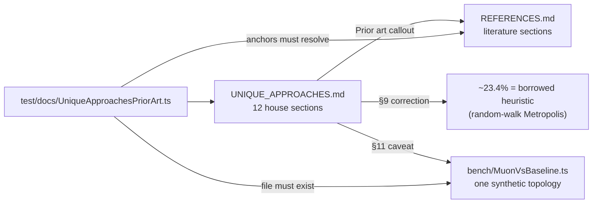

# Docs: cite the prior art behind each named approach (Issue #3908)

## Summary

`docs/comparison/UNIQUE_APPROACHES.md` compared every headline extension against
standard NEAT (2002) and nothing else. Each "standard NEAT has no equivalent"
line is true, and each one read — to anyone from the wider ML literature — as a
claim that the technique itself was new. It usually is not.

Every one of the twelve sections now carries a `> **Prior art:**` callout naming
what the technique is called outside this project, and the two places where the
claim outran the evidence are corrected. **Not one house name changed** — 🧬
Memetic, 💉 CRISPR, 🌿 Grafting, 🎲 MCMC, 🧮 Muon and 🔗 Synthetic Synapses all
keep their names; only the implied novelty goes. Closes #3908.

What changed:

- **`docs/comparison/UNIQUE_APPROACHES.md`** — a prior-art callout on all twelve
  sections, plus an opening note that "absent from NEAT" is not "new". §3
  (UUIDs) says plainly that it is NEAT innovation numbers decentralised — an
  engineering variation, not a new mechanism. §6 (Grafting) states the
  counter-argument the issue asked for: NEAT refuses cross-species crossover
  because of the competing-conventions problem, so grafting is a deliberate bet,
  not a free win.
- **MCMC correction (§9)** — the ~23.4% acceptance target is no longer presented
  as theory. Roberts, Gelman & Gilks (1997) is an optimal-scaling result for
  random-walk Metropolis on a smooth high-dimensional target, not a result about
  evolutionary-algorithm acceptance rates. The knob stays and is documented as a
  starting heuristic; the appeal to theory is withdrawn.
- **Muon caveat (§11)** — the published benefit is on large dense 2-D weight
  matrices. A per-neuron fan-in matrix in a sparse evolved topology is tiny (a
  plain vector at fan-in 1, where orthogonalisation is a no-op), so the effect
  may be near-nil. The only measurement we have — `bench/MuonVsBaseline.ts` on a
  hand-built 4→4→2 creature, 415 → 251 iterations, ~19% cheaper per step (Issue
  #2529) — is cited as exactly that, and the production-scale gain is marked
  **unproven**. The unsupported "smoother training, particularly for small batch
  sizes" claim was removed.
- **`docs/comparison/REFERENCES.md`** — new sections for 🔮 Predictive coding
  (Rao & Ballard 1999; Whittington & Bogacz 2017; Millidge, Seth & Buckley
  2021), 🧮 Orthogonalised gradient updates (Jordan et al. 2024; Bernstein &
  Newhouse 2024; Shampoo; Higham 2008) and 💉 Population seeding (Grefenstette
  1987; Julstrom 1994; Louis & McDonnell 2004); competing-conventions citations
  (Montana & Davis 1989; Radcliffe 1993) added to horizontal gene transfer, and
  adaptive operator selection (Fialho et al. 2010) to surrogate-assisted search.
  The subsystem→literature map at the top of the page gained the three new arcs.
- **`docs/cspell.json`** — the new author surnames and two technical terms.

Already landed by the sibling issues, verified rather than redone: the
`COMPARISON.md` note that academic neuroevolution moved on to ES and
quality-diversity (`COMPARISON.md:73`, Issue #3914), and the MAP-Elites /
quality-diversity gap in `FUTURE_WORK.md:43-58` (Issue #3913).

## Evidence

Documentation-only change — no web interface to screenshot. The evidence is the
new gate test, which asserts on the shipped docs:

```
deno test -A test/docs/UniqueApproachesPriorArt.ts
running 6 tests from ./test/docs/UniqueApproachesPriorArt.ts
every UNIQUE_APPROACHES.md section carries a Prior art callout ... ok
each Prior art callout names the precedent from the literature ... ok
UNIQUE_APPROACHES.md citations resolve to a REFERENCES.md heading ... ok
the MCMC section treats the ~23.4% target as a heuristic, not theory ... ok
the Muon section states the scale caveat and cites its own measurement ... ok
no house name changed in UNIQUE_APPROACHES.md ... ok
ok | 6 passed | 0 failed
```

Full gate: `./quality.sh` —
`ok | 8911 passed (5 steps) | 0 failed | 41 ignored
(8m47s)`.
`cspell --config docs/cspell.json` over the three changed files — 0 issues.

Where a claim now points, and what backs it:



## Test Plan

- Added `test/docs/UniqueApproachesPriorArt.ts` (6 tests), written before the
  docs were edited and confirmed failing against the unfixed docs — 4 of the 6
  failed on the original file, including the two correction checks.
  - Every numbered section carries a `> **Prior art:**` callout.
  - Each callout names its precedent by author and year (fragments, so rewording
    the sentence around them does not break the test).
  - Every `REFERENCES.md#anchor` citation resolves to a heading that exists.
  - The MCMC section no longer calls ~23.4% "theoretically optimal", scopes the
    result to random-walk Metropolis, and calls the target a heuristic.
  - The Muon section states the dense-versus-small-matrix caveat, marks the
    production-scale gain unproven, and cites `bench/MuonVsBaseline.ts` — which
    the test `stat`s on disk, so the citation cannot rot into a dead path.
  - All twelve house names are still present verbatim.
- Existing doc gates re-run and still green:
  `ComparisonReferencesPrimarySources` (the REFERENCES.md rebuild from #3911,
  including its own ~23.4% assertion), `ExtensionAncestryCitations` (#3912),
  `ComparisonSplit`, `DocsIndex`, `JekyllLiquidSafety`,
  `NeatTerminologyDefersToCanonical`.
