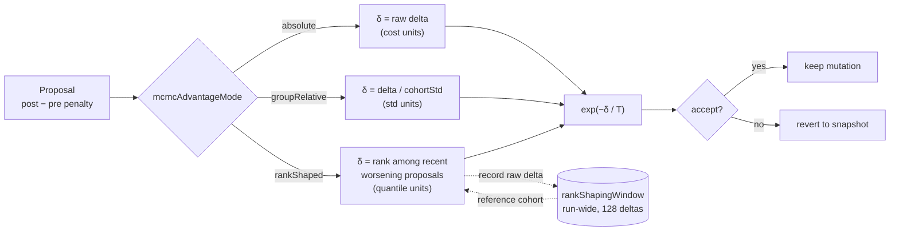

# Rank-based fitness shaping for MCMC acceptance and candidate ranking

## Summary

Adds `mcmc.mcmcAdvantageMode: "rankShaped"` — the
[Salimans et al. 2017](https://arxiv.org/abs/1703.03864) centred-rank transform
— to the two places NEAT-AI consumed raw fitness magnitudes. Closes #3909.

Both places inherited the problems rank shaping exists to fix:

1. **MCMC acceptance.** `exp(-δ / T)` is scale-dependent by construction: the
   temperature only means something relative to the numeric spread of the
   current cost distribution, which moves when the corpus moves, when the cost
   function changes, and slowly as the population converges. Under
   `"rankShaped"` the value fed to Metropolis-Hastings is the proposal's
   **quantile among recent worsening proposals**, so `T` is in quantile units
   and means the same thing at every stage of a run.
2. **Parent selection.** `buildGroupRelativeAdvantageMap` z-scored raw fitness
   against the cohort, so a single freak score inflated the std and flattened
   every other member's signal. `"rankShaped"` uses centred ranks in
   `[-0.5, +0.5]` instead, which depend only on the ordering.

The **authoritative scorer verdict is deliberately not rank-shaped** — that is
the one place the absolute number is the point.

Off by default: `mcmcAdvantageMode` still defaults to `"absolute"`, so existing
behaviour is bit-for-bit unchanged.

### What changed

| File                                 | Change                                                                                                    |
| ------------------------------------ | --------------------------------------------------------------------------------------------------------- |
| `src/NEAT/RankShaping.ts`            | New. `centredRanks`, `rankQuantile`, `rankShapedDelta`, and the bounded `RankShapingWindow` ring buffer.  |
| `src/NEAT/MetropolisHastings.ts`     | `resolveMcmcAcceptanceDelta` gained the `"rankShaped"` branch and a `rankReference` option.               |
| `src/NEAT/MCMCState.ts`              | Owns the run-wide `RankShapingWindow`; `reset()` clears it so a restart cannot rank against the old run.  |
| `src/NEAT/Mutator.ts`                | Shapes the delta against the injected window, recording the raw delta _after_ shaping (no self-ranking).  |
| `src/NEAT/NeatEvolution.ts`          | Injects the `MCMCState` window so the reference cohort survives the per-generation `Mutator` rebuild.     |
| `src/breed/ParentSelection.ts`       | `buildGroupRelativeAdvantageMap` gained a `shaping: "zscore" \| "centredRank"` option; default unchanged. |
| `src/breed/{Breed,ParallelBreeding}` | Select the shaping that matches the configured advantage mode.                                            |
| `src/config/MCMCConfig.ts`           | `AdvantageMode` gained `"rankShaped"`; new `rankShapingWindow` (default 128).                             |
| `src/config/parsers/*`               | Parses and validates the new mode and window; an unknown mode still fails fast.                           |

Two design decisions worth a reviewer's attention:

- **Improving proposals are never shaped.** `rankShapedDelta` returns
  `rawDelta <= 0` unchanged. M-H accepts those unconditionally, and shaping them
  could only manufacture a rejection of a strict improvement.
- **Worsening proposals rank only against worsening history.** Ranking against a
  mostly-improving reference would push every worsening move to the top of the
  distribution.

## Evidence

Backend/library change — no web interface to screenshot. Evidence is the
benchmark below plus the test suite.

### Measured: `bench/MCMCAdvantageConvergence.ts`

Population 32, 500 iterations, 12 seeded trials, identical initial population,
mutation magnitudes and temperature curriculum across all three modes — the only
delta is the acceptance signal. Higher mean score is better.

```text
absolute      mean=-0.151315 best=-0.102291 worst=-0.211029 accept=0.832333
groupRelative mean=-0.111894 best=-0.046335 worst=-0.183941 accept=0.708500
rankShaped    mean=-0.093585 best=-0.038659 worst=-0.146018 accept=0.501167

groupRelative mean(score) delta vs absolute = 0.039421  → neutral or improved
rankShaped    mean(score) delta vs absolute = 0.057730  → neutral or improved
```

**Result: improvement.** `"rankShaped"` converges closest to the optimum, and
lands nearest the 0.234 target acceptance rate of the three.

The cost-scale sweep multiplies the whole objective while holding the
temperature curriculum fixed — this is the property the change exists for:

```text
absolute      x1: mean=-0.151315 accept=0.832333 | x1000: mean=-0.089692 accept=0.425167 | x1e6: mean=-0.089687 accept=0.410833
groupRelative x1: mean=-0.111894 accept=0.708500 | x1000: mean=-0.111894 accept=0.708500 | x1e6: mean=-0.111894 accept=0.708500
rankShaped    x1: mean=-0.093585 accept=0.501167 | x1000: mean=-0.093585 accept=0.501167 | x1e6: mean=-0.093585 accept=0.501167
```

`"absolute"` loses half its acceptance rate (83% → 41%) for the same schedule
when the objective is rescaled. `"rankShaped"` rows are bit-identical across six
orders of magnitude — exactly the coupling the transform removes.

### Acceptance-signal flow



### Documentation

The issue asked that the docs record what the temperature actually means under
each rule. `docs/config/MUTATION_ADAPTATION.md` gained a **What the temperature
actually means** section with a per-mode unit table (cost-function units /
cohort standard deviations / quantile units), the readability worked example
(`q ≈ 0.5` accepts at ~61% for `T = 1.0`, 8% for `T = 0.2`), the diagram above,
and the measured numbers. `docs/api/CONFIGURATION.md` and `docs/GLOSSARY.md`
link to it; `CHANGELOG.md` records the new mode.

## Test Plan

New — `test/NEAT/RankShaping.ts` (24 tests) covering the pure transform:

- `centredRanks` — spans `[-0.5, +0.5]`, sums to zero, ties share the averaged
  rank, invariant to affine rescaling and to a `1e9` outlier, degenerate cohorts
  (empty / single / all-identical) stay finite, non-finite entries score `0` and
  take no part in the ranking.
- `rankQuantile` — empty reference is a flat `0.5`, results stay strictly inside
  `(0, 1)` so neither certain acceptance nor certain rejection can be
  manufactured, a median value sits near `0.5`.
- `rankShapedDelta` — improving and neutral deltas pass through unchanged,
  worsening deltas rank only against worsening history, scaling every cost
  leaves the shaped delta identical, a converged cohort still produces a spread
  of quantiles, non-finite deltas yield no signal, and M-H acceptance is
  invariant to cost-function rescaling.
- `RankShapingWindow` — `shape()` does not record the candidate, ranks against
  recorded history, evicts oldest at capacity, ignores non-finite deltas,
  `reset()` empties it, invalid capacity falls back to the default.

New — `test/NEAT/RankShapedAcceptance.ts` (12 tests) covering the wiring:

- Config accepts the new mode, it remains opt-in, an unknown mode still fails
  fast, and `rankShapingWindow` defaults to 128 and validates.
- `MCMCState` sizes its window from config and `reset()` drops the abandoned
  run's deltas.
- A near-zero temperature rejects every worsening proposal; a hot temperature
  lets worsening mutations through; the shared window accumulates across
  generations.
- `centredRank` shaping preserves the fitness ordering, an outlier cannot
  flatten the rest of the cohort, and the default shaping is still the z-score.

Modified — `test/config/MCMCConfigDocumentation.ts`: the `RequiredMCMCConfig`
literal gained `rankShapingWindow`. No existing test was removed, commented out,
or weakened.

Full `./quality.sh` passes.
