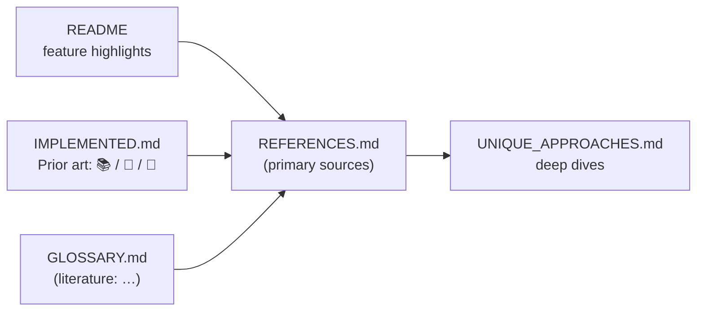

# Docs: name the ancestor wherever an extension is first claimed (Issue #3912)

## Summary

Most readers meet a NEAT-AI extension in the README feature list, in the
`IMPLEMENTED.md` extension lists, or in the glossary — not in
`UNIQUE_APPROACHES.md`. All three named the house term and linked to Wikipedia,
so the first impression of, say, Neuron Pruning was "a NEAT-AI feature" rather
than "our implementation of a 1989 result". This change names the ancestor at
each of those first-contact surfaces. **Not one house name changed.** Closes
#3912.

1. **`README.md` — Feature Highlights.** One bracketed citation per feature,
   linking into `docs/comparison/REFERENCES.md`:

   | Feature                           | Ancestor now named                                                                                                                                                                  |
   | --------------------------------- | ----------------------------------------------------------------------------------------------------------------------------------------------------------------------------------- |
   | Distributed Training              | Cohoon et al. 1987; Tanese 1989 — the island model's primary sources                                                                                                                |
   | Neuron Pruning                    | LeCun, Denker & Solla 1989 (_Optimal Brain Damage_); Hassibi & Stork 1993 — with the note that NEAT-AI's activation-variance criterion is a zeroth-order member of that family      |
   | CRISPR                            | population seeding / domain-knowledge injection, standard EA practice                                                                                                               |
   | Grafting                          | Barr et al. 2015, _Automated Software Transplantation_, plus the competing-conventions problem this bets against                                                                    |
   | Memetic Evolution                 | Moscato 1989; Whitley, Gordon & Mathias 1994 and the diversity trade-off they measured                                                                                              |
   | Error-Guided Structural Evolution | Fahlman & Lebiere 1990, Cascade-Correlation — the direct ancestor                                                                                                                   |
   | MCMC Mutation Acceptance          | Kirkpatrick et al. 1983, simulated annealing; plus the corrected ~23.4% gloss from #3911 (a heuristic borrowed from a random-walk Metropolis result, not EA acceptance-rate theory) |
   | Synthetic Synapse Training        | Han et al. 2017 (DSD); Mocanu et al. 2018 (SET); Evci et al. 2020 (RigL)                                                                                                            |

2. **`docs/comparison/IMPLEMENTED.md`.** The document framed every extension
   against a single 2002 baseline, which says how far each is from standard NEAT
   but not how much evidence stands behind it. Every entry in the two extension
   sections now carries a **`Prior art:`** line with one of three tags, defined
   in a new legend and linking into `REFERENCES.md`:

   - **📚 borrowed** — an established result NEAT-AI implements (memetic,
     pruning, synthetic synapses, discovery caching, distributed evolution,
     fitness-sharing quotas, …).
   - **🎲 open bet** — no established result at this scale; the citation is the
     closest precedent (grafting, subgraph transplantation, Muon at this scale,
     adaptive population sizing, conditional squashes, …).
   - **🔧 engineering** — infrastructure with no literature ancestor to name
     (panic recovery, ONNX export, disk monitoring, core pinning, …).

3. **`docs/GLOSSARY.md`.** Each house term with a literature equivalent carries
   it in parentheses on the definition line — memetic evolution (memetic /
   Lamarckian EA), CRISPR injection (population seeding / knowledge injection),
   Grafting (module transplantation), Discovery (error-guided structural growth;
   cf. Cascade-Correlation), Synthetic synapses (dense-sparse-dense training).
   **Impact** was used across the discovery subsystem but never defined in the
   glossary; it is now defined, with attribution / saliency as its literature
   equivalent. Creature and Squash deliberately carry no equivalent — the
   section intro says so, so an absent gloss reads as deliberate.

Where an area has no primary source in `REFERENCES.md` yet (continual learning),
the `Prior art:` line says so plainly rather than implying a citation exists.



## Evidence

Documentation-only change — no runtime code, no web interface, so no screenshot
applies. The evidence is the new test suite, which fails against the previous
docs and passes against these:

```text
$ deno test --allow-read test/docs/ExtensionAncestryCitations.ts
README feature entries name the ancestor of each extension ... ok
every IMPLEMENTED.md extension carries a classified Prior art line ... ok
IMPLEMENTED.md legend defines every Prior art marker ... ok
IMPLEMENTED.md distinguishes borrowings from open bets ... ok
glossary house terms carry their literature equivalent ... ok
no house name changed in README, IMPLEMENTED.md or the glossary ... ok
citations into REFERENCES.md resolve to a heading that exists ... ok

ok | 7 passed | 0 failed
```

Before the doc edits, six of the seven failed (for example
`Neuron Pruning: missing citation of LeCun, 1989, Optimal Brain Damage …` and
`Numerical Stability: no "Prior art:" line`). The anchor test was also checked
against a deliberately corrupted anchor (`#-attribution-and-saliencyX`) and
failed as expected, so it is not vacuous.

The whole `test/docs/` suite (281 tests) passes, and `markdownlint-cli2` reports
no issues on the three edited files.

## Test Plan

- **Added** `test/docs/ExtensionAncestryCitations.ts` — seven structural "what"
  tests, in the style of `test/docs/ComparisonReferencesPrimarySources.ts`:
  - README features cite their ancestor, matched by author surname and year so
    rewording does not break the test.
  - Every `IMPLEMENTED.md` extension entry carries a `Prior art:` line with
    exactly one of the three legend markers, and the legend defines all three.
  - Known borrowings and known open bets are classified on the correct side.
  - Glossary terms carry their literature equivalent.
  - House names in all three documents are unchanged.
  - Every `REFERENCES.md#anchor` cited from the three documents resolves to a
    heading that exists (GitHub slug rules), so a citation cannot rot silently.
- **Unchanged**: no existing test was modified, disabled or removed.
