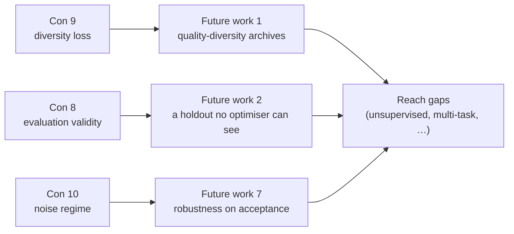

# Docs: the Cons list now says whether the results are valid (Issue #3913)

## Summary

`docs/comparison/PROS_AND_CONS.md` promised candid trade-offs, but all seven
cons were about **cost and capability** — compute, convergence speed, scale,
CUDA. Not one was about **whether the reported results are valid**, which is
where the exposure actually is. This adds the three validity cons, the two
discipline pros that were going unclaimed, and the three trustworthiness gaps
that mitigate them in `docs/comparison/FUTURE_WORK.md`. Closes #3913.

**`PROS_AND_CONS.md` — three new cons**

- **8. Evaluation validity under repeated selection** — the same corpus and the
  same scorer, queried thousands of times by several independent optimisers, is
  adaptive data analysis. Cites Dwork et al. (2015) and Blum & Hardt (2015).
- **9. Diversity loss from accept-only optimisation** — NEAT-AI hedges (MCMC
  acceptance, speciation, diversity-aware reheating); the sibling Rust
  optimisers are greedy hill-climbing on one incumbent. Cites Whitley, Gordon &
  Mathias (1994), who measured that exact trade-off.
- **10. Operating in the noise regime** — accepted improvements of order 1e-04
  (one recent fleet comparison turned on 5.7e-05) mean the point score and true
  quality are different quantities.

**The holdout question is answered explicitly** (acceptance criterion 4): **no
corpus slice is withheld from every optimiser.** That is a statement of fact
about the code, not a guess:

- Fitness is scored over the whole dataset directory a run is given —
  `trainingSampleRate` (`src/architecture/training/TrainingSamples.ts:27`)
  samples records for gradient training only, and appears nowhere on the scoring
  path (`src/architecture/Fitness.ts`).
- The library's one holdout mechanism, `HoldoutValidator`
  (`src/discovery/HoldoutValidator.ts:1`, Issue #1308), is opt-in and off by
  default (`EnhancedHoldoutOptions.enabled`,
  `src/discovery/EnhancedDiscoveryValidator.ts:33`), and it splits the _same_
  corpus for discovery candidates only — so its reserved slice is still visible
  to the fitness evaluation that later accepts the creature.

**`PROS_AND_CONS.md` — two new pros.** The acceptance discipline is a genuine
differentiator and was unclaimed: the immutable incumbent with one authoritative
full-corpus judge, and the per-optimiser `experiments.jsonl` journal with its
`report` command (verified present in NEAT-AI-Lamarck, NEAT-AI-Ockham,
NEAT-AI-Forests and NEAT-AI-Rebase).

**`FUTURE_WORK.md` — three new gaps, sorted above the reach-extending ones.**
New framing paragraph separates gaps about _reach_ from gaps about
_trustworthiness of results we already have_, and the latter now sort first
inside each tier:

- **1. Quality-Diversity and Behavioural Archives** (high) — Lehman & Stanley
  (2011), Mouret & Clune (2015). The named answer to con 9.
- **2. A Holdout No Optimiser Can See** (high) — Dwork et al. (2015), Blum &
  Hardt (2015). The mechanism for con 8.
- **7. Robustness as an Acceptance Criterion** (medium) — Hochreiter &
  Schmidhuber (1997), Keskar et al. (2017), Foret et al. (2021). Tracked as a
  scorer capability in NEAT-AI-scorer#588.

Existing sections renumbered (1–12 → 3–6, 8–15) and the one inbound anchor
(`FUTURE_WORK.md#2--unsupervised-learning` → `#4--unsupervised-learning`)
updated in the same change. No citation needed adding to `REFERENCES.md` — every
paper the new entries cite was already there from Issue #3911.

## Evidence

Documentation-only change plus its guard test; there is no web interface to
screenshot. What was tested instead:

```text
$ deno test --allow-read test/docs/ComparisonValidityCons.ts   # before the doc edits
FAILED | 0 passed | 7 failed

$ deno test --allow-read test/docs/ComparisonValidityCons.ts   # after
ok | 7 passed | 0 failed

$ deno test test/docs/*.ts
ok | 274 passed | 0 failed

$ npx markdownlint-cli2 "docs/comparison/*.md"
Summary: 0 issues in 0 files

$ npx cspell --config docs/cspell.json docs/comparison/*.md
CSpell: Files checked: 3, Issues found: 0 in 0 files.
```

How the two documents now hang together:



Each con names its mitigation; each mitigation sorts above the reach-extending
gaps, which is the ordering the test pins.

## Test Plan

Added `test/docs/ComparisonValidityCons.ts` — seven structural "what" tests over
the rendered documents, written before the doc edits and failing against the
unfixed text:

- `cons the evaluation validity of repeated selection` — the con exists and
  cites both Dwork et al. and Blum & Hardt.
- `answers the holdout question explicitly` — the text states that no corpus
  slice is withheld from every optimiser.
- `cons diversity loss under accept-only optimisation` — cites Whitley (1994).
- `cons operating in the noise regime` — quotes the observed magnitude.
- `claims the acceptance discipline as a pro` — both new pros present, with the
  single full-corpus judge and the `report` command named.
- `carries the three trustworthiness gaps, above the reach gaps` — section
  ordering versus unsupervised learning and multi-task learning.
- `cites the literature behind each trustworthiness gap` — all seven citations.

The tests assert on entry membership, citations and ordering rather than prose,
so rewording does not break them; the holdout assertion is deliberately
wording-sensitive because an explicit answer is what the issue asked for.
