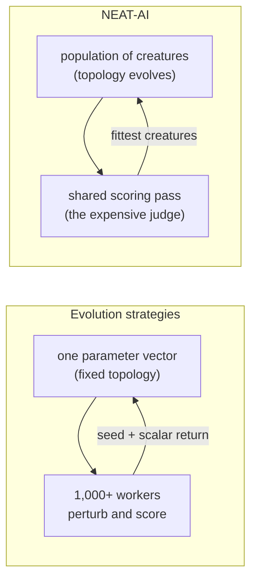

# Docs: benchmark against the live alternative, not only NEAT 2002

## Summary

`COMPARISON.md` and `docs/comparison/TRAINING_PARADIGMS.md` benchmarked NEAT-AI
against exactly two things — standard NEAT (2002) and traditional neural
networks — so the comparison a knowledgeable reader actually asks for ("why not
evolution strategies?") was missing. Closes #3914.

- **`docs/comparison/TRAINING_PARADIGMS.md`** gains a **🧭 Modern Gradient-Free
  Training** section between the NEAT-AI and reinforcement-learning sections,
  covering:
  - **Evolution strategies (ES)** — Salimans, Ho, Chen, Sidor & Sutskever
    (2017): perturb a fixed-length parameter vector, weight by return, no
    backpropagation; scaled past 1,000 workers because workers exchange a random
    seed and a scalar return rather than a parameter vector, solving 3D humanoid
    walking in about ten minutes of wall-clock. Notes that NEAT-AI already
    borrows its centred rank transform (`mcmc.mcmcAdvantageMode: "rankShaped"`).
  - **Quality-diversity** — Lehman & Stanley (2011) novelty search and Mouret &
    Clune (2015) MAP-Elites: archives of behaviourally diverse elites rather
    than a single champion, with the NEAT-AI gap linked to `FUTURE_WORK.md`.
  - **CMA-ES** — Hansen & Ostermeier (2001), the adaptive-covariance lineage.
  - **The honest scoreboard** — ES wins parallel scaling (✅ vs 🟡, the axis
    NEAT-AI would most like to claim) and cannot evolve topology at all (❌ vs
    ✅). Both halves are stated in the prose beneath the table.
  - **Sample efficiency versus wall-clock** — the ES paper's own framing (less
    sample-efficient than RL, but the binding budget is wall-clock through
    parallelism) applied to NEAT-AI's design: many cheap proposals, one
    expensive shared scoring judge. This reframes the "slower convergence" con
    as a deliberate, defended trade-off.
- **`COMPARISON.md`** gains a framing note under the at-a-glance matrix saying
  the matrix compares against standard NEAT **by design** and linking into the
  new section, plus updated sub-document map/table entries.
- **Citations** already landed in `docs/comparison/REFERENCES.md` under 🔬
  Neuroevolution via #3911; the new test pins that every citation used in the
  section is present there, so the two cannot drift apart.

No source or behaviour changed — documentation only.

## Evidence

Documentation-only change with no web interface to screenshot, so the evidence
is the new structural test suite plus the full quality gate.

```
deno test --allow-read test/docs/TrainingParadigmsModernBaselines.ts

TRAINING_PARADIGMS.md places modern gradient-free training between NEAT-AI and reinforcement learning ... ok
The modern gradient-free section cites ES, quality-diversity and CMA-ES ... ok
Every modern gradient-free citation also lands in REFERENCES.md ... ok
The scoreboard states both halves — ES wins parallel scaling, NEAT-AI wins topology ... ok
COMPARISON.md points at the modern gradient-free section with a resolving anchor ... ok

ok | 5 passed | 0 failed
```

All five failed against the pre-change docs (missing section, missing citations,
missing scoreboard, no hub link), which is the regression linkage for this
issue.

The comparison the new section makes, at a glance:



## Test Plan

- Added `test/docs/TrainingParadigmsModernBaselines.ts` — five structural "what"
  tests, in the style of `ComparisonSplit.ts` and
  `ComparisonReferencesPrimarySources.ts`:
  1. the modern gradient-free section sits between the NEAT-AI and
     reinforcement-learning sections;
  2. it cites ES, novelty search, MAP-Elites and CMA-ES by stable URL fragment;
  3. every one of those citations also appears in `REFERENCES.md`;
  4. the scoreboard's ES/NEAT-AI verdicts match the honest reading (ES ✅ /
     NEAT-AI 🟡 on parallel scaling, ES ❌ / NEAT-AI ✅ on topology, and so on);
  5. `COMPARISON.md` links into the section with an anchor that resolves against
     a real heading (GitHub slug rules applied).
- Existing `test/docs/ComparisonSplit.ts` continues to verify every relative
  link in the changed docs resolves on disk.
- Full `./quality.sh` run (format, lint, bash syntax, type-check, WASM sync, all
  tests).
