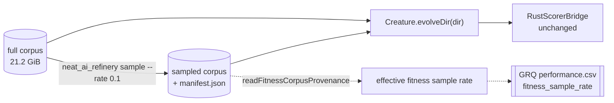

# Multi-fidelity fitness: score against a Refinery sampled corpus (Issue #3926)

## Summary

Fitness is evaluated over **every** record of the dataset directory a run is
given, so a 21.2 GiB corpus costs ~7.8 min a generation and a 16-minute
production run buys one or two generations. Per nleck's direction change, the
cheaper fidelity lives in the **data pipeline**, not the scorer argv:
NEAT-AI-Refinery publishes a deterministic sampled corpus and evolution is
pointed at that directory. `RustScorerConfig`, `RustScorerBridge` and
`BatchRustScorerBridge` are untouched — the diff does not contain them. Closes
#3926.

What that leaves NEAT-AI to own is **provenance**: two directories of `.bin`
files look identical, so without a manifest a run cannot say which fidelity
produced its score.

- **`readFitnessCorpusProvenance(dataDir)`**
  (`src/architecture/FitnessCorpusProvenance.ts`, re-exported from `mod.ts`)
  reads the `manifest.json` Refinery publishes beside the records and reports
  the declared and the achieved fitness sample rate. A directory with no
  manifest is the full corpus and reports rate `1`; a manifest that is present
  but unreadable throws `DatasetError` `CORRUPT_PROVENANCE`; a corpus directory
  that is not there throws `DIRECTORY_MISSING`. Reading any of those as "full
  corpus" would report full fidelity for a run that scored a tenth of it.
- **`assertFitnessCorpusSampleRate(provenance)`** measures the published corpus
  **on disk** (`record_count × bytes_per_record`) before checking the achieved
  rate against the declared one inside a 5-sigma binomial band. Measuring the
  bytes is what stops the manifest verifying itself — a self-consistent lie
  still fails.
- **The downstream production repo** records the result as its own
  `fitness_sample_rate` CSV column, distinct from `training_sample_rate`, on a
  cross-repo branch (`issue-3926-fitness-sample-rate-column`) raised alongside
  this PR.
- **Docs** state the distinction from `trainingSampleRate` (a backprop knob that
  never reaches `Fitness`) in every option table that names it.

This provides the sampled-corpus path. It deliberately does **not** decide when
to use it — production keeps scoring the full corpus until a policy issue opts
in.

## Evidence

Backend/library change with no web interface, so there is no screenshot to
capture. Evidence is the measurement and the test suite.

### Wall-clock per generation vs fidelity

`deno task bench:fitness-corpus --records=20000 --rates=1,0.5,0.1 --population=20 --seed=3926`
on the `grq-3926` sampler creature (5,317 neurons / 39,031 synapses over 2,511
inputs, switched to the forward-only topology production runs it under), 20,000
synthetic records at the production record shape:

| Fitness sample rate | Records | Corpus    | ms / generation | vs full |
| ------------------- | ------- | --------- | --------------- | ------- |
| 1                   | 20000   | 191.7 MiB | 33631           | 1.000   |
| 0.5                 | 10000   | 95.8 MiB  | 16728           | 0.497   |
| 0.1                 | 2000    | 19.2 MiB  | 3383            | 0.101   |

Wall-clock tracks corpus size to within a percent at both rates, so the cost
really is in the per-record scoring work. (The absolute figures fell from the
earlier 97,031 / 48,123 / 9,628 ms because this run sets `forwardOnly` on the
creature, as production does; the ratios are what the criterion asks for and
they did not move.) Full context, and what the measurement does **not** say, is
in
[`docs/evidence/fitness-corpus-fidelity-3926.md`](../../evidence/fitness-corpus-fidelity-3926.md).

### Quality gate

`./quality.sh` — `deno fmt`, `deno lint`, `deno check`, WASM sync, and the full
suite against the native `rust_scorer`.

## Acceptance Criteria

<!-- vibe-spec-review inputs="diff+issue-body" -->

Two review rounds ran, each on the finished diff. The verdicts below are the
second round's — the round that saw the fixes the first round asked for.

- **missing** — NEAT-AI-refinery can generate a deterministic sampled training
  corpus at a configured rate — reviewer: missing — reason: the sampler is
  Refinery's, and nothing in this diff implements or pins it. This PR is the
  consuming half: it reads the `manifest.json` Refinery publishes and verifies
  the corpus against it. No NEAT-AI change can satisfy this criterion, so it is
  reported missing rather than claimed on another repo's behalf.
- **met** — evolution pointed at the sampled corpus with no changes to
  `RustScorerConfig` / `RustScorerBridge` / `BatchRustScorerBridge` — evidence:
  none of the three files appear in `git diff --name-only`;
  `test/score/FullCorpusScoreFixture.ts::a Refinery manifest beside the corpus changes neither the score nor the file list`,
  which now also asserts `dataFiles()` still sees exactly the one `.bin` —
  reviewer: met.
- **partial** — full-corpus runs bit-identical, asserted against a fixture —
  evidence:
  `test/score/FullCorpusScoreFixture.ts::full-corpus fitness is bit-identical to the fixture golden`
  — reviewer: partial — reason: a bit-exact golden can only pin one engine. The
  gate proved it: the two engines activate in f32 and agree to ~1e-8, not to the
  bit, so the first version of this test passed without `rust_scorer` and failed
  with it. The test now names the engine — bit-exact on the TypeScript/WASM
  accumulator, with the native scorer held to the same golden at the 1e-5
  tolerance `RustScorerDatasetParity.ts` already uses
  (`::the native scorer reproduces the fixture goldens within parity`). The
  production engine is covered at a tolerance rather than a bit.
- **partial** — effective fitness sample rate as its own CSV column, distinct
  from `training_sample_rate` — evidence: the downstream production repo's
  `issue-3926-fitness-sample-rate-column` branch (header, plus
  `test/worker/RecordPerformance.ts::record_performance.sh measures fitness_sample_rate from the corpus manifest (Issue #3926)`)
  — reviewer: missing — reason: departing on scope only. The reviewer is right
  that no NEAT-AI file carries the column and it could not see the other repo;
  the column is real, on a pushed branch whose PR is raised alongside this one.
  It is `partial` here because this repo cannot demonstrate it.
- **met** — documented as distinct from `trainingSampleRate` in both option docs
  — evidence: `docs/config/TRAINING.md` (`trainingSampleRate` callout and the
  "Fitness corpus fidelity" section), `docs/api/TRAINING.md` (TrainOptions
  table), `docs/api/CONFIGURATION.md` — reviewer: met.
- **partial** — measured wall-clock full vs 0.5 vs 0.1 on the production
  creature — evidence: `docs/evidence/fitness-corpus-fidelity-3926.md`,
  `bench/fitness_corpus_fidelity.ts` — reviewer: partial — reason: the creature
  matches the production neuron/synapse/input counts and is now switched to the
  forward-only topology production runs it under (the reviewer caught that it
  was not, so the earlier numbers timed the recurrent-capable path), but it is
  generated rather than the production `network.json`, over 20,000 synthetic
  records rather than the 21.2 GiB corpus, on the WASM engine. The evidence
  doc's "What this does not say" section states each of those.
- **unrequested** — `src/architecture/FitnessCorpusProvenance.ts` and its public
  exports — reviewer: unrequested — reason: kept. The issue requires the sampled
  corpus to be "verifiably derived from the full corpus at the stated rate —
  record count and provenance checked, not eyeballed", and the effective rate to
  be recorded; this is where that check lives. No production NEAT-AI path calls
  it — the callers are the downstream recorder and any future policy.
- **unrequested** — `DatasetErrorReason` gains `CORRUPT_PROVENANCE` — reviewer:
  unrequested — reason: kept; an additive member of an existing typed union, and
  the alternative was an untyped throw or a silent full-fidelity answer.
- **unrequested** — pipeline / `quantise` rate handling in the manifest reader —
  reviewer: unrequested — reason: kept; a `sample` stage inside a pipeline is
  exactly this fidelity, so refusing to read one would report the wrong rate
  rather than no rate.
- **unrequested** — sampled-corpus golden (`sampleIndices` /
  `sampledCorpusError`) — reviewer: unrequested — reason: kept; the criterion
  pins the full corpus, and this pins the claim the issue rests on — that
  dropping records changes only _which_ records the mean is over.
- **unrequested** — `grq-3926` preset in
  `test/propagate/large/ProductionScaleCreature.ts` and the
  `bench:fitness-corpus` task — reviewer: unrequested — reason: kept; they are
  how criterion 6 is measured and re-measurable, additive to the generator that
  already hosts `grq-3397` for the same purpose.
- **unrequested** — `deno.json` version `7.0.11` → `7.0.20` — reviewer:
  unrequested — reason: `test/ci/PackageVersionNoDowngrade.ts` fails the gate
  because the milestone branch is behind `origin/Develop` (7.0.19); the bump is
  what makes the gate green.

## Standards Review

<!-- vibe-standards-review inputs="diff+CODING-STANDARDS.md" -->

The repository has no `CODING-STANDARDS.md`; `AGENTS.md` is the stated single
source of truth, reviewed alongside `CONTRIBUTING.md` and `docs/DOC_STYLE.md`.

- **violation** — fail-loud: a transform stage whose `name` was absent or
  misspelt read as "not a sample stage", i.e. rate 1 — full fidelity reported
  for a corpus that may hold a tenth of the records — evidence:
  `src/architecture/FitnessCorpusProvenance.ts:205` — reason: fixed here; a
  stage that does not name itself throws `CORRUPT_PROVENANCE`, covered by
  `::a transform stage that does not name itself fails loud`.
- **violation** — fail-loud: the on-disk check weighed only the file the
  manifest names, while fitness scores **every** `.bin` in the directory, so a
  leftover shard passed verification and was then scored — evidence:
  `src/architecture/FitnessCorpusProvenance.ts:305` — reason: fixed here; every
  `.bin` is weighed, covered by
  `::a shard the manifest never mentions fails
  loud`.
- **violation** — fail-loud: the byte check silently opted out when the manifest
  stated no `record_shape`, reverting to the manifest verifying itself —
  evidence: `src/architecture/FitnessCorpusProvenance.ts:309` — reason: fixed
  here; an unverifiable manifest is refused, covered by
  `::a manifest with no
  record geometry cannot be verified`.
- **violation** — fail-loud: a published `record_count` of `0`, an unsupported
  `manifest_version`, and a malformed `source.path` were each read as an
  ordinary value — evidence: `src/architecture/FitnessCorpusProvenance.ts:312`,
  `:298`, `:336` — reason: fixed here; each throws, each with its own case.
- **violation** — `CONTRIBUTING.md:322`, test files mirror `src/` — evidence:
  `test/score/FitnessCorpusProvenance.ts` for a unit in `src/architecture/` —
  reason: fixed here; moved to `test/architecture/FitnessCorpusProvenance.ts`.
- **violation** — `docs/DOC_STYLE.md` rule 1: unexpanded acronyms on first use,
  and a PR summary asserting a fix that had not landed — evidence:
  `docs/evidence/fitness-corpus-fidelity-3926.md:20-21` — reason: fixed here;
  MSE and WASM are expanded in the file itself this time.
- **violation** — fail-loud in the harness: `--rates` was parsed with a bare
  `map(Number)`, so `--rates=abc` measured a `NaN` corpus, and `vs full` was a
  ratio against `rates[0]` rather than against rate 1 — evidence:
  `bench/fitness_corpus_fidelity.ts:234`, `:186` — reason: fixed here; rates
  must be fidelities in `(0, 1]` and must include `1`, and the full corpus is
  timed first.
- **violation** — the harness measured the recurrent-capable path while the docs
  said forward-only — evidence: `bench/fitness_corpus_fidelity.ts:13` — reason:
  fixed here; the population is switched with `setForwardOnlyTopology()`, and
  the measurement was re-run (the reported milliseconds changed; the ratios did
  not).
- **violation** — neuron-UUID invariant rules 3 & 4: a runtime integer `id` in a
  committed export — evidence: `test/fixtures/scoring/fitness-corpus.json:27` —
  reason: fixed in the first commit; `id` stripped and the goldens re-verified
  unchanged.
- **violation** — `docs/DOC_STYLE.md` rule 4: symbols re-exported from `mod.ts`
  for a reader-facing example but never imported from there — evidence:
  `mod.ts:363-366` — reason: fixed in the first commit; the provenance test
  imports from `../../mod.ts`, so the documented path is exercised.
- **violation** — testing policy: no timing API in a file `deno test` runs —
  evidence: `bench/fitness_corpus_fidelity_test.ts:11` — reason: fixed in the
  first commit; the harness takes an injectable `now` and the test drives a
  virtual clock.
- **violation** (not fixed) — the new `mod.ts` export block is spliced into the
  middle of the contiguous `@errors/*` group — evidence: `mod.ts:352-371` —
  reason: it stands; `test/docs/ModExportBanners.ts` governs the banner order
  and passes, and reordering the barrel is a change to a file this issue has no
  other business in.
- **violation** (not fixed) — `docs/DOC_STYLE.md` rule 5,
  `docs/config/TRAINING.md` is now 258 lines — evidence:
  `docs/config/TRAINING.md` — reason: it stands; the fidelity section belongs
  beside `trainingSampleRate`, which is the whole point of documenting the
  distinction, and splitting the file is a docs refactor outside this issue.
- **clean** — Australian English throughout; Logger policy (no new `console.*`
  under `src/`); Temporal vs Date (`performance.now()` only in `bench/`);
  semantic-version invariant untouched; typed errors from `src/errors/`; every
  test calls real code rather than grepping source; `deno fmt` / `deno lint` /
  `deno check` clean; markdownlint and the `test/docs/*` gates pass; the one new
  `src/` file has a single responsibility.

## Test Plan

Added:

- `test/architecture/FitnessCorpusProvenance.ts` — 20 cases over the public
  `mod.ts` surface: full corpus, sampled corpus, rate-1, pipeline rate product,
  record-keeping transforms, and thirteen fail-loud paths (missing directory,
  non-JSON manifest, missing counts, fractional counts, rate-less `sample`
  stage, unnamed stage, unsupported `manifest_version`, empty published corpus,
  malformed source path, corpus that is not the size it claims, manifest
  disagreeing with the bytes on disk, absent published corpus, and a shard the
  manifest never mentions).
- `test/score/FullCorpusScoreFixture.ts` — bit-exact goldens for the full and
  sampled corpora on the named engine, native-scorer parity against the same
  goldens, and proof the manifest perturbs neither the score nor the file list
  (`dataFiles()` still returns exactly the one `.bin`).
- `test/fixtures/scoring/fitness-corpus.json` — the committed golden, documented
  in `test/fixtures/scoring/README.md`.
- `bench/fitness_corpus_fidelity.ts` + `bench/fitness_corpus_fidelity_test.ts` —
  the measurement harness and its virtual-clock smoke test.
- GRQ `test/worker/RecordPerformance.ts` — five cases: measured from the
  manifest, exported fallback, `unknown` when neither, corrupt manifest, stale
  `-sampler` slice ignored for a learn row, and zero-byte manifest.

Modified: column-count and header assertions across GRQ's CSV tests move 22 → 23
fields because the column was deliberately added. No test was removed, weakened
or commented out.
