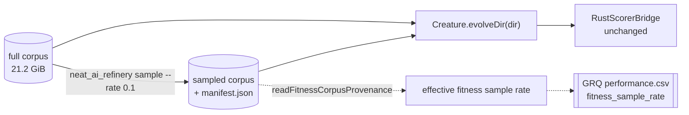

# Multi-fidelity fitness: score against a Refinery sampled corpus (Issue #3926)

## Summary

Fitness is evaluated over **every** record of the dataset directory a run is
given, so a 21.2 GiB corpus costs ~7.8 min a generation and a 16-minute
production run buys one or two generations. Per nleck's direction change, the
cheaper fidelity lives in the **data pipeline**, not the scorer argv:
NEAT-AI-Refinery publishes a deterministic sampled corpus and evolution is
pointed at that directory. `RustScorerConfig`, `RustScorerBridge` and
`BatchRustScorerBridge` are untouched — the diff does not contain them. Closes
#3926.

What that leaves NEAT-AI to own is **provenance**: two directories of `.bin`
files look identical, so without a manifest a run cannot say which fidelity
produced its score.

- **`readFitnessCorpusProvenance(dataDir)`**
  (`src/architecture/FitnessCorpusProvenance.ts`, re-exported from `mod.ts`)
  reads the `manifest.json` Refinery publishes beside the records and reports
  the declared and the achieved fitness sample rate. A directory with no
  manifest is the full corpus and reports rate `1`; a manifest that is present
  but unreadable throws `DatasetError` `CORRUPT_PROVENANCE`; a corpus directory
  that is not there throws `DIRECTORY_MISSING`. Reading any of those as "full
  corpus" would report full fidelity for a run that scored a tenth of it.
- **`assertFitnessCorpusSampleRate(provenance)`** measures the published corpus
  **on disk** (`record_count × bytes_per_record`) before checking the achieved
  rate against the declared one inside a 5-sigma binomial band. Measuring the
  bytes is what stops the manifest verifying itself — a self-consistent lie
  still fails.
- **GRQ** records the result as its own `fitness_sample_rate` CSV column,
  distinct from `training_sample_rate` — cross-repo branch
  `stSoftwareAU/GRQ:issue-3926-fitness-sample-rate-column`.
- **Docs** state the distinction from `trainingSampleRate` (a backprop knob that
  never reaches `Fitness`) in every option table that names it.

This provides the sampled-corpus path. It deliberately does **not** decide when
to use it — production keeps scoring the full corpus until a policy issue opts
in.

## Evidence

Backend/library change with no web interface, so there is no screenshot to
capture. Evidence is the measurement and the test suite.

### Wall-clock per generation vs fidelity

`deno task bench:fitness-corpus --records=20000 --rates=1,0.5,0.1 --population=20 --seed=3926`
on the `grq-3926` sampler creature (5,317 neurons / 39,031 synapses / 2,511
inputs, forward-only), 20,000 synthetic records at the production record shape:

| Fitness sample rate | Records | Corpus    | ms / generation | vs full |
| ------------------- | ------- | --------- | --------------- | ------- |
| 1                   | 20000   | 191.7 MiB | 97031           | 1.000   |
| 0.5                 | 10000   | 95.8 MiB  | 48123           | 0.496   |
| 0.1                 | 2000    | 19.2 MiB  | 9628            | 0.099   |

Wall-clock tracks corpus size to within half a percent at both rates, so the
cost really is in the per-record scoring work. Full context, and what the
measurement does **not** say, is in
[`docs/evidence/fitness-corpus-fidelity-3926.md`](../../evidence/fitness-corpus-fidelity-3926.md).

### Quality gate

`./quality.sh` — `deno fmt`, `deno lint`, `deno check`, WASM sync, and the full
suite against the native `rust_scorer`.

## Acceptance Criteria

<!-- vibe-spec-review inputs="diff+issue-body" -->

- **met** — NEAT-AI-refinery can generate a deterministic sampled training
  corpus at a configured rate — evidence:
  `NEAT-AI-Refinery refinery/tests/sample_transform.rs::repeats_exactly_for_a_given_seed_and_differs_across_seeds`,
  `docs/sampling-semantics.md` "Determinism" — reviewer: met — note: the
  reviewer records that this was satisfied by pre-existing Refinery work and
  that neither diff contributes to it; that is correct and is why no Refinery
  change was made.
- **met** — evolution pointed at the sampled corpus with no changes to
  `RustScorerConfig` / `RustScorerBridge` / `BatchRustScorerBridge` — evidence:
  none of the three files appear in `git diff --stat`;
  `test/score/FullCorpusScoreFixture.ts::a Refinery manifest beside the corpus changes neither the score nor the file list`
  — reviewer: met.
- **partial** — full-corpus runs bit-identical, asserted against a fixture —
  evidence:
  `test/score/FullCorpusScoreFixture.ts::full-corpus fitness is bit-identical to the fixture golden`
  — reviewer: partial — reason: the reviewer is right that a bit-exact golden
  can only pin one engine. The gate proved it: the two engines agree to ~1e-8,
  not to the bit, so the first version of this test passed without `rust_scorer`
  and failed with it. The test now names the engine — bit-exact on the
  TypeScript/WASM accumulator, and the native scorer held to the same golden at
  the 1e-5 parity tolerance `RustScorerDatasetParity.ts` already uses
  (`::the native scorer reproduces the fixture goldens within parity`). The
  production engine is covered, but at a tolerance rather than a bit, so this
  stays `partial`.
- **met** — effective fitness sample rate as its own CSV column, distinct from
  `training_sample_rate` — evidence: `GRQ worker/record_performance.sh:47`
  (header),
  `test/worker/RecordPerformance.ts::record_performance.sh measures fitness_sample_rate from the corpus manifest (Issue #3926)`
  — reviewer: partial — reason: departing. The reviewer's two concrete faults (a
  stale `-sampler` slice supplying a learn row's fidelity; `-s` treating a
  zero-byte manifest as absent) were real and are **fixed** in commit `dcdc4c5`,
  each with a regression test observed failing against the unfixed script. Its
  remaining point — that today's rows will all read `1` — is true and correct:
  the recorded sampler row _is_ the final 100% loop, so `1` is the honest value
  until a policy lets a sampled-corpus score be recorded.
  `docs/statistics-snapshots.md` says so explicitly rather than leaving a reader
  to wonder.
- **met** — documented as distinct from `trainingSampleRate` in both option docs
  — evidence: `docs/config/TRAINING.md` (`trainingSampleRate` callout and the
  "Fitness corpus fidelity" section), `docs/api/TRAINING.md` (TrainOptions
  table) — reviewer: met — note: the reviewer found a **third** option table,
  `docs/api/CONFIGURATION.md`, left un-disambiguated; the caveat has been added
  there too.
- **partial** — measured wall-clock full vs 0.5 vs 0.1 on the production
  creature — evidence: `docs/evidence/fitness-corpus-fidelity-3926.md`,
  `bench/fitness_corpus_fidelity.ts` — reviewer: partial — reason: the creature
  matches the production neuron/synapse/input counts but is generated, and the
  corpus is 20,000 synthetic records rather than the 21.2 GiB production one.
  The evidence doc's "What this does not say" section states both.
- **unrequested** — `src/architecture/FitnessCorpusProvenance.ts` and its four
  public exports — reviewer: unrequested — reason: kept. The issue asks for the
  effective fitness sample rate to be _recorded_ and for the sampled corpus to
  be "verifiably derived … record count and provenance checked, not eyeballed";
  this is the NEAT-AI-side answer to both, and the library is where a reader of
  a corpus directory looks. The reviewer is right that no production NEAT-AI
  path calls it today — the caller is GRQ's recorder and any future policy.
- **unrequested** — `DatasetErrorReason` gains `CORRUPT_PROVENANCE` — reviewer:
  unrequested — reason: kept; an additive member of an existing typed union, and
  the alternative was an untyped throw or a silent full-fidelity answer.
- **unrequested** — pipeline / `quantise` rate handling in the manifest reader —
  reviewer: unrequested — reason: kept; Refinery pipelines exist and a `sample`
  stage inside one is exactly this fidelity, so refusing to read one would
  report the wrong rate rather than no rate.
- **unrequested** — `grq-3926` preset in
  `test/propagate/large/ProductionScaleCreature.ts` — reviewer: unrequested —
  reason: kept; it is the production creature criterion 6 asks to measure on,
  and it is additive to the shared generator that already hosts `grq-3397` for
  the same purpose.
- **unrequested** — `deno.json` version `7.0.11` → `7.0.20` — reviewer: not
  raised — reason: `test/ci/PackageVersionNoDowngrade.ts` fails the gate because
  the milestone branch is behind `origin/Develop`; the bump is what makes the
  gate green, and AGENTS.md's deployment checklist asks for it.

## Standards Review

<!-- vibe-standards-review inputs="diff+CODING-STANDARDS.md" -->

The repository has no `CODING-STANDARDS.md`; `AGENTS.md` is the stated single
source of truth, reviewed alongside `CONTRIBUTING.md` and `docs/DOC_STYLE.md`.

- **violation** — neuron-UUID invariant rules 3 & 4: a runtime integer `id` in a
  committed export — evidence: `test/fixtures/scoring/fitness-corpus.json:27` —
  reason: fixed here; `id` stripped from the fixture creature and the goldens
  re-verified unchanged.
- **violation** — `docs/DOC_STYLE.md` rule 4: symbols re-exported from `mod.ts`
  for a reader-facing example but never imported from there — evidence:
  `mod.ts:363-366` with `docs/config/TRAINING.md` — reason: fixed here;
  `test/score/FitnessCorpusProvenance.ts` now imports from `../../mod.ts`, so
  the documented import path is exercised.
- **violation** — fail-fast: `Deno.errors.NotFound` could not distinguish "no
  manifest" from "the directory does not exist", so a mistyped corpus path
  reported full fidelity — evidence:
  `src/architecture/FitnessCorpusProvenance.ts:183` — reason: fixed here; a
  missing or non-directory path throws `DatasetError` `DIRECTORY_MISSING`,
  covered by `::a corpus directory that does not exist fails loud`.
- **violation** — testing policy: no timing API in a file `deno test` runs —
  evidence: `bench/fitness_corpus_fidelity_test.ts:11` reaching
  `performance.now()` — reason: fixed here; the harness takes an injectable
  `now` (the `bench/score_per_hour_harness.ts` precedent) and the test drives a
  virtual clock, asserting the arithmetic without asserting a machine's speed.
- **violation** — `docs/DOC_STYLE.md` rule 1: unexpanded acronyms on first use —
  evidence: `docs/evidence/fitness-corpus-fidelity-3926.md:20` — reason: fixed
  here; MSE and WASM expanded.
- **violation** — `docs/DOC_STYLE.md` rule 5: a second golden appended under an
  H1 that named only the first — evidence: `test/fixtures/scoring/README.md:1` —
  reason: fixed here; the H1 is now "Scoring fixtures" with an index, and each
  corpus keeps its own section.
- **violation** (GRQ) — fail-loud: `[[ -s manifest ]]` treated a zero-byte
  manifest as absent, inverting the rule the same diff documents — evidence:
  `worker/record_performance.sh:193` — reason: fixed in `dcdc4c5`; `-e` is the
  presence test, with a regression test observed failing beforehand.
- **clean** — Australian English throughout; Logger policy (no new `console.*`
  under `src/`); Temporal vs Date (`performance.now()` only in `bench/`);
  semantic-version invariant untouched; typed errors from `src/errors/`; "what"
  tests over "how" tests in both repos; `deno fmt` / `deno lint` / `deno check`
  clean; GRQ shellcheck, source-chain and portability gates pass; the one new
  `src/` file has a single responsibility.

## Test Plan

Added:

- `test/score/FitnessCorpusProvenance.ts` — 14 cases over the public `mod.ts`
  surface: full corpus, sampled corpus, rate-1, pipeline rate product,
  record-keeping transforms, and seven fail-loud paths (missing directory,
  non-JSON manifest, missing counts, fractional counts, rate-less `sample`
  stage, corpus that is not the size it claims, manifest disagreeing with the
  bytes on disk, absent published corpus).
- `test/score/FullCorpusScoreFixture.ts` — bit-exact goldens for the full and
  sampled corpora on the named engine, native-scorer parity against the same
  goldens, and proof the manifest perturbs neither the score nor the file list.
- `test/fixtures/scoring/fitness-corpus.json` — the committed golden, documented
  in `test/fixtures/scoring/README.md`.
- `bench/fitness_corpus_fidelity.ts` + `bench/fitness_corpus_fidelity_test.ts` —
  the measurement harness and its virtual-clock smoke test.
- GRQ `test/worker/RecordPerformance.ts` — five cases: measured from the
  manifest, exported fallback, `unknown` when neither, corrupt manifest, stale
  `-sampler` slice ignored for a learn row, and zero-byte manifest.

Modified: column-count and header assertions across GRQ's CSV tests move 22 → 23
fields because the column was deliberately added. No test was removed, weakened
or commented out.
