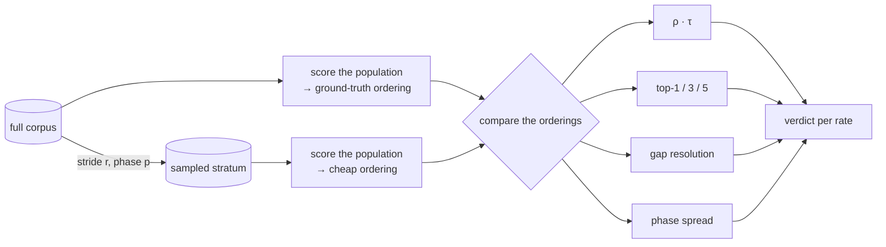

## Summary

Nothing in the repository measured whether a **cheap fitness ranks creatures the
way the expensive one does** — the property Jin (2011) §2/§4 says selection
actually consumes. #3926 made a sampled corpus obtainable and measured what it
_costs_; this is the evidence gate that decides whether it is safe to use.
Closes #3927.

The change is a measurement harness plus its recorded result. Nothing under
`src/` imports it and no scoring behaviour changes.

- **`scripts/lib/rankFidelity.ts`** — the rank arithmetic, pure and fail-loud:
  Spearman ρ (average-rank tie correction), Kendall τ-b, top-k agreement,
  score-gap resolution, stride/phase indices, phase spread, and the three
  failure signals #3927 states.
- **`scripts/rank_fidelity_sweep.ts`** — the sweep: load a real creature
  directory, score the full corpus for the ground-truth ordering, then score
  every distinct stride phase of every rate and report the lot with wall-clock.
- **`docs/evidence/rank-fidelity-3927.md`** + **`.json`** — the committed table
  and the machine-readable run.
- **`docs/config/TRAINING.md`** — a warning beside the sampled-corpus mechanism,
  because that is where a reader decides to use one.

### The result: no rate is safe

Measured over the **46 real creatures** in the downstream sampler's `samples/`
(all `forwardOnly`, 2,511 → 1, median 7,598 neurons / 50,305 synapses) against
20,000 records at the production record shape:

| Rate | Records | Spearman ρ (min–max) | Top-1 | Gap resolution | × median adjacent gap | vs full |
| ---- | ------- | -------------------- | ----- | -------------- | --------------------- | ------- |
| 1    | 20000   | 1.0000–1.0000        | 1.000 | 0.00e+0        | —                     | 1.000   |
| 0.5  | 10000   | 0.9886–0.9956        | 1.000 | 3.74e-3        | 7.4×                  | 0.492   |
| 0.25 | 5000    | 0.9726–0.9956        | 0.750 | 5.35e-3        | 10.6×                 | 0.246   |
| 0.1  | 2000    | 0.9806–0.9925        | 0.750 | 1.09e-2        | 21.6×                 | 0.099   |
| 0.05 | 1000    | 0.9543–0.9811        | 0.750 | 4.40e-2        | 87.2×                 | 0.049   |
| 0.01 | 200     | 0.7455–0.9950        | 0.250 | 8.01e-2        | 159.0×                | 0.010   |

**Spearman ρ stays above 0.95 down to rate 0.05 and every one of those rates is
unusable** — which is the whole point of the issue. Rank correlation is not the
discriminating statistic; score-gap resolution is. Even at rate 0.5 the sampled
score cannot order pairs 7.4× further apart than the median margin between
adjacent creatures in that very population.

## Evidence

Backend/CLI change with no web interface, so there is no screenshot. The
evidence is the recorded run and the test suite.

- Table, caveats and reproduction:
  [`docs/evidence/rank-fidelity-3927.md`](../../evidence/rank-fidelity-3927.md);
  every creature's score at every rate and phase in
  [`rank-fidelity-3927.json`](../../evidence/rank-fidelity-3927.json).
- Findings reported on the parent milestone issue #3919, and corrected there
  after review (see below).
- 38 tests, all calling the real exported functions; the coefficients are
  checked against hand-worked values, and wall-clock is driven by an injected
  virtual clock so no test asserts on machine speed.

### What review changed

Two independent reviewers saw only the finished diff. The substantive fixes they
produced, all in this branch:

- **A dimensional over-claim was removed.** Gap resolution is measured on this
  corpus's MSE scale (scores span 1.10–6.37) and the first draft divided it by
  the ~1e-05 production improvement threshold, which sits on a score
  distribution with a mean near 0.36. The doc now gives a same-scale comparison
  (× the median adjacent gap) and a scale-free one (fraction of the mean score),
  and the parent-issue comment carries a posted correction.
- **Two fail-silent paths were closed**: a `topK` set missing 1/3/5 printed
  `NaN` columns and handed `assessRate` a top-1 never measured; and `--corpus`
  defaulted `--records` to 4,000, which would have scored a prefix of a very
  large corpus and reported it as the full-corpus ground truth. Both now throw.
- **Two false claims in comments were corrected**: stride sampling was
  attributed to #3926's refinery corpora (which draw each record independently
  with probability `rate`), and `loadCorpus` claimed its lexicographic shard
  order was the order a run streams in (`readDatasetDirEntriesSync` returns raw
  directory order).

## Acceptance Criteria

<!-- vibe-spec-review inputs="diff+issue-body" -->

- **partial** — Harness runs over the sampler's `samples/` creature set against
  the production corpus — evidence: `docs/evidence/rank-fidelity-3927.md` "The
  run"; the 46 real creatures are the sampler's, `corpusProvenance: "synthetic"`
  in `docs/evidence/rank-fidelity-3927.json` — reviewer: partial — reason: the
  21.2 GiB production corpus is not reachable from the build container, so the
  records are synthetic at the production record shape; the harness takes
  `--corpus=<dir> --records=<n>` and the doc names this as the one criterion the
  evidence leaves open.
- **partial** — a set of ≥50 real creatures — evidence:
  `scripts/rank_fidelity_sweep.ts::loadCreatures` (default floor 50) — reviewer:
  partial — reason: the sampler's `samples/` holds 46 today, not the 55 the
  issue quotes; `--min-creatures=46` was passed deliberately so the shortfall is
  recorded rather than silently accepted, and the doc says so.
- **met** — Spearman ρ, Kendall τ, and top-1/3/5 agreement reported per rate —
  evidence:
  `test/scripts/RankFidelity.ts::rank fidelity - Spearman matches the hand-worked value for one swap`,
  `::rank fidelity - Kendall tau-b corrects for a tie the sampled score introduces`,
  `::rank fidelity - top-k agreement looks only at the head of the ordering`;
  columns in `docs/evidence/rank-fidelity-3927.md` — reviewer: met — reason: the
  reviewer independently reimplemented all four statistics in Python and
  reproduced every committed number to 1e-12.
- **met** — Score-gap resolution reported in absolute score units — evidence:
  `test/scripts/RankFidelity.ts::rank fidelity - gap resolution reports the largest gap the sample got wrong`;
  the "Gap resolution" column — reviewer: met — reason: the reviewer noted the
  statistic is the complement of the issue's literal wording (largest gap got
  wrong, rather than smallest gap still right). Departing deliberately: the
  literal quantity is ill-posed because a small gap can come out right by luck,
  so the harness reports the guarantee — every gap strictly larger is ordered
  correctly — and the doc states the departure.
- **partial** — Phase sensitivity reported across ≥4 phases per rate — evidence:
  `test/scripts/RankFidelity.ts::rank fidelity - a rate has only as many phases as it has strata`;
  the "Phases" column — reviewer: partial — reason: rate 0.5 has a stride of 2
  and therefore exactly two strata, so it reports two phases. Measuring a
  stratum twice would report a phase spread the estimator does not have. Rates
  0.25 and below report four.
- **met** — Wall-clock per rate reported alongside — evidence: the "ms / pass"
  and "vs full" columns; `scripts/rank_fidelity_sweep.ts::scorePopulation` with
  the injected clock — reviewer: met.
- **met** — Result table committed; a recommended rate named, or a documented
  finding that none is safe — evidence: `docs/evidence/rank-fidelity-3927.md`
  "The finding"; `recommendedRate: null` in the recorded JSON;
  `test/scripts/RankFidelitySweep.ts::rank fidelity sweep - every sampled rate reaches a verdict against the failure signals`
  — reviewer: met.
- **met** — Findings reported on #3919 — evidence: comment
  `stSoftwareAU/NEAT-AI#3919` (2026-09-10), plus a posted correction to the
  dimensional error review found — reviewer: met.
- **unrequested** — synthetic-corpus mode (`--synthetic-records`, `--seed`) —
  reviewer: unrequested — reason: the production corpus is unreachable from the
  container, so without it the harness could not be run at all; the corpus
  provenance is stamped on every report so a synthetic table cannot be misread
  as a production one.
- **unrequested** — `--min-creatures` override — reviewer: unrequested — reason:
  `samples/` holds 46, not the ≥50 the issue assumes; an explicit
  acknowledgement is better than a harness that cannot run or a floor quietly
  lowered in code.
- **unrequested** — `--records` and the `loadCorpus` `.bin` reader — reviewer:
  unrequested — reason: this is the `--corpus` path the outstanding criterion
  needs; without it nobody who _can_ reach the production corpus could close it.
- **unrequested** — the `docs/config/TRAINING.md` warning block — reviewer:
  unrequested — reason: a code change owes a docs change. That section is where
  a reader decides to point a run at a sampled corpus, and it previously carried
  only the cost evidence.
- **unrequested** — `docs/evidence/rank-fidelity-3927.json` — reviewer:
  unrequested — reason: the issue asks for a recorded baseline later work can
  argue against; per-creature scores are what makes that possible without
  re-running a seven-minute sweep.
- **unrequested** — the `rank-fidelity` `deno` task, `assertRates` requiring
  rate 1, and the "no sampled rate was measured" report branch — reviewer:
  unrequested — reason: mechanical support for the above — the task matches how
  every sibling harness is invoked, rate 1 is the ground truth everything is
  reported against, and the report branch stops a full-corpus-only run printing
  a verdict it never reached.

## Standards Review

<!-- vibe-standards-review inputs="diff+CODING-STANDARDS.md" -->

- **violation** — the spelling gate rejected a coined adjective for a stride-cut
  sample — evidence: `test/scripts/RankFidelitySweep.ts:136` — reason: reworded
  to "a sample cut at a stride" in this diff; `cspell --config docs/cspell.json`
  is now clean on every changed file.
- **violation** — no `docs/archive/pr-summaries/pr-summary-3927.md` — evidence:
  `docs/README.md:308` — reason: this file, added in this diff.
- **violation** — silent `NaN` substitution contradicting the module's own
  fail-loud contract — evidence: `scripts/rank_fidelity_sweep.ts` `assessRate`
  call site and `markdownReport` — reason: fixed here; `assertPopulation` now
  refuses a `topK` set missing a `k` the report has a column for, covered by
  `test/scripts/RankFidelitySweep.ts::rank fidelity sweep - a top-k set the report cannot fill is refused`.
- **violation** — file placement and task naming diverge from the sibling
  harness (`bench/fitness_corpus_fidelity.ts` with a co-located test and a
  `bench:` task) — evidence: `scripts/rank_fidelity_sweep.ts`, `deno.json` —
  reason: stands. Issue #3927 asks in so many words for "a script under
  `scripts/`, not a production code path", and the more specific instruction
  wins; tests follow `test/scripts/` as every other `scripts/` file does. The
  task was moved out of the middle of the `bench:*` block so it does not read as
  one.
- **violation** — `assertFidelityRate` / `strideForRate` duplicate the inline
  rate check and `stride()` in `bench/fitness_corpus_fidelity.ts` — evidence:
  `scripts/lib/rankFidelity.ts` against `bench/fitness_corpus_fidelity.ts:81`
  and `:150` — reason: stands. Rerouting #3926's harness at the new module would
  edit a committed evidence-producing file this issue does not touch; noted for
  a follow-up rather than folded in.
- **clean** — Australian English throughout code, comments, docs and the JSON
  artefact; the testing policy (every test calls a real exported function and
  asserts on its result, no source-text greps, injected clock so nothing asserts
  on machine speed, 38 tests in ~300 ms); fail-loud everywhere else (ragged,
  short, non-finite and constant score vectors, empty strata, empty medians,
  short populations and short corpora all throw; temp strata removed in
  `finally`); doc style (Mermaid diagram, acronyms expanded on first use,
  resolving anchors); no private-repository references; commit safety — no
  hidden, key or credential paths staged.

## Test Plan

- `test/scripts/RankFidelity.ts` — 25 tests over the arithmetic: Spearman
  against a hand-worked one-swap value, Kendall τ-b against a hand-worked tied
  case, average-rank ties, top-k restricted to the head of the ordering, gap
  resolution including the sampled-tie and zero-truth-gap cases, stride/phase
  index selection and its bounds, distinct phase capping, phase spread, and each
  of the three failure signals plus the "no safe rate" outcome.
- `test/scripts/RankFidelitySweep.ts` — 13 end-to-end tests over the harness:
  every rate measured at every distinct phase, the full corpus as its own ground
  truth, a verdict for every sampled rate, a safe rate recommended, the corpus
  provenance stamped on the report, and the refusals — a rate set without the
  full corpus, a population too small for top-5, a `topK` set the report cannot
  fill, a creature whose shape misses the corpus, a population of identical
  creatures, a short creature directory, and a short or corrupt corpus.
- `./quality.sh` — `deno fmt`, `deno lint`, `deno check`, WASM sync and the full
  suite.
